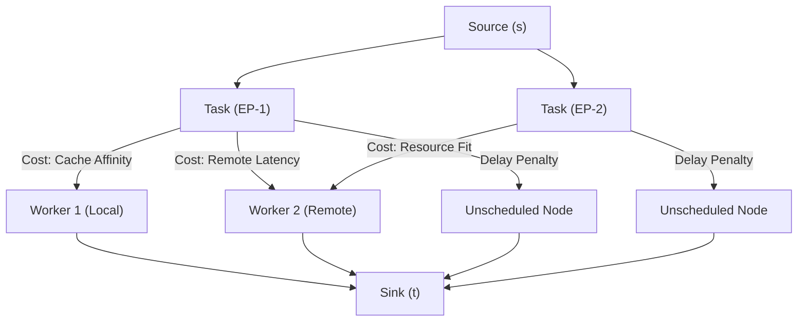

# ADR-0004: Learning-Augmented Build Scheduling

- **Status**: PROPOSED (DRAFT)
- **Date**: 2026-06-05
- **Deciders**: nrd
- **Source**: [Eos SAD §7](../architecture/eos-sad.md) |
  [Eos Scheduler Spec](../specs/eos-scheduler.md) |
  [Formal Model](../models/publishing-stack-layers.md)

---

**Document Classification**: Architecture Decision Record
**Audience**: Architects, Core Developers

---

## Context

> **Terminology note**: This ADR uses **plan** (the Eos
> `BuildEngine::Plan` abstraction) for the build unit the
> scheduler operates on, per the monorepo's canonical
> glossary. A plan corresponds to the Nix-native
> `[derivation]`; where that Nix-native unit or a verbatim
> snix/Nix identifier must be named exactly, it appears in
> brackets (e.g. `[derivation]`). Plan digests, plan DAGs,
> and the profile store's `plan_name` keys are all stated in
> this canonical vocabulary.

The Eos scheduler currently uses tag-based set-containment
matching with Rendezvous hashing for cache affinity (SAD §7).
This is a correct baseline but leaves significant performance
on the table:

1. **No historical awareness**: Every build of atom X is
   treated identically regardless of whether X has been built
   a thousand times or never. The scheduler cannot distinguish
   a 2-second leaf compilation from a 30-minute monolithic
   link step until it's already running.

2. **No plan DAG awareness**: When evaluation produces a
   plan DAG, the scheduler sees a flat set of uncached
   plans. It does not consider the graph structure when
   selecting which plans to schedule as top-level build
   entries — missing opportunities to colocate tightly coupled
   subgraphs on the same machine.

3. **No multi-resource awareness**: Jobs are dispatched based
   on tag match and capacity, without considering whether the
   job's resource profile aligns with the worker's currently
   available resources. This causes fragmentation.

### The Plan DAG Problem

This is the core scheduling challenge. A Nix evaluation
produces not a single plan but a **directed acyclic
graph** of plans — the top-level plan and all
its transitive build dependencies:

```
top-level
├── dep-a
│   ├── dep-c  (cached ✓)
│   └── dep-d
├── dep-b
│   ├── dep-d  (shared with dep-a)
│   └── dep-e  (cached ✓)
└── dep-f
```

After filtering cached plans, the remaining uncached
nodes form the **uncached sub-DAG**. The key insight from
Nix/snix's execution model is:

> **Scheduling a plan for build automatically builds
> all its transitive dependencies.** The builder resolves
> the full dependency chain internally — there is no need
> to explicitly schedule each transitive node.

This means the scheduler's job is not to partition every
uncached node into groups. Its job is to **select optimal
entry points** (peaks) into the uncached DAG:

- Each entry point, when scheduled to a worker, causes the
  builder to transitively build everything below it on that
  same machine — with full locality (no cross-machine
  artifact transfers for transitive outputs).
- The scheduler tracks only the entry points, not every
  individual plan in the graph.
- Parallelism comes from scheduling multiple entry points
  to different workers simultaneously.

The scheduling question becomes: **which plans should
be the entry points, and which workers should execute them?**

#### Entry Point Selection

Naive approach (schedule only the top-level plan):

- One worker builds the entire DAG sequentially
- Zero parallelism — all transitive dependencies serialize

Naive approach (schedule every uncached leaf independently):

- Maximum parallelism but redundant work — multiple workers
  may attempt to build the same shared dependency (dep-d
  appears under both dep-a and dep-b)
- Requires synchronization to avoid duplicate builds
- No locality benefit: outputs of shared dependencies must
  transfer through the global store

Optimal approach (select strategic entry points):

- Identify subgraph roots that capture useful amounts of
  transitive work without excessive overlap
- Schedule entry points that share dependencies to the same
  worker when possible (colocating dep-a and dep-b means
  dep-d builds once, locally)
- Assign heavy entry points to capable workers based on
  historical profiles or developer metadata

### The Atom-Id Advantage

Unlike generic build systems where task identity is fragile,
atom-id = `digest(anchor, label)` is **cryptographically
stable across versions**. Build #1 and build #1000 of atom X
share the same atom-id. This gives us a high-quality
prediction oracle:

- **Duration**: atom X consistently takes ~45s to evaluate,
  ~120s to build
- **Resources**: atom X consistently uses ~2GB RAM during
  build
- **DAG shape**: atom X's plan DAG is structurally
  similar across versions (same dependencies, same depth)
- **Cache behavior**: atom X's dependencies are 90% cached
  after the first build

No ML training is needed — the atom protocol provides the
stable identifier that makes historical tracking trivially
reliable.

### Developer Metadata (Cold-Start Signal)

For atoms the scheduler has never encountered, developers
MAY provide scheduling hints via atom metadata tags:

```toml
[atom.metadata.scheduling]
expected-build-duration = "30m"
expected-build-memory   = "8GiB"
build-weight            = "heavy"
requires                = ["big-parallel", "kvm"]
```

This fills the cold-start gap. A developer publishing a
Chrome-scale build can signal "this is an extremely heavy
build that needs a capable machine" before the scheduler
has ever seen it. After the first build, historical profiles
take over and the metadata becomes a fallback.

**Priority order**: Historical profile (most data) >
developer metadata (domain knowledge) > system defaults
(conservative fallback).

---

## Decision

Augment the tag-based scheduler with four capabilities, each
grounded in academic prior art:

### 1. Historical Build Profiles (Unified Plan Model)

Everything is a plan. An atom is a plan with extra metadata
(atom-id, developer scheduling hints), not a separate
classification. The profile store reflects this:

```
P[plan_name] → {
    build_duration:  ExponentialMovingAverage,
    build_memory:    ExponentialMovingAverage,
    build_cpu_cores: ExponentialMovingAverage,  // average or peak cpu cores
    output_size:     ExponentialMovingAverage,
    confidence:      f64,                        // computed as 1 - EMA(|η_e|) from error history

    // enrichment (present when the plan is also an atom)
    atom-id:        Option<atom-id>,
    atom_metadata:  Option<SchedulingMetadata>,
}
```

Profiles are keyed by the plan's `plan_name` — the
human-readable, version-stable identifier from its
`StorePath` (e.g., `openssl-3.0.12`). These keys are
structurally stable: the same package produces
similarly-keyed plans across versions.

**Storage architecture**: The profile store is a persistent
database (e.g., embedded KV store like `sled`, `redb`, or
SQLite), not an in-memory structure. The set of unique
plan keys grows unboundedly over time — a
long-running daemon serving diverse workloads will
accumulate profiles for hundreds of thousands of distinct
plan keys. Keeping all of them in memory is not
feasible.

The scheduler maintains an **in-memory hot cache** of
profiles for the plans present in the current
active DAG ($G_\cup$). Profiles are loaded from the
persistent store on `RequestArrival` (when the cache
filter walks the incoming DAG) and evicted when the
corresponding plan nodes are garbage-collected
from $G_\cup$. After each completed build, the updated
profile is written through to the persistent store
immediately — the persistent store is always the source
of truth.

When a plan that appears as a transitive dependency in
one atom's DAG is also an independently-published atom, the
scheduler recognizes this: the plan's key matches an
existing profile, and the atom-id (if present) provides
cross-version stability and access to developer-provided
scheduling metadata.

**Prediction resolution** for a plan:

1. **Exact match**: `P[plan_name]` — exact plan-key match (historical).
2. **Cross-version aggregate**: Aggregate EMA of the `atom-id` group — if the plan is an atom, query the secondary index to aggregate historical profiles from other versions of the same atom (calibrating prediction for version bumps like `openssl-3.0.12` → `openssl-3.0.13`).
3. **Developer metadata**: `P[plan_name].atom_metadata` — developer-provided hints (if the plan is an atom).
4. **Defaults**: System defaults — conservative fallback.

**Cross-version querying**: The `atom-id` field is a
secondary index, not just a passive annotation. Grouping
profiles by `atom-id` gives the full historical trajectory
of an atom across versions — how build duration, memory, CPU,
and DAG shape have evolved over time. This is essential for
trend detection (is this atom's build getting heavier?),
EMA calibration, and operator visibility. Plan keys
change with versions (e.g., `openssl-3.0.12` →
`openssl-3.0.13`), but the atom-id groups them coherently.

This unified model avoids the complexity of maintaining
separate atom-level and plan-level stores. A
plan that is also an atom simply has richer metadata
in the same profile entry.

**Prior art**: Learning-augmented algorithms framework
(Mitzenmacher & Vassilvitskii, arXiv:2006.09123). Historical
profiles and developer metadata serve as the "prediction" in
the consistency/robustness/smoothness framework.

### 2. Entry Point DAG Construction and Dispatch

#### 2a. Construction of the Unified Global DAG and Coarsening

To prevent redundant computation across concurrent requests and minimize myopic scheduling, all requests contribute to a **unified global plan graph** $G_\cup = (V_\cup, E_\cup)$ keyed by plan hash (N1). When a new build request arrives, its plan sub-graph is merged JIT into the global DAG in $O(|V_{\text{new}}| + |E_{\text{new}}|)$ time. Plans whose outputs are already cached in the artifact store are immediately filtered out.

The scheduler partitions the mutable portion of $G_\cup$ into coarsened **entry points** ($S$) with a greedy top-down walk that covers the uncached sub-DAG. *Which* nodes become entry points is governed by promotion criteria. The criteria below are the **leading hypothesis (H1)** — they are **not settled**. The campaign's trace-driven simulator (node P10) compares H1 against the alternatives H2–H4 on real nixpkgs DAGs (constraint C2), and that simulation, not this ADR, selects the production heuristic.

**Hypothesis H1 (leading) — priority-ordered promotion.** Derived from the formal objective (minimize $\text{makespan} + \lambda \cdot \text{concurrent\_redundant\_work}$, makespan primary, redundancy avoidance secondary). A node $v$ is promoted to a standalone entry point if any criterion fires, evaluated in priority order:

1. **Critical-path cut (PRIMARY — parallelism)**: $\operatorname{critical_path}(v) > \theta_{\text{critical}}$. A long serial chain below $v$ blocks everything above it; promoting $v$ lets that chain start on a dedicated worker immediately while other EPs handle parallel work. This **replaces** $\operatorname{subgraph_cost}(v)$, which summed *all* transitive cost (much of it parallelizable inside the builder); critical path measures only the serial portion that actually constrains makespan.
2. **Cost-gated convergence (SECONDARY — avoid expensive redundancy)**: $(\operatorname{fan_in}(v) - 1) \cdot d(v) > \theta_{\text{redundancy}}$. High-fan-in nodes appear in multiple concurrent EP scopes; promotion converts concurrent overlap into a sequential dependency built once. The cost gate refuses to promote trivial shared nodes, where the synchronization barrier costs more than simply rebuilding. This **replaces** the bare $\operatorname{fan_in}(v) > \theta_{\text{fanin}}$ criterion, which ignored whether the redundancy was worth preventing.
3. **Troublesome node (TERTIARY — resource isolation)**: $d(v) > \theta_{\text{cost}}$. A single heavyweight plan (e.g. a 30-minute compile) becomes its own EP so it can be routed to the most capable worker.

Where $d(v)$ is the predicted isolated build duration of plan $v$ (from `P[plan_name].build_duration`), $\operatorname{critical_path}(v)$ is the longest weighted dependency chain below $v$, and $\operatorname{fan_in}(v)$ is its in-degree in $G_\cup$.

**Confidence gating.** Every threshold is gated on prediction confidence so unreliable estimates do not over-partition:
$$\theta_{\text{eff}} = \frac{\theta}{1 + \operatorname{conf}(v) \cdot \theta_{\text{scale}}}, \qquad \operatorname{conf}(v) = 1 - \operatorname{EMA}(|\eta_v|)$$
Low confidence raises the effective threshold (conservative coarsening — fewer EPs, fewer scheduling decisions); high confidence lowers it (finer-grained promotion for PEFT to optimize). For the critical-path criterion, $\operatorname{conf}$ is the *minimum* confidence of any node on the path (weakest-link model — the chain is only as reliable as its least-predicted node).

**Alternative hypotheses (simulation candidates).** The simulator (node P10) evaluates H1 against:

- **H2 — combined score**: a weighted sum $w_1 \cdot \operatorname{critical_path}(v) + w_2 \cdot (\operatorname{fan_in}(v) - 1) \cdot d(v) + w_3 \cdot d(v) > \theta_{\text{combined}}$, letting partial signals jointly trigger promotion even when no single criterion is met (more expressive, but more weights to tune and harder to interpret).
- **H3 — redundancy-aware critical path**: the critical-path and troublesome-node criteria only, with **no** explicit fan-in term — relying on the cache-skip scan (§2b) to absorb convergence points organically (simplest; risks missing off-critical-path convergence that causes expensive redundancy).
- **H4 — ADR-0004 original (baseline)**: the prior formulation $$\operatorname{predicted_cost}(v) > \theta_{\text{eff,cost}} \;\lor\; \operatorname{fan_in}(v) > \theta_{\text{fanin}} \;\lor\; \operatorname{subgraph_cost}(v) > \theta_{\text{eff,subgraph}}$$ retained as the comparison baseline against which H1–H3 are judged.

The simulator sweeps thresholds per variant against the nixpkgs trace corpus and reports makespan (primary), redundant work, EP count, and worker utilization (§Optimality, *The Simulation Gap*). Until those results land, H1 is the default but provisional choice.

**The Scheduling Table T (one graph, not two)**:
There is exactly **one** graph — $G_\cup$. The coarsened
entry-point set $S$ is not a second graph but a **persistent
lightweight scheduling table** $T = (S, E_S)$ layered over
$G_\cup$: a small map (typically tens of entries) of EP
records. Each record holds the EP's coverage scope (which
$G_\cup$ nodes it covers), its aggregate cost and peak-memory
estimates, its status, its per-worker OCT values, and
dependency pointers to other EPs. Those dependency pointers
**are** $E_S$ — adjacency lists, not a separately materialized
edge set; PEFT walks them for OCT and the dispatcher walks them
for readiness cascades.

```rust
struct SchedulingState {              // this is T
    eps: HashMap<EpId, EpRecord>,     // |S| entries (tens)
}

struct EpRecord {
    scope: HashSet<PlanHash>,         // G∪ nodes covered
    time_cost: Duration,              // Σ d(v) for v ∈ scope
    mem_peak: Bytes,                  // max peak_mem(v)
    status: EpStatus,                 // pending|ready|dispatched|complete|failed
    deps: Vec<EpId>,                  // dependency pointers (E_S)
    oct: HashMap<WorkerId, f64>,      // per-worker OCT values
}
```

$T$ **persists between events** so PEFT can update OCT
incrementally on status-only events without re-walking
$G_\cup$. The formal proofs' $T = (S, E_S)$ denotes exactly
this table — a coarsened projection of $G_\cup$, never a
duplicate of it.

**Frozen/Mutable Partition & Re-Coarsening**:
The records in $T$ are **logically** partitioned by status.
This is a classification within the one table, not a split
into two structures:

1. **FROZEN partition**: $\{ ep \mid ep.\text{status} \in \{\text{dispatched}, \text{complete}, \text{failed}\} \}$. This boundary is sacred. Dispatched EPs are immutable: their coverage scope $\kappa(v, s)$ and worker assignment can never change (Frozen Stability invariant).
2. **MUTABLE partition**: $\{ ep \mid ep.\text{status} \in \{\text{pending}, \text{ready}\} \} \cup \{ \text{unassigned nodes} \}$. These EPs can be freely restructured (merged, split, promoted, demoted) by re-coarsening when new requests arrive or cache updates occur (Mutable Freedom invariant).

"Re-coarsening" is a **scoped re-walk of the mutable
partition**, not an in-place incremental patch. On a
structure-changing event the scheduler re-walks the mutable
portion of $G_\cup$ from scratch (skipping frozen nodes) and
rebuilds the mutable EP records — their scopes, aggregate
costs, and $E_S$ pointers. Frozen records are untouched inputs
to the walk. $E_S$ on the mutable side is recomputed on demand
via reachability over the selected set ($O(|S|^2)$, $|S|$
small), not maintained incrementally.

#### 2b. Event-Driven PEFT Dispatch Protocol

Instead of sequential topological dispatch or epoch batching, the scheduler employs **event-driven PEFT (Predict Earliest Finish Time) re-planning** on the **full EP DAG** (pending + ready + frozen). PEFT (Arabnejad & Barbosa, 2014) replaces static HEFT's upward rank with an **Optimistic Cost Table** (OCT). For each entry point `e` and worker `w`, `OCT(e, w)` is the optimistic cost to complete *all* remaining work downstream of `e`, assuming `e` runs on `w` and every future assignment is optimal. It is computed **backward** over the scheduling table T from exit EPs (EPs with no EP-level dependents):

$$OCT(e_i, w_k) = \max_{e_j \in \operatorname{succ}(e_i)} \; \min_{w_m \in W} \big[\, OCT(e_j, w_m) + d(e_j, w_m) \,\big], \qquad OCT(e_{\text{exit}}, w_k) = 0$$

PEFT uses OCT for both decisions HEFT made from upward rank, in $O(|S|^2 \cdot |W|)$ time — the same bound as the HEFT pass it replaces:

1. **Priority ordering**: rank EPs by **average OCT across workers**. An EP with high average OCT has the largest downstream impact and is scheduled first. This replaces static upward rank.
2. **Worker selection**: for each ready EP, select the worker **minimizing `EFT(e, w) + OCT(e, w)`**, where `EFT(e, w) = worker_available_time(w) + d(e, w)`. This places the EP where it both finishes earliest *and* best sets up downstream work. Because `d(e, w)` is the cache- and fit-adjusted duration from §3, cache affinity and resource fit enter the selection through the duration model — there is no separate placement score.

Ready EPs with feasible workers are dispatched within the bounded window Δ (immediately when prediction confidence is low — see P9' under §Guarantees), while pending EPs have their priorities and tentative placements computed but do NOT lock workers; workers remain available for ready work.

Frozen EPs (dispatched/complete) are included in the PEFT computation as **fixed constraints** — their worker assignments and occupancy are immutable inputs that shape OCT for the mutable EPs above them. Only mutable EPs (pending/ready) have their priorities and assignments computed by PEFT.

For single-cluster deployments (all workers in the same artifact store namespace), the transfer cost $\tau = 0$ for all EP pairs. PEFT degenerates to a compute-only DAG scheduler, which is the intended behavior. Communication costs become relevant only in federated deployments with distinct store namespaces (see note #3).

To avoid scheduler thrashing, the engine uses an **event coalescing** loop (draining the non-blocking event channel completely before running a single PEFT pass). The event loop is **single-threaded for state mutations**: event _producers_ (request ingress, completion callbacks, health monitors) run concurrently and push events to an async channel (`tokio::sync::mpsc`), but the event loop is the sole consumer. This serialization is required by the Frozen Stability invariant — concurrent PEFT passes could dispatch the same ready EP to different workers.

The state transitions are governed by the following event handlers:

1. **RequestArrival(dag, request_id)**:
   - Cache filter (two-level): For each node in the
     incoming DAG, first check whether $G_\cup$ already
     holds a node with the same plan hash in a
     **completed** state (a free in-memory hash lookup —
     recently built plans not yet removed by terminal
     GC). Then collect the remaining unresolved plans and
     issue **one logical batched existence query** over
     the Cap'n Proto `SubstitutionService`
     (`SubstitutionService.query`, keyed by
     `SubstitutionQuery.planHash` —
     eos-network-protocol.md:282-300) to a **store shim**.
     The scheduler makes no per-node store round trips and
     holds no snix imports or gRPC client code; the shim
     owns amortization (see *Cache filter and the store
     boundary* below). The in-memory pre-filter shrinks the
     batch handed to the shim; terminal GC should not be
     overly aggressive, as retaining completed EPs briefly
     serves as a "recently cached" index that shrinks it
     further. If the uncached sub-DAG is empty after
     filtering, the request is immediately marked complete
     and the client notified — no merge, coarsening, or
     PEFT pass is needed.
   - Merge: JIT merge uncached nodes/edges into $G_\cup$.
   - Request tracking: Add `request_id` to `request_clients` set on each node.
   - Re-coarsening: scoped re-walk of the MUTABLE partition (rebuilds mutable EP records; frozen records untouched).
   - PEFT re-plan: Run PEFT on full EP DAG.
   - Dispatch: Dispatch ready EPs to feasible workers.
2. **EPComplete(ep)**:
   - Freeze: Mark `ep` as completed (frozen).
   - Cache update: Populate artifact store with `ep` outputs.
   - EMA update: Refine prediction error and update profile.
   - Cache-skip scan: For each MUTABLE EP whose scope overlaps `ep`: if all outputs are now in the store, mark it complete (cache-skipped); otherwise, update its predicted duration. Scope overlap is computed in memory against $G_\cup$ using `ep`'s own (locally known) output set; only a partially-overlapped scope ever consults the store shim, so the common case needs no store round trip.
   - Dependency cascade: Downstream pending EPs whose dependencies are satisfied transition to `ready`.
   - PEFT re-plan & Dispatch: Run PEFT and dispatch ready EPs.
   - Note: Re-coarsening is intentionally omitted from
     `EPComplete`. Mutable EPs retain their existing
     coverage scope; the cache-skip scan handles the
     common case (entire scope cached), and partial
     cache updates within a scope are handled lazily on
     the next `RequestArrival`.
3. **EPFail(ep, failure_kind)**:
   - If `deterministic`: Mark failed, fail downstream dependents, and notify clients.
   - If `transient` (infra failure): Revert `ep` to `ready`, run PEFT, and re-dispatch.
4. **WorkerHealthChange(worker, status)**:
   - If `unhealthy`: Revert affected running EPs on
     `worker` to `ready`. Run PEFT excluding `worker`
     and dispatch.
   - If `healthy` (restored): Mark worker available.
     Run PEFT re-plan and dispatch accumulated ready
     EPs.
5. **RequestCancellation(request_id)**:
   - For each plan node in $G_\cup$, remove
     `request_id` from `request_clients(v)`. For each
     EP whose constituent nodes now all have empty
     `request_clients` and which is MUTABLE, prune it.
     (Per the formal model, `request_clients` is tracked
     on plan nodes, not EPs. An EP's effective
     client set is the union of its constituent nodes'
     `request_clients`.)

**Cache filter and the store boundary**:
The "single logical query" above is a property of the
**scheduler↔shim** Cap'n Proto surface, not of the snix store.
The snix store wire protocol has **no batch existence RPC and no
standalone existence RPC** — only per-digest
`PathInfoService.Get`, with existence read as `Get` returning
`NOT_FOUND` (`rpc_pathinfo.proto:13-61`). The store shim
(deployable inside a worker or standalone) implements
`SubstitutionService` by fanning the batch out to per-digest
`Get` calls with **bounded concurrency**, so the scheduler sees
one round trip while the shim absorbs the per-digest fan-out.
This keeps the scheduler free of snix dependencies and gRPC code
(`[eos-scheduler-state-isolation]`) even in federated
topologies. A batch-native existence RPC (e.g. a `Stat`/bulk
API) is **PROPOSED upstream on the snix canon** (campaign node
P12); the shim will consume it once it lands to drop the
fan-out, but it is **not** an existing snix capability and the
design does not assume one. An earlier draft claimed the store's
gRPC protocol natively answered a batch existence query; that
was factually wrong against the snix proto and is corrected
here.

**Structural Deduplication & CAS Idempotency**:
Deduplication is achieved at two distinct levels:

1. **Entry Point Level (Unified DAG)**: Structural deduplication. Because requests merge into $G_\cup$, identical plan hashes map to the same node. This is the primary defense against redundant computation.
2. **Plan Level (CAS Idempotency)**: Unlike Nix's legacy model which relies on store-level locks, Snix store operations (gRPC `BlobService`, `DirectoryService`, `PathInfoService`) are content-addressed and **purely idempotent**. Concurrent writes of the same outputs both succeed. If two builders race on the same plan, they both execute the computation, incurring **redundant CPU/resource cost** rather than lock contention. The builder's internal `has()` check provides a partial defense by skipping a build if it finishes after another, but the scheduler's convergence-point promotion is the primary mechanism to prevent overlapping scopes from triggering wasted computation.

**DAG Lifecycle & Garbage Collection**:
The unified DAG $G_\cup$ is a long-lived structure in a
persistent daemon. Completed work exits the DAG through
three mechanisms at different lifecycle stages:

1. **Ingress cache filter** (`RequestArrival`): When a new
   request's plan sub-DAG is merged, each node is
   checked against the artifact store. Plans whose
   outputs are already cached — including those built by
   earlier requests — are filtered out before merge.
   They never enter $G_\cup$. This is the primary
   mechanism by which prior completed work becomes
   invisible to new requests: once outputs are in the
   store, the plans are indistinguishable from
   pre-existing cache hits.

2. **Mid-lifecycle cache-skip** (`EPComplete`): When an
   EP completes, the cache-skip scan checks all mutable
   EPs whose scopes overlap the completed EP. If a
   mutable EP's entire scope is now cached (because
   another EP's completion populated the store with the
   needed outputs), it is marked complete without
   dispatch. This catches work that became redundant
   mid-execution — the EP is effectively absorbed into
   the cache.

3. **Terminal GC** (post-completion): Once all requests
   referencing an EP have terminated (all entries in
   `request_clients` are resolved — completed or
   failed), the EP and its underlying plan nodes
   are eligible for removal from $G_\cup$. The GC
   should be triggered lazily (e.g., after client
   notification) and must remove:
   - The EP itself from the EP DAG
   - Any plan nodes in $G_\cup$ whose
     `request_clients` set is now empty and that are
     not referenced by any remaining EP's scope
   - The EP's edges in the EP dependency graph

   This prevents $G_\cup$ from growing monotonically in
   a long-running daemon. Without GC, completed EPs
   accumulate in the frozen partition, inflating $\|S\|$
   in every PEFT pass and consuming memory indefinitely.
   The `RequestCancellation` handler (which prunes
   mutable EPs with empty `request_clients`) is the
   partial version of this — terminal GC extends the
   same logic to frozen EPs in terminal states.

   However, GC should be **lazy, not aggressive**.
   Completed nodes still in $G_\cup$ serve as a free
   in-memory "recently cached" index for the two-level
   cache filter (§2b): new requests can check them
   before consulting the store shim. A reasonable GC
   policy is to defer collection until the completed EP
   has no remaining `request_clients` AND a brief
   retention period has elapsed (or memory pressure
   demands it).

**Prior art**: Graphene/DagPS (Grandl et al., OSDI 2016) — troublesome task identification and pre-allocation in multi-resource space-time.

### 3. Placement Signals and the Folded Duration Model

Two placement signals steer where an entry point runs: **cache affinity**
(which worker already holds the inputs) and **multi-resource fit** (which
worker's free capacity best matches the work). Rather than evaluate these as a
standalone placement score that competes with the dispatch layer's timing
estimates, the scheduler folds both directly into the **predicted duration**
`d(e, w)` that PEFT consumes (§2b). This is the "Option C" integration: a
worker that caches `e`'s inputs builds it faster (smaller `d`), and a worker
whose free capacity poorly fits `e`'s resource vector is penalized (larger
`d`), so `EFT(e, w)` and `OCT(e, w)` account for affinity and fit through their
effect on predicted finish time, not through a separate weighted sum.

**Placement signals.** For each feasible worker `w` and entry point `e`:

- **affinity(w, e)**: Local Rendezvous Hash score for atom
  content locality. Measures likelihood that worker `w`
  already has entry point `e`'s source tree and transitive
  inputs cached locally.

- **resource_fit(w, e)**: Capacity-normalized resource alignment
  between the entry point's predicted resource vector $\mathbf{r}_e$ and
  the worker's available capacity vector $\mathbf{a}_w$, normalized by the
  worker's total capacity vector $\mathbf{c}_w$ (as established in Tetris):
  $$\operatorname{resource_fit}(w, e) = \sum_{i \in \mathcal{D}} \left( \frac{r_{e,i}}{c_{w,i}} \cdot \frac{a_{w,i}}{c_{w,i}} \right)$$
  where $\mathcal{D}$ is the set of resource dimensions (typically
  $\{\text{cpu}, \text{mem}, \text{disk}\}$, extensible with
  `egress_bandwidth` per note #12).
  Normalizing each dimension by total worker capacity $c_{w,i}$ converts
  raw resource values (e.g., CPU cores vs. memory bytes) into unitless, comparable
  fractions in $[0,1]$ before combination. This prevents large byte ranges from
  dominating CPU count while preserving the absolute magnitude of tasks to steer
  heavy builds to capable workers (preventing the magnitude erasure of cosine similarity).

**Reduced placement weighting.** With the availability term removed (see below),
the two signals combine as

$$\operatorname{score}(w, e) = \alpha \cdot \operatorname{affinity}(w, e) + \beta_e \cdot \operatorname{resource_fit}(w, e)$$

An earlier formulation added a third term, $\gamma \cdot \operatorname{availability}(w)$,
a scalar headroom ratio $1 - (w.\text{current\_load} / w.\text{max\_capacity})$.
That term is **removed**: `resource_fit` already contains the per-dimension
headroom factor $a_{w,i}/c_{w,i}$, so the scalar availability double-counted the
same signal. Worse, when an entry point's resource vector is near-zero (trivial
tasks) `resource_fit` vanishes and the availability term dominated, scattering
micro-tasks onto empty workers instead of cache-affinity workers — actively
undermining LRH locality.

**Folding into the duration model (Option C).** The reduced weighting above is
not evaluated as a separate score. Its two signals are absorbed into the
per-worker predicted duration

$$d(e, w) = \operatorname{base_predicted_cost}(e) \times \big(1 - \operatorname{affinity}(w, e) \cdot \operatorname{cache_speedup_factor}\big) \times \operatorname{resource_fit_penalty}(w, e)$$

where $\operatorname{base_predicted_cost}(e) = \sum_{v \in \operatorname{scope}(e)} d(v)$ is
the aggregate isolated-build cost of the entry point's uncached scope (from
historical profiles), the affinity factor shrinks `d` toward a warm-cache
build, and `resource_fit_penalty` inflates `d` when free capacity fits poorly.
The dispatch layer then selects the worker minimizing $\operatorname{EFT}(e, w) + \operatorname{OCT}(e, w)$
(§2b), with both quantities computed from this cache- and fit-adjusted `d(e, w)`.
Folding the signals into `d` rather than a hybrid score eliminates the
unit-mixing problem of combining unitless affinity/fit scores with time-valued
finish-time estimates.

To protect against adversarial or
highly inaccurate predictions, the effective weight of the resource fit term
is dynamically decayed based on the exponential moving average (EMA) of the absolute
relative prediction error:
$$\beta_e = \beta \cdot e^{-\lambda \cdot \text{EMA}(|\eta_e|)}$$
where $\text{EMA}(|\eta_e|)$ is the running average of the absolute relative prediction
error magnitude for that atom/plan group, and $\lambda > 0$ is a decay
constant. If predictions are systematically incorrect (even if stable and having zero variance),
$\text{EMA}(|\eta_e|)$ grows, causing $\beta_e \to 0$ and safely falling back to the
prediction-free baseline — the resource-fit signal drops out of `d(e, w)`,
leaving placement governed by $\alpha \cdot \operatorname{affinity}$ alone (pure
LRH cache locality). Operators running homogeneous clusters may set $\beta = 0$.

**Symbol note**: The placement weights $\alpha, \beta$
are operator-tunable parameters distinct from the identically
named symbols in the formal guarantees: $\alpha$ in Theorem 2
is the heuristic's base approximation ratio (a bound, not a
knob), and $\gamma$ in Theorem 3 is the EMA smoothing factor
(a convergence parameter), unrelated to any placement weight.
Context disambiguates.

**Prior art**: Tetris (Grandl et al., SIGCOMM 2014) —
multi-resource dot-product alignment heuristic.

#### 3a. Operational Tuning and Sensitivity Analysis

Production scheduling performance is highly sensitive to the prediction decay constant ($\lambda$) and the entry-point coarsening thresholds.

##### Prediction Decay Constant ($\lambda$) Tuning

The decay constant $\lambda$ governs the rate at which the resource-fit optimization term degrades under prediction errors. A primary design goal is balancing responsiveness to systematic prediction error against resilience to ambient noise (e.g., I/O jitter, network drops, or CPU throttling):

- **High Sensitivity ($\lambda \gg 1$)**: Setting $\lambda$ too high causes the scheduler to treat minor ambient variance as a systematic failure. A transient network slowdown during a build will temporarily inflate $\text{EMA}(|\eta_e|)$, causing $\beta_e \to 0$ rapidly. The scheduler will discard valuable historical profiles and fall back to the prediction-free baseline prematurely, resulting in suboptimal multi-resource bin-packing and increased cluster fragmentation.
- **Low Sensitivity ($\lambda \approx 0$)**: Setting $\lambda$ too low makes the scheduler sluggish to react to true systematic prediction errors (e.g., when a package version bump drastically changes its dependency tree or memory usage, or when developer-provided cold-start metadata is highly inaccurate). The scheduler will continue to place tasks using incorrect estimates, leading to resource overloading, queue stalls, and load imbalance.

To tune $\lambda$, operators should align it with the expected coefficient of variation ($CV$) of healthy build execution times. Let $CV = \sigma_{\text{ambient}} / \mu_{\text{duration}}$ represent the standard deviation of ambient duration jitter under nominal conditions. The decay constant should satisfy:

- $e^{-\lambda \cdot CV} \approx 1$ (nominal jitter does not decay weight).
- $e^{-\lambda \cdot E_{\text{sys}}} \approx 0$ for a systematic error magnitude $E_{\text{sys}}$ (e.g., $E_{\text{sys}} \ge 1.0$, corresponding to a $100\%$ or greater estimation error).

##### Entry-Point Coarsening Thresholds

The entry-point selection heuristic determines which nodes in the uncached sub-DAG are promoted to standalone entry points ($S$) and which are merged into transitive parent scopes. The thresholds for promote-vs-merge (subgraph cost threshold, convergence/fan-in threshold, and resource limits) dictate the scheduling granularity:

- **Aggressive Coarsening (High Thresholds)**: Too few entry points are promoted. Trivial dependencies, convergence points, and even heavy plans are absorbed into a small number of top-level tasks. This serializes execution, forcing individual workers to build large subgraphs sequentially and starving the rest of the cluster of parallel execution opportunities.
- **Weak Coarsening (Low Thresholds)**: Too many entry points are promoted. The scheduler shatters the DAG into a high volume of tiny tasks (e.g., short compile tasks, small script runs). This leads to:
  1. High scheduling queue overhead.
  2. Destruction of input cache locality, as sub-DAG nodes are scattered across different workers rather than executing on the same machine.
  3. Redundant computation, as multiple workers simultaneously execute the same shared transient dependencies due to overlapping entry point scopes.

Production environments should calibrate coarsening thresholds to the _scheduling latency_ of the cluster. The minimum subgraph cost threshold must be significantly larger than the average round-trip scheduling latency (dispatch + worker pickup overhead) to ensure that the parallel execution benefit outweighs the coordination cost.

### 3b. Strategy Trait and JIT Solver

The scheduler decouples the mathematical properties of the assignment phase from the concrete solver implementation through a strategy trait boundary:

```rust
pub trait SchedulerStrategy {
    fn plan(&self, ep_dag: &EpDag, workers: &[Worker], predictions: &Profiles)
        -> Assignment;

    // Invariants any strategy must satisfy:
    // 1. Total coverage: every EP is assigned to some worker
    // 2. Dependency ordering: if A -> B in EP DAG, B does not start before A completes
    // 3. Worker capacity: peak memory/CPU does not exceed worker limits

    // Competitive Makespan Bound:
    fn alpha_bound(&self) -> f64;
}
```

The Eos scheduling daemon utilizes this trait boundary to support three swappable strategy backends:

1. **PEFT (Primary)**: The default active strategy. PEFT ranks EPs by average OCT and assigns each to the worker minimizing `EFT + OCT` (§2b). It is highly efficient ($O(|S|^2 \cdot |W|)$) and, as a list-scheduling algorithm, provides a provable competitive bound ($\alpha_{\text{peft}}$) mechanized in Lean 4.
2. **Greedy (Fallback)**: A low-overhead fallback strategy activated under high prediction error or missing profiles. It assigns tasks greedily to the highest scoring cache-affinity worker, satisfying basic capacity safety.
3. **MILP/MCMF (Deferred)**: A global solver strategy reserved for federated scale ($|W| > 1000$). It solves the JIT assignment globally via mixed-integer programming or min-cost max-flow, operating over the coarsened EP DAG. Because the graph size is naturally bounded ($|S| \leq 20$), the solver completes in sub-millisecond time, bypassing NP-hardness in practice.

### 3.1 Virtual Capacity and Enforcement

The scheduler's capacity model is **enforcement-agnostic**.
`WorkerCap` is an abstract capacity vector reported by the
worker at registration. The scheduler treats it as a budget
and applies a single dispatch guard uniformly:

$$
L(w) + \text{PredictedLoad}(s) \leq \text{WorkerCap}(w)
$$

How that capacity is determined is a worker-side concern:

- **With OCI cgroups**: The worker reports its full physical
  capacity (e.g., 128 cores, 256 GiB RAM) because enforcement
  is kernel-guaranteed. Each dispatched build receives a cgroup
  with limits matching `PredictedLoad` — the OCI runtime spec
  sets `linux.resources.cpu.max` and `linux.resources.memory.max`.
  Builds physically cannot exceed their allocation. If a
  prediction underestimates, the build is throttled by the
  kernel, not the machine exhausted. P4 is **kernel-enforced**.

- **Without OCI (macOS, disabled)**: The worker reports a
  **conservative virtual capacity** — smaller than hardware
  reality, accounting for the lack of enforcement and
  shared-resource interference. A 128-core Mac might report
  effective capacity equivalent to 2–3 concurrent max-jobs.
  P4 is **scheduler-enforced** with conservative margins.

The scheduler algorithm is identical in both cases. No
conditional branches, no tier detection, no capability
queries. The abstraction boundary is clean:

```
┌────────────────────────────────┐
│   Scheduler                    │
│   Sees only: WorkerCap[w]      │
│   Guard: L[w] + P[s] <= C[w]  │
└──────────────┬─────────────────┘
               │ abstract capacity vector
┌──────────────▼─────────────────┐
│   Worker Registration          │
│   ┌─────────┐  ┌─────────────┐ │
│   │ OCI:    │  │ Non-OCI:    │ │
│   │ report  │  │ report      │ │
│   │ physical│  │ conservative│ │
│   │ capacity│  │ virtual cap │ │
│   └─────────┘  └─────────────┘ │
└────────────────────────────────┘
```

**Snix seam**: `BuildConstraints::MinMemory(u64)` already
exists in the build request protocol
(`snix/build/src/buildservice/build_request.rs`). Extending
with CPU resource constraints is a clean addition.
`snix/build/src/oci/spec.rs` generates OCI runtime specs
with PID/IPC/UTS/Mount namespaces; cgroup namespace support
is architecturally prepared.

### 4. Local Rendezvous Hashing (LRH)

Replace standard Highest Random Weight (HRW) hashing with
Local Rendezvous Hashing, which restricts candidate
selection to a cache-local window of `C` neighbors on a
virtual ring:

- Near-optimal load balance (comparable to multi-probe
  consistent hashing)
- ~6.8× higher throughput than standard HRW by exploiting
  CPU cache locality during hash computation
- 0% excess churn under topology-fixed failures
- O(log|R| + C) lookup complexity

**Prior art**: Local Rendezvous Hashing
(arXiv:2512.23434, 2025).

### 5. Computational Complexity

The entire scheduling pipeline runs in **polynomial time**,
linear in the DAG size plus the product of entry points
and workers. No phase has exponential or super-polynomial
cost.

#### Per-Event Cost (Coalesced Batch)

Each coalesced event batch triggers the following phases.
Not all phases run on every event type — `RequestArrival`
triggers DAG merge + re-coarsening + PEFT; `EPComplete`
triggers cache-skip scan + dependency cascade + PEFT;
failure/health events trigger only PEFT re-planning.

| Phase                   | Operation                                    | Complexity                                     | Trigger Events |
| :---------------------- | :------------------------------------------- | :--------------------------------------------- | :------------- |
| DAG merge (incremental) | JIT merge new nodes/edges into $G_\cup$      | $O(\|V_{\text{new}}\| + \|E_{\text{new}}\|)$   | RequestArrival |
| Cache filtering         | Two-level: $G_\cup$ completed set then store | $O(\|V_{\text{new}}\|)$                        | RequestArrival |
| Re-coarsening           | Greedy walk over MUTABLE partition           | $O(\|V'_{\text{mut}}\| + \|E'_{\text{mut}}\|)$ | RequestArrival |
| Cache-skip scan         | Check scope overlap for mutable EPs          | $O(\|S_{\text{mut}}\| \cdot \bar\kappa)$       | EPComplete     |
| Dependency cascade      | Update ready status of pending EPs           | $O(\|S\|)$                                     | EPComplete     |
| EP DAG construction       | Transitive closure on selected set           | $O(\|S\|^2)$ worst case                        | RequestArrival |
| PEFT re-planning        | Full EP DAG scheduling                       | $O(\|S\|^2 \cdot \|W\|)$                       | All events     |
| EMA update              | Per-completion profile update                | $O(1)$                                         | EPComplete     |

Where $\bar\kappa$ is the average entry-point scope size
(number of plans in a typical EP's transitive closure).

The **dominant per-event cost** is PEFT re-planning at
$O(\|S\|^2 \cdot \|W\|)$. Event coalescing amortizes this:
$k$ closely-spaced events trigger one PEFT pass, not $k$.

#### Initial Construction Cost

The first `RequestArrival` for a given request incurs the
full DAG construction cost:

| Phase                 | Operation                                    | Complexity                                 |
| :-------------------- | :------------------------------------------- | :----------------------------------------- |
| DAG construction      | Topological sort + cache filtering           | $O(\|V'\| + \|E'\|)$                       |
| Entry point selection | Greedy top-down walk with fan-in/cost checks | $O(\|V'\| + \|E'\|)$                       |
| EP DAG construction     | Transitive closure on selected set           | $O(\|S\|^2)$ worst case                    |
| PEFT planning         | Initial full EP DAG scheduling               | $O(\|S\|^2 \cdot \|W\|)$                   |
| LRH lookup (per EP)   | Cache affinity scoring                       | $O(\log\|R\| + C)$                         |
| **Total (initial)**   | **First scheduling pass**                    | $O(\|V'\| + \|E'\| + \|S\|^2 \cdot \|W\|)$ |

#### Lifecycle Cost

Over the full lifetime of a request (from arrival through
all EP completions), the scheduler runs approximately
$\|S\|$ PEFT re-plans (one per EP completion, amortized by
coalescing). The total lifecycle cost is:

$$O(\|V'\| + \|E'\| + \|S\|^3 \cdot \|W\|)$$

The $\|S\|^3$ term arises from $\|S\|$ re-plans each
costing $O(\|S\|^2 \cdot \|W\|)$. In practice, coalescing
reduces this significantly — concurrent completions
trigger a single re-plan. The $\|S\|^3$ bound is
conservative.

Where:

- $\|V'\|, \|E'\|$ = uncached sub-DAG nodes and edges
- $\|S\|$ = selected entry points ($\|S\| \leq \|V'\|$,
  typically $\|S\| \ll \|V'\|$ due to coarsening)
- $\|W\|$ = number of candidate workers
- $d$ = resource dimensions (constant, typically 3–4:
  CPU, memory, disk, optionally egress bandwidth — see note #12)
- $\|R\|$ = LRH ring size, $C$ = cache-local window
- EP DAG construction is $O(\|S\|^2)$ in the worst case
  (all-pairs reachability on the coarsened set) but
  typically much smaller since $\|S\| \ll \|V'\|$
- **Single-machine degenerate case**: When $\|W\| = 1$,
  PEFT degenerates to a topological sort and coarsening
  is irrelevant — all EPs are assigned to the single
  worker regardless of the partition chosen

**Key property**: The NP-hard optimal entry point
selection is sidestepped by the greedy heuristic, which
runs in $O(\|V'\| + \|E'\|)$. The tradeoff is between
selection quality (captured by $\alpha$ in Theorem 2) and
computational cost. A global MILP solver could potentially
find a better $\alpha$ but at exponential cost —
unacceptable when the scheduling decision itself must
complete in sub-second time.

**Implementation note**: The dominant cost per event is
PEFT at $O(\|S\|^2 \cdot \|W\|)$. For a cluster of 100
workers and a DAG coarsened to 50 entry points, this is
250,000 operations per PEFT pass — trivially fast. At
federated scale ($\|W\| > 1000$), the min-cost flow
formulation (§Future Work) replaces PEFT with a global
flow optimization.

---

## Guarantees

The scheduling architecture provides two classes of formal
guarantees, each backed by independent verification
tracks. See `docs/models/lean/` and `docs/models/tla/`.

### Protocol Correctness (Model-Checked — Track A, TLA+)

The dispatch protocol satisfies the following safety and
liveness properties, verified via TLC model checking
across four DAG topologies (linear chain, diamond
fork-join, convergence, independent) with weak fairness.

> **Pending re-verification (P9')**: The relaxation of work
> conservation to the bounded-window form **P9'** (below) is
> **not yet model-checked**. It needs an explicit clock
> variable and `readySince` timestamps the current models do
> not have; the re-check is tracked as campaign node P2. Every
> other property in this section reflects the *current* model
> state. The time-free safety properties (P1, P3, P4, P8, P11)
> are unaffected by the relaxation; the liveness properties
> retain their structure under a clock-guarded `Next`.

**Safety properties** (nothing bad ever happens):

- **Ordering soundness (P1)**: An entry point is never
  dispatched before all its EP-level dependencies have
  completed. This is the fundamental dependency ordering
  invariant — no worker ever receives an EP whose inputs
  don't exist yet.
- **Capacity safety (P4)**: The scheduler never
  dispatches an EP to a worker whose current load plus
  the EP's predicted resource requirements would exceed
  the worker's reported capacity.
- **Artifact completeness (P3)**: When an EP is marked
  complete, all its outputs have been published to the
  artifact store.
- **Frozen stability (P8)**: Once an EP is dispatched or
  completed, its coverage scope and worker assignment are
  immutable. Re-coarsening only touches the mutable
  partition.
- **Failure isolation (P11)**: A deterministic build
  failure in one EP cascades only to its transitive
  dependents, not to unrelated requests or EPs.

**Liveness properties** (good things eventually happen):

- **Progress (P5)**: If a ready EP exists and a worker
  has available capacity, the EP is eventually dispatched.
  The scheduler never indefinitely holds a schedulable EP.
- **Head-of-line immunity (P5')**: A large, slow EP on
  one worker does not block dispatch of unrelated ready
  EPs to other workers. The event-driven PEFT protocol
  evaluates all ready EPs on each pass, not just the
  first in queue.
- **Completion propagation (P6)**: Every dispatched EP
  eventually reaches a terminal state (completed or
  failed). No EP hangs in `dispatched` indefinitely.
- **Per-request completion (P6')**: Every request
  eventually terminates — either all its EPs complete
  successfully, or a deterministic failure cascades and
  the client is notified.
- **Bounded-window work conservation (P9')** *(pending TLC
  re-verification — node P2)*: When a ready EP has a feasible
  worker, it is dispatched within a bounded window Δ rather
  than necessarily immediately:

  ```
  P9': □( Q(s) = ready ∧ ∃w: feasible(s, w) ) ⟹ ◇≤Δ Q(s) ∈ {dispatched, complete, failed}
  ```

  The window is **confidence-gated**: under low prediction
  confidence Δ = 0, degenerating to strict immediate dispatch
  (the original P9); under high confidence the scheduler may
  hold a ready EP for up to Δ to wait for a higher-affinity
  worker about to free up, since a warm cache can save orders
  of magnitude over a cold fetch. This relaxation is what makes
  PEFT's look-ahead valuable — strict work conservation forced
  immediate dispatch and rendered the look-ahead inert.
- **Transient recovery (P10)**: After a transient
  infrastructure failure (worker crash, network partition),
  the affected EPs are reverted to `ready` and
  re-dispatched to a healthy worker. The system does not
  require manual intervention to recover.

**Key finding**: `CascadeFail` is **required** for
liveness. Without active failure propagation, dependent
tasks hang in `pending`/`ready` indefinitely after a
dependency fails. This must be implemented as a mandatory
transition, not an optional recovery mechanism.

### Optimization Quality (Machine-Checked — Track B, Lean 4)

#### Consistency (Theorem 2)

When historical predictions are $\varepsilon$-accurate
($|d(s) - \hat{d}(s)| \leq \varepsilon \cdot \hat{d}(s)$),
the heuristic assignment $\sigma_H$ satisfies:

$$
M(\sigma_H) \leq \alpha \cdot \frac{1 + \varepsilon}
{1 - \varepsilon} \cdot M(\sigma^*)
$$

where $\alpha$ is the heuristic's base approximation ratio
on perfectly-predicted inputs, and $\sigma^*$ is the optimal
offline assignment. For small $\varepsilon$, this simplifies
to $\alpha \cdot (1 + 2\varepsilon + O(\varepsilon^2))$.

This bound cleanly separates two concerns: heuristic quality
($\alpha$, a function of DAG structure and the placement
signals folded into `d(e, w)`)
and prediction degradation ($(1+\varepsilon)/(1-\varepsilon)$,
a function of profile accuracy). The implementation can
independently tune each axis.

**Implementation note**: After each build, compute observed
$\varepsilon$ from `|d_actual - d_predicted| / d_predicted`
and track it via EMA. This provides a live monitorable
metric for how close the system is to the proven bound.

#### Adaptive Consistency (Theorem 2')

As prediction error increases gradually, scheduling quality degrades proportionally through the parameterized approximation function $\alpha(\bar{\epsilon})$:

$$
M(\sigma_H) \leq \alpha(\bar{\epsilon}) \cdot \frac{1 + \bar{\epsilon}}{1 - \bar{\epsilon}} \cdot M(\sigma^*)
$$

Where:

- $\bar{\epsilon}$ is the average prediction error magnitude.
- $\alpha(\bar{\epsilon})$ is a monotonically non-increasing function representing the quality of the selected entry-point DAG coarsening:
  $$\alpha(0) = \alpha_{\text{peft}} \quad \text{and} \quad \alpha(1) \leq \alpha_{\text{max}}$$

This theorem bounds the combined performance of both graph coarsening and worker placement. Under accurate predictions ($\bar{\epsilon} \to 0$), cost thresholds are safely lowered, yielding fine-grained entry points that PEFT schedules optimally ($\alpha \to \alpha_{\text{peft}}$). When error is high ($\bar{\epsilon} \to 1$), thresholds rise, yielding a coarse DAG with fewer entry points, falling back to the prediction-free baseline bound $\alpha_{\text{max}}$.

#### Robustness (Theorem 3)

When predictions are arbitrarily wrong ($\eta \to \infty$),
the system self-heals:

1. **Assignment stability** (Lemma 3.1): If the prediction
   perturbation satisfies $2P < \Delta_{\min}$ (twice the
   perturbation is less than the baseline affinity gap), then
   $\sigma_H = \sigma_{\text{base}}$ — the heuristic makes
   the same assignment as the prediction-free baseline, which
   after the availability-term removal (§3) is **pure LRH
   cache affinity** ($\alpha \cdot \operatorname{affinity}$
   alone).

2. **EMA convergence**: Under sustained prediction error
   $\eta \geq \eta_0 > 0$, the EMA of error magnitudes
   satisfies $\text{EMA}_n \geq (1 - \gamma^n) \eta_0 +
   \gamma^n E_0$, causing the prediction weight $\beta_e$
   to decay geometrically toward zero.

Together: bad predictions → EMA grows → $\beta_e$ decays →
perturbation shrinks → eventually $2P < \Delta_{\min}$ →
assignment equals baseline. Dropping the availability term
strengthens this result: with only one prediction-dependent
signal remaining (resource fit, gated by $\beta_e$), the
perturbation bound $P$ is smaller, so the stability condition
$2P < \Delta_{\min}$ is reached sooner. The convergence is
automatic and requires $O(\ln(\beta R_{\max}/\Delta_{\min}))$
observations.

#### Smoothness (Corollary of Theorem 2)

As prediction error increases gradually (incremental version
changes, slowly shifting build profiles), scheduling quality
degrades proportionally via the $(1+\varepsilon)/(1-\varepsilon)$
factor — not catastrophically. This follows directly from
Theorem 2's bound: the consistency ratio is a smooth, monotone
function of $\varepsilon$. When error becomes sustained, the
EMA decay mechanism (Theorem 3) automatically collapses
placement to the prediction-free baseline (pure LRH affinity).

#### Concrete Instantiation of α (Graham's Bound)

Theorems 2–3 leave α abstract — "the heuristic's base
approximation ratio." Since our modified PEFT is a **list
scheduling algorithm** (it processes EPs in OCT-priority
order and assigns each to a worker), we can instantiate α
using Graham's classical List Scheduling Bound (1966):

$$\alpha \leq 2 - \frac{1}{|W|}$$

This is the tightest known worst-case bound for any list
scheduling algorithm on $|W|$ identical machines, and it is
tight (there exist adversarial DAGs that achieve it).

Substituting into Theorem 2, the full consistency bound
becomes:

$$
M(\sigma_H) \leq \left(2 - \frac{1}{|W|}\right) \cdot
\frac{1 + \varepsilon}{1 - \varepsilon} \cdot M(\sigma^*)
$$

**Concrete worst-case ratios** for representative cluster
sizes and prediction error levels:

| Workers | α bound | ε = 5% | ε = 10% | ε = 20% |
| :------ | :------ | :----- | :------ | :------ |
| 2       | 1.50    | 1.58×  | 1.83×   | 2.25×   |
| 10      | 1.90    | 2.00×  | 2.32×   | 2.85×   |
| 50      | 1.98    | 2.08×  | 2.42×   | 2.97×   |
| 100     | 1.99    | 2.09×  | 2.43×   | 2.99×   |

These are **worst-case** guarantees. Empirically, PEFT on
small DAGs ($|S| \leq 20$, which coarsening targets)
typically achieves 1.1–1.3× optimal. The Graham bound is
rarely tight because it requires adversarial DAG structures
(long critical paths with precise fan-out patterns) that
do not arise naturally in build dependency graphs.

**Heterogeneous machines**: Graham's bound assumes identical
machines. For heterogeneous clusters (varying worker speeds
or capacities), the bound loosens by the **heterogeneity
ratio** $Q = \max_{w,s} d_w(s) / \min_{w,s} d_w(s)$ (ratio
of slowest to fastest execution time for any task across
workers). For "related machines" — where worker speeds differ
by a bounded constant factor, typical of build farms with a
mix of small and large nodes — the bound remains $O(1)$. The
general heterogeneous case is bounded by $O(\sqrt{m})$, but
this is overly pessimistic for practical build clusters where
heterogeneity ratios are typically $Q \leq 4$.

**Coarsening gap**: This bound covers the assignment phase
only (given a fixed EP DAG $T$). The coarsening phase
(selecting which nodes become entry points) introduces a
separate approximation factor not captured by α. The
Adaptive Consistency bound (Theorem 2') addresses this by
parameterizing α as a function of prediction error:
$\alpha(\bar{\epsilon})$ tightens as predictions improve
(better coarsening decisions) and loosens as they degrade
(conservative fallback coarsening).

**Prior art**: R. L. Graham, "Bounds for Certain
Multiprocessing Anomalies," Bell System Technical Journal
45(9), pp. 1563–1581, 1966.

---

## Optimality Assessment

The formal proofs (§Appendix) establish that the algorithm
is **correct** (Track A) and achieves **bounded quality**
relative to an optimal offline schedule on a fixed DAG
(Track B). But "bounded" is not "optimal." This section
documents the specific tradeoffs.

### Where the Algorithm Departs from Optimality

To achieve $O(\|V'\| + \|E'\| + \|S\|^2 \cdot \|W\|)$
polynomial-time scheduling (§5), the design makes four
intentional mathematical compromises relative to a
theoretical omniscient MILP solver:

1. **Graph coarsening blindspot**: Finding the optimal
   antichain cover of a weighted DAG to minimize
   distributed makespan is NP-hard. The entry point
   selection uses a greedy heuristic — it cannot foresee
   if bundling a subgraph will accidentally serialize
   tasks that could have been parallelized, or fragment
   what should be colocated. This gap is captured by
   $\alpha(\bar\varepsilon)$ in Theorem 2': the coarsening
   gap closes adaptively as the mean prediction error
   $\bar\varepsilon \to 0$, because higher-confidence
   predictions enable finer-grained partitions.

2. **Cross-event residual myopia**: PEFT on the full EP
   DAG replaces the earlier myopic greedy dispatch,
   computing a global OCT-priority ordering across all ready
   entry points within a single scheduling event.
   Residual sub-optimality is bounded to cross-event
   myopia — decisions made between successive PEFT
   re-plans, where a completion event reveals new ready
   EPs that could not be anticipated. Event coalescing
   (batching closely-spaced events into a single PEFT
   invocation) further reduces this gap.
   Example: a 4-worker cluster with 4 available cores
   each receives 5 concurrent 4-core entry points.
   Capacity is exhausted (4 × 4 = 16 cores, 5 × 4 = 20
   required). The 5th EP must wait for a completion
   event, and PEFT cannot anticipate which of the 4
   running EPs will finish first. An omniscient scheduler
   with perfect completion-time knowledge would pre-assign
   the 5th EP to the worker whose current task finishes
   soonest.

3. **Submodular redundant computation**: The relaxed coverage
   mapping permits non-entry-point plans to exist in
   multiple entry points' transitive scopes. When two
   workers concurrently build entry points with shared
   transitives (e.g., `openssl`), they will both redundantly
   build that shared dependency if their executions overlap.
   The builder's `has()` check will only skip the build if
   the other builder completes and publishes the output before
   the second builder starts the same plan. A global
   solver could calculate submodular overlap costs and perfectly
   stagger or route tasks to eliminate redundant computation.

4. **Federation topology blindness**: LRH measures logical
   hash-ring distance, not physical WAN bandwidth or
   inter-cluster latency. Transferring a 50GB artifact
   from Tokyo to Virginia incurs massive wall-clock
   penalties invisible to the placement signals (§3). The
   deferred min-cost flow formulation (§Future Work)
   addresses this by encoding federation topology as edge
   costs.

### Why It Is Highly Efficacious for This Domain

The algorithm exploits three domain-specific realities
that close most of the gap to theoretical optimality:

1. **Nix granularity solution**: Nix plan DAGs are
   wildly bimodal — a few colossal linchpin tasks plus
   thousands of trivial micro-tasks (patches, fetches,
   hooks). Academic schedulers choke on this; scheduling
   10,000 micro-tasks across a network incurs RPC overhead
   that dwarfs compute time. Entry point coarsening forces
   the distributed scheduler to handle only macroscopic
   peaks, offloading trivial leaves to the builder's
   native transitive execution with perfect local data
   locality and zero network overhead.

2. **Atom-id prediction oracle**: The hardest part of DAG
   scheduling is predicting task durations. Advanced
   systems (Decima) use graph neural networks requiring
   expensive training. Because Nix evaluation is pure and
   `atom-id = digest(anchor, label)` is cryptographically
   stable across versions, a cheap EMA over historical
   observations achieves the performance of a sophisticated
   learning system. The atom protocol IS the prediction
   oracle.

3. **Fail-safe packing**: The $\beta_e$ decay mechanism
   (§3) guarantees that when predictions fail, the scoring
   function smoothly degrades to a cache-affinity baseline
   rather than actively making adversarial placements that
   crash workers via OOM kills — the primary cause of
   CI/CD bottlenecking in production.

### The Simulation Gap

Formal proofs validate bounds on **fixed, abstract DAGs**
but cannot validate that the heuristic thresholds
(troublesome node cost, convergence fan-in limit, subgraph
cost threshold) are well-calibrated for **real Nix
plan shapes**. The $\alpha$ factor in Theorem 2
absorbs heuristic quality — the proofs guarantee bounded
quality for any $\alpha$ but do not tell us what $\alpha$
is in practice.

Bridging this gap requires trace-driven simulation:

1. Extract real plan DAGs from `nixpkgs` (e.g.,
   `chromium`, `kde-plasma`, `linux`) as trace corpus
2. Extract actual build durations and resource profiles
   from Hydra/Cachix as ground truth
3. Implement the entry point selection + scoring in a
   single-threaded Rust simulator
4. Sweep heuristic thresholds **and the promotion variants
   H1–H4 (§2a)** against an LRH-only baseline (cache-affinity
   dispatch without coarsening or prediction), measuring
   makespan, redundant work, EP count, and worker utilization

This is campaign node **P10**: it is the binding evaluator
(constraint C2) for the promotion heuristic. The ADR adopts H1
as the leading hypothesis, but P10's results — not this
document — select the production variant.

If the simulator demonstrates order-of-magnitude DAG
reduction without serializing the critical path, the
algorithm's practical efficacy is confirmed beyond what
formal proofs alone can establish.

---

## Rejected Alternatives

### Static HEFT (Superseded Baseline)

The initial design dispatched with **static HEFT** (Topcuoglu
et al., IEEE TPDS 2002), prioritizing EPs by upward rank and
building a time-slotted assignment plan. It is superseded by
PEFT (§2b) for two reasons. First, HEFT's time-slot matrix for
*pending* EPs is causally disconnected from dispatch under strict
work conservation — the predictions never drive a decision, so
the matrix was effectively phantom. Second, PEFT's Optimistic
Cost Table is strictly more informative than upward rank
(it is worker-aware and downstream-path-aware) at the *same*
$O(|S|^2 \cdot |W|)$ complexity. The lookahead-HEFT variant
(Bittencourt et al., Euromicro PDP 2010) achieves comparable
downstream awareness but at $O(|S|^3)$ — too expensive for the
per-event re-plan. HEFT is retained only as the conceptual
baseline that PEFT improves upon, and as the list-scheduling
family whose Graham bound (§Guarantees) PEFT inherits.

### GNN + Reinforcement Learning (Decima)

Decima (Mao et al., SIGCOMM 2019, arXiv:1810.01963) uses
graph neural networks to embed DAG structure and an RL agent
to make scheduling decisions. Rejected because:

1. **No simulator**: Decima requires a faithful cluster
   simulator for RL training. Building one is substantial
   engineering effort outside our core mission.
2. **No production deployments**: Even the authors only
   demonstrated on a 25-node prototype. No known production
   use.
3. **Opaque scheduling**: RL policies are non-interpretable.
   Debugging "why was this job placed here?" requires
   inspecting neural network weights.
4. **Generalization failure**: RL policies trained on one
   workload distribution don't generalize to another.
   Workload shifts require retraining.
5. **Unnecessary**: Atom-id stability gives us the prediction
   oracle that Decima needs a simulator to learn. Historical
   profiles with the learning-augmented framework provide
   the same adaptive benefit with provable guarantees and
   deterministic, debuggable behavior.

### Peer-to-Peer Work Stealing

No production build system uses inter-worker work stealing
for coarse-grained build tasks. Builds are non-migratable —
the cost of abort-and-re-execute exceeds the benefit of
rebalancing. The locality-aware gain function from SLAW
(Guo et al., IPDPS 2010) is valuable as a placement
heuristic (the `resource_fit` scoring term), not as a
runtime stealing mechanism.

Additionally, Nix's execution model (builder transitively
resolves dependencies internally) means there is no
meaningful "steal" granularity — you cannot steal a
transitive dependency mid-build.

### MILP Solver (TetriSched)

TetriSched (Tumanov et al., EuroSys 2016) uses Mixed Integer
Linear Programming for global rescheduling. Adds a solver
dependency (CPLEX/Gurobi/SCIP) and solving time may exceed
scheduling time at smaller scales. Rejected for the initial
implementation but may be revisited if the MILP formulation
aligns well with the formal model (§Appendix).

### Min-Cost Flow (Firmament) — Deferred, Not Rejected

Firmament (Gog et al., OSDI 2016) models scheduling as
min-cost max-flow on a directed graph. Flow network encodes
tasks, machines, racks, locality, fairness, and anti-affinity
as edge costs. Incremental MCMF solving achieves sub-second
placement at 10,000+ machines.

This was initially dismissed on the assumption of small
cluster sizes. That assumption is wrong. The target
architecture includes **federated build sharing between
clusters** — potentially global-scale decentralized build
distribution for open-source ecosystems. At that scale,
min-cost flow's ability to encode complex placement
constraints (data locality, trust boundaries, federation
policies) as edge costs in a single optimization is
compelling.

**Status**: Deferred to a follow-up ADR. The initial
implementation uses the heuristic placement model (§3).
Min-cost flow is a candidate replacement for that placement
model when:

- Cluster sizes exceed ~1000 workers
- Federation introduces cross-cluster placement decisions
- The formal model (§Appendix) identifies properties that MCMF
  can guarantee and the heuristic cannot

---

## Consequences

### Positive

- **Predictable improvement**: Repeated builds of the same
  atoms (the common case in CI/CD) benefit from historical
  awareness without any configuration.
- **DAG-aware locality**: Entry point selection colocates
  related subgraphs on the same worker. The builder handles
  all transitive work internally with full locality.
- **Reduced scheduler tracking**: The scheduler tracks entry
  points, not individual plans. The builder's internal
  dependency resolution handles the rest.
- **Resource efficiency**: Multi-resource scoring reduces
  fragmentation, improving effective cluster utilization.
- **Graceful degradation**: Cold starts with developer
  metadata degrade to informed estimates. Cold starts without
  metadata degrade to conservative defaults. Never worse than
  the current baseline.
- **Deterministic and debuggable**: No ML inference in the
  scheduling loop. Historical profiles are inspectable.
  Scheduling decisions are reproducible given the same state.
- **Cross-request optimization**: The unified global DAG
  shares cached dependencies across concurrent requests.
  HoL immunity (P5') ensures no request can block another's
  progress.
- **Adaptive coarsening**: Coarsening quality adjusts
  automatically to prediction accuracy via the confidence
  gate.

### Negative

- **Storage overhead**: Historical build profiles are
  persisted in an embedded database (§1). Each profile
  is small (~100 bytes), but the store grows unboundedly
  with the number of distinct plan names ever seen.
- **Entry point quality is heuristic**: The selection
  algorithm uses greedy heuristics, not a provably optimal
  algorithm. Quality depends on prediction accuracy and
  DAG structure.
- **Tuning surface**: Two operator-tunable placement weights
  (α, β) plus entry point selection thresholds. Sensible defaults
  should cover most cases.
- **Global DAG memory**: The unified global DAG's memory
  footprint is proportional to the sum of concurrent request
  DAG sizes. Under many concurrent requests with large DAGs,
  this may require memory budgeting.

### Risks

- **Redundant computation on overlapping scopes**: Two entry points on
  different workers whose transitive scopes share plans will both
  attempt to build the shared plans. Because Snix uses a
  CAS-idempotent store model rather than store-level locks, both workers
  will redundantly compute the shared dependency if their executions overlap.
  The builder's `has()` check only prevents redundant work if the first
  builder finishes before the second builder starts the shared plan.
  Mitigation: the convergence point promotion rule in entry point selection
  promotes high fan-in nodes to standalone entry points, ensuring they are
  scheduled and built exactly once before downstream dependents start,
  minimizing redundant computation.
- **EMA lag**: Exponential moving average adapts slowly to
  sudden changes in build characteristics. Mitigation:
  configurable decay factor; operators can flush profiles.
- **Chain pathology**: A deep linear dependency chain has
  only one useful entry point (the top). This serializes
  the build on one worker. Mitigation: this is inherent to
  the dependency structure — there IS no parallelism to
  extract from a linear chain. The scheduler correctly
  identifies this.
- **Deduplication-amplified failure cascade**: A shared EP's
  deterministic failure cascades to all requests that depend
  on it. Independent scheduling would isolate this failure.
  Mitigation: transient failure detection + re-dispatch (P10).

### Implementation Notes

Derived from formal verification (§Appendix) and the
optimality assessment above:

1. **Critical path priority (Greedy fallback)**: This note
   applies to the Greedy fallback strategy (§3b, strategy 2),
   which does not compute an OCT. The PEFT strategy
   inherently prioritizes by average OCT (a downstream-aware
   refinement of critical-path rank). Under the Greedy strategy, when multiple
   entry points become `ready` simultaneously, the dispatcher
   should sort them by estimated critical-path contribution
   (longest weighted path to a top-level target) before assigning.
   Greedy FIFO readiness ordering risks assigning trivial
   entry points to capable workers, blocking imminent
   critical tasks. The critical path computation is
   $O(\|S\| + \|E_S\|)$ on the coarsened DAG (a single
   reverse topological pass with max-aggregation over EP
   edges).

2. **Redundant computation monitoring**: When overlapping
   coverage causes workers to redundantly compute the same plans,
   resources are wasted. The implementation should track the frequency
   of redundant builds (e.g., when a worker publishes outputs that
   were already populated by another worker during its execution)
   as a per-entry-point metric, and feed it back into the
   convergence-point promotion threshold — high redundant computation
   on a specific transitive dependency is a signal to promote it to
   an explicit entry point.

3. **Federation-aware transfer cost**: The $\tau(s', s)$
   transfer time in the formal model should be populated
   from actual inter-cluster RTT measurements (e.g., via
   periodic pings or artifact store latency probes), not
   from a constant default. For intra-cluster assignments,
   $\tau \approx 0$. For cross-region assignments, $\tau$
   may dominate makespan — the placement model's
   `affinity` signal partially captures this via LRH but
   does not model WAN bandwidth constraints.

4. **Coverage properties as debug assertions**: The four
   `EosModel` properties (total coverage, self-coverage,
   transitive containment, downward closure) from the Lean
   proof should be implemented as `debug_assert!` checks on
   the output of the entry point selection algorithm. These
   are $O(\|S\| \cdot \|V'\|)$ and should be gated behind
   a debug or test build flag.

5. **ε-monitoring**: After each completed build, compute
   the observed prediction error $\varepsilon = |d - \hat{d}|
   / \hat{d}$ and report it as a metric. The consistency
   bound $(1+\varepsilon)/(1-\varepsilon)$ is a live,
   monitorable quantity — operators can directly observe how
   close the system is to the proven worst-case ratio.

6. **Artifact upload before completion**: Workers **must**
   ensure all output artifacts are uploaded to the store and
   globally visible **before** reporting `EPComplete` to the
   scheduler. If the scheduler dispatches a dependent EP
   before the parent's artifacts are available, the dependent
   worker will encounter missing inputs. The completion
   protocol is: build → upload all outputs → confirm store
   acknowledgment → report `EPComplete`. This ordering is
   critical for the correctness of the dependency cascade in
   the event handler (§2b, `EPComplete`, dependency cascade
   step: "Downstream pending EPs whose dependencies are
   satisfied transition to `ready`").

7. **Opportunistic artifact salvage on failure**: When a
   build fails, the worker should upload any intermediate
   artifacts that were successfully produced before the
   failure point. Many Nix builds consist of deep transitive
   dependency chains where early phases (fetching sources,
   building dependencies) succeed before the final
   compilation step fails. By uploading the successful
   intermediate outputs, subsequent re-dispatch attempts —
   or entirely different requests that share those
   dependencies — can skip the already-completed work. The
   failure protocol is: detect failure → upload all
   successfully produced store paths → report `EPFail` with
   failure kind. This is best-effort: if the failure is a
   worker crash or network partition, salvage may not be
   possible. The scheduler must not block on salvage — if
   `EPFail` arrives without salvage, it proceeds normally.

8. **Prediction inflation on resource exhaustion**: When a
   worker reports a sandbox failure caused by resource
   exhaustion (e.g., OOM exit code 137, disk quota exceeded),
   the scheduler **must** immediately inflate the historical
   profile for the failing EP before returning it to the
   `ready` pool. Without this inflation, the scheduler will
   re-dispatch the EP with the same faulty resource estimate,
   inducing a dispatch-fail-redispatch loop. The inflation
   should set the resource estimate to at least the worker's
   capacity limit for the exhausted resource dimension, and
   the failure should be classified as `transient` (infra
   failure) rather than `deterministic` (build error) to
   allow re-dispatch to a higher-capacity worker. The formal
   model's EMA decay (Theorem 3) handles gradual prediction
   drift; this note addresses the acute case where a single
   catastrophic misprediction needs immediate correction.

9. **Convergence point cost floor**: The fan-in promotion
   rule ($\operatorname{fan_in}(v) > \theta_{\text{fanin}}$) should
   be gated with an absolute cost floor to prevent trivial
   high-convergence nodes (e.g., a 20ms header copy with
   many dependents) from being promoted to standalone entry
   points. Promoting such nodes inserts a synchronization
   barrier whose coordination overhead (RPC dispatch,
   worker pickup, result reporting) exceeds the node's actual
   computation time. The cost floor should be calibrated to
   the cluster's average round-trip scheduling latency
   $\Omega_{\text{latency}}$:
   $\operatorname{fan_in}(v) > \theta_{\text{fanin}} \;\land\;
   \operatorname{predicted_cost}(v) \ge \Omega_{\text{latency}}$.
   This aligns with the general guidance in §3a that
   coarsening thresholds must exceed scheduling latency.

10. **Resource-fit normalization**: The Tetris-style
    `resource_fit` formula (§3) is self-normalizing — each
    dimension is capacity-relative ($r_{e,i}/c_{w,i} \in [0,1]$
    and $a_{w,i}/c_{w,i} \in [0,1]$), so each term is bounded
    by $[0,1]$ and the sum is bounded by $|\mathcal{D}|$ (the
    number of resource dimensions). To normalize to $[0,1]$
    for comparable weighting with affinity,
    divide by $|\mathcal{D}|$. Do NOT use cosine similarity —
    the Tetris formula intentionally preserves task magnitude
    to steer heavy builds to capable workers, and this property
    is relied upon by the Theorem 3 robustness proof.

11. **Non-blocking ingress draining**: The scheduler's
    event channel **must not** block on PEFT planning or
    graph coarsening. Because entry-point selection involves
    graph searches over potentially large plan trees,
    inline processing would cause backpressure that stalls
    request ingress. The implementation should use a
    non-blocking `try_recv` drain loop that immediately
    buffers all pending events into an in-memory queue,
    then runs a single coalesced PEFT pass over the
    accumulated events. This matches the event coalescing
    model described in §2b and prevents the ingress channel
    from filling under burst request load. Reference
    pattern: `eka-ci`'s `poll_for_builds` loop uses
    `try_recv` + `VecDeque` to completely insulate its
    ingress from downstream processing latency.

12. **Fixed-output plan (FOD) locality**: FODs
    (source fetches, git checkouts, tarball downloads) have
    a fundamentally different resource profile from compute
    tasks: they are network-bound, I/O-heavy, and produce
    unpredictable latency. Some CI systems (e.g., `eka-ci`)
    isolate FODs onto dedicated worker pools to prevent
    network I/O storms from starving compute slots. However,
    in the coarsened EP model this advice does **not**
    translate directly. Because FODs are typically source
    inputs absorbed into a parent EP's transitive scope, the
    build worker fetches them locally with perfect data
    locality. Routing FODs to a dedicated node would add a
    pointless store round-trip: the dedicated node fetches
    the source, uploads it to the store, and then the actual
    build worker downloads it again as an input — strictly
    more work than letting the builder fetch directly. The
    coarsening heuristic already handles this correctly: a
    trivial FOD is absorbed into its parent EP scope rather
    than promoted to a standalone entry point (see note #9,
    cost floor). FOD isolation may be worth considering only
    in extreme deployment topologies where dedicated caching
    proxies or mirrors serve as intermediaries for expensive
    upstream fetches (e.g., large git monorepos), but this
    is an infrastructure concern rather than a scheduling
    decision. What **is** relevant for FOD-aware placement
    is **worker internet egress bandwidth**: an EP whose
    scope contains many FODs will have its predicted duration
    dominated by fetch time, which varies dramatically with
    worker bandwidth (100 Mbps vs. 10 Gbps). The resource
    vector (§3) should include `egress_bandwidth` as a
    dimension so that the duration model can steer
    FOD-heavy EPs toward high-bandwidth workers. Historical
    profiles can track FOD fetch durations per plan
    hash to refine bandwidth-adjusted predictions.

13. **Worker reconnection protocol**: When a worker is
    marked unhealthy (heartbeat timeout), the scheduler
    reverts its running EPs to `ready` and re-dispatches
    them. However, the worker may still be alive and
    actively building — the health check failure may be a
    transient network blip. If the worker reconnects while
    a duplicate build is in flight, the cluster wastes
    resources. The implementation should use a **grace
    period** before rescheduling: when a worker misses a
    heartbeat, enter a `suspect` state for a configurable
    cooldown (e.g., 30–60 seconds) before transitioning to
    `unhealthy`. During the cooldown, no rescheduling
    occurs. If the worker reconnects during the cooldown,
    its EPs remain assigned and the incident is logged as
    a transient network event. If the cooldown expires, the
    worker transitions to `unhealthy` and rescheduling
    proceeds normally. Additionally, if a worker reconnects
    _after_ rescheduling has already occurred and reports
    that it is still actively building the same EP, the
    scheduler should allow the original build to continue
    (with its own short monitoring window in case the
    network issue recurs) and cancel the duplicate. CAS
    idempotency guarantees correctness regardless of which
    build "wins," but minimizing redundant work is a
    resource efficiency concern.

14. **Causal prediction error attribution**: The EMA-based
    prediction system tracks _that_ predictions are wrong
    (magnitude of |η|) but not _why_. For faster
    convergence, the implementation should track
    per-worker-class performance deltas: if plan X
    takes 120s on a 64GB worker but 45s on a 256GB worker,
    the prediction error is attributable to memory pressure
    (swapping or cache thrashing), not to an inherent
    change in the plan. The profile store can
    maintain resource-conditioned predictions — e.g.,
    separate EMA tracks for "duration on workers with
    ≥128GB RAM" vs. "duration on workers with <128GB RAM."
    When a prediction error exceeds a significance
    threshold (e.g., >50% deviation), the scheduler should
    compare the worker's resource profile to the historical
    median worker profile for this plan and attribute
    the error to the most divergent resource dimension.
    This attribution can then drive targeted prediction
    inflation (note #8) and inform the resource-fit
    scoring (§3) without waiting for the EMA to accumulate
    enough samples to self-correct.

15. **Heuristic refinement stability**: The formal model
    is explicitly designed so that heuristic tuning does
    not invalidate the proofs. The `SchedulerStrategy`
    trait (§3b) abstracts over the specific solver; the
    `Coarsening` structure (Lean 4) abstracts over the
    specific entry-point selection criteria; and the
    competitive ratio α absorbs heuristic quality — worse
    heuristics produce a larger α, but the bound structure
    remains valid. Implementors should treat the
    coarsening thresholds, scoring weights, EMA decay
    constants, and cooldown timers as continuously
    tunable parameters. Steady refinement of these
    heuristics through production telemetry is expected
    and encouraged — the architecture's formal seams
    guarantee that tuning cannot violate safety or
    liveness properties.

16. **Scheduler disaster recovery**: The unified DAG
    $G_\cup$, EP assignments, and `request_clients`
    mappings are in-memory state. A scheduler process
    crash loses all of this. The artifact store and
    profile store both survive (they are separate
    durable services/databases), and workers may
    still be actively building dispatched EPs. Recovery
    must address three concerns:

    **State snapshotting**: The scheduler should
    periodically snapshot its in-memory scheduling
    state to durable storage:
    - The EP DAG (node states, coverage scopes, dependency edges)
    - EP-to-worker assignments for dispatched EPs
    - `request_clients` mappings

    Note: EMA prediction profiles do NOT need
    snapshotting — they live in the persistent profile
    store (§1) and are written through on every
    `EPComplete`.

    Snapshot frequency is an operator-tunable parameter
    trading durability against I/O cost. A reasonable
    default is after every N events or every T seconds,
    whichever comes first.

    **Warm restart (from snapshot)**: Load the last
    snapshot, then reconcile against reality:
    1. Query the artifact store: any EP whose outputs
       are now cached can be marked complete (the build
       finished between the snapshot and the crash).
    2. Reconnect to workers and poll for in-flight
       builds. Workers that are still building should
       report what they're working on. Match these
       against dispatched EPs in the snapshot.
    3. Any dispatched EP whose worker is unreachable or
       reports no matching build should be reverted to
       `ready` and re-planned (same logic as the
       `WorkerHealthChange` handler).
    4. Mutable EPs are re-coarsened against current
       cache state and PEFT is re-run.

    **Cold restart (no snapshot)**: Clients must re-submit
    their requests. The cache filter handles this
    gracefully — any work completed before the crash is
    in the store, so re-submitted requests only schedule
    the remaining uncached work. Cold restart loses EP
    assignments (requiring full re-planning) but retains
    prediction accuracy — the persistent profile store
    (§1) survives the crash, so re-submitted requests
    immediately benefit from historical profiles. This
    is functionally correct and only operationally
    expensive in the re-planning cost, not in prediction
    re-learning.

    **Client reconnection**: Clients whose connections
    were severed by the crash must re-submit their
    requests. The re-submitted request follows the
    normal `RequestArrival` path — the cache filter
    ensures already-completed work is skipped. Clients
    should use idempotent request identifiers so the
    recovered scheduler can deduplicate re-submissions
    against any surviving state from the snapshot.

    **Worker-side completion of orphaned builds**: After
    a crash, workers may complete builds that the
    recovered scheduler doesn't know about (the build
    was dispatched before the last snapshot, or after it
    but before the crash). The worker should still upload
    outputs to the store (per note #6). The recovered
    scheduler will discover these outputs via cache
    filter or cache-skip scan.

---

## Prior Art

| Technique                         | Source                                  | Application                            |
| :-------------------------------- | :-------------------------------------- | :------------------------------------- |
| OCT-based list scheduling (PEFT)  | Arabnejad & Barbosa (IEEE TPDS 2014)    | Active dispatch priority + selection   |
| List scheduling (HEFT)            | Topcuoglu et al. (IEEE TPDS 2002)       | Superseded baseline PEFT improves upon |
| Troublesome task pre-allocation   | Graphene (OSDI 2016)                    | Entry point identification             |
| Multi-resource dot-product        | Tetris (SIGCOMM 2014)                   | Placement signals (folded into d(e,w)) |
| Learning-augmented framework      | Mitzenmacher & Vassilvitskii (2020)     | Consistency/robustness guarantees      |
| Greedy stochastic scheduling      | Gupta et al. (Math OR 2020)             | Greedy with predictions is competitive |
| Permutation predictions           | Lindermayr & Megow (SPAA 2022)          | Robustness bounds                      |
| Local Rendezvous Hashing          | arXiv:2512.23434 (2025)                 | Cache-local HRW replacement            |
| Multi-resource DAG bounds         | Kedad-Sidhoum et al. (arXiv:2106.07059) | Approximation ratio bounds             |
| Request coalescing (singleflight) | Fitzpatrick (groupcache), BuildBuddy    | Cross-request dedup (prior art)        |
| Build systems formalization       | Mokhov et al. (ICFP 2018)               | Cloud build memoization model          |

### Open Research Area

No academic work addresses scheduling with content-addressed
storage semantics, where:

- Build outputs are globally shared via a content-addressed
  store (output locality is trivial)
- Build inputs (atom source trees) have per-worker locality
  (input locality is the scheduling concern)
- Task identity is content-addressed and stable across
  versions (atom-id)
- The builder internally resolves transitive dependencies,
  reducing the scheduler's responsibility to entry point
  selection

This intersection of CAS, stable identity, and DAG entry
point selection is a potential novel contribution.

---

## Open Questions

### Resolved

1. **DAG visibility** — RESOLVED. The snix evaluator
   accumulates the full plan DAG as a side-effect in
   `KnownPaths` (owned by `SnixStoreIO`). After evaluation,
   the eval worker can report from `KnownPaths`:
   - an enumeration of all plans it has seen
   - each plan's input-plan edges (a
     `BTreeMap<StorePath, BTreeSet<String>>`)
   - existence of each plan's outputs (on the snix side, via
     `PathInfoService.get(digest)` returning NOT_FOUND)
   - a topological ordering invariant (all input plans
     registered before their dependents)

   The Eos scheduler can therefore introspect the full DAG
   without itself touching the store: it consumes the
   plan-DAG fragment and walks the input-plan edges, and
   routes existence checks through its two-level cache filter
   (§2b) — the in-memory completed-node index plus the
   `SubstitutionService` store shim — never a direct per-node
   `PathInfoService` call. This keeps the scheduler free of
   snix imports and gRPC client code while still constructing
   the uncached sub-DAG and entry-point DAG proactively.

2. **Dynamic re-evaluation** — RESOLVED (unnecessary).
   Because evaluation is deterministic (invariant
   `[eos-eval-pure-eval]`) and plan hashes are
   content-addressed, the uncached sub-DAG is fully
   determined at construction time. When entry point D
   completes, the downstream cache state is exactly what
   was predicted — D's outputs are now cached, and this was
   already factored into the entry point DAG's dependency
   edges. Re-evaluation would produce the same result.
   The entry point DAG is constructed once and dispatched
   topologically without re-computation.

3. **Entry point granularity** — RESOLVED *in form, not in
   calibration*. Granularity is algorithmic (determined per
   plan by analyzing the subgraph below each candidate), not
   a static parameter — that much is settled. *Which* signals
   and thresholds drive promotion is **not** settled: the
   leading hypothesis H1 (§2a) promotes on critical-path cut,
   cost-gated convergence, and troublesome cost, all
   confidence-gated; the alternatives H2–H4 and the threshold
   calibration are decided by trace-driven simulation
   (§Optimality, *The Simulation Gap*), not by this ADR.
   In all variants, small tightly-coupled subgraphs are
   absorbed into their parent entry point while large,
   loosely-coupled subgraphs are split at convergence points;
   the variants differ in exactly where that cut falls.

4. **Historical profile schema** — RESOLVED (unified
   plan model). Everything is a plan at the
   base layer. An atom is a plan with extra metadata
   (atom-id, developer scheduling hints), not a separate
   classification. One profile store keyed by the plan's
   `plan_name`, with optional atom enrichment.

   This eliminates the two-table split (atom-level vs
   plan-level) that added classification complexity
   without clear benefit. A plan appearing as a
   transitive dep in one DAG and as an independent atom
   in another context shares the same profile entry —
   the scheduler recognizes it automatically via key
   match and uses the atom metadata if available.

5. **Cross-request deduplication** — RESOLVED (structural
   deduplication as a Track B optimization). This is a well-understood,
   production-proven pattern called **request coalescing** (inspired by Go's "singleflight",
   Bazel backends: "action merging", CDN: "request collapsing").

   Mechanism: maintain a concurrent map of in-flight entry
   point builds keyed by plan hash:

   ```
   in_flight: Map<PlanHash, SharedFuture<BuildResult>>
   ```

   When dispatching an entry point:
   1. Check artifact store → HIT: skip, already built
   2. Check `in_flight` map → IN-FLIGHT: subscribe to the
      existing future, await the result
   3. Neither: insert a new future into `in_flight`, dispatch
      the build to a worker, broadcast the result to all
      subscribers on completion, remove from map

   **Failure Domain Isolation (Crucial)**: To preserve sequential request
   equivalence (bisimulation), the coalesced future must differentiate between
   deterministic build failures and transient infrastructure/worker failures. If a
   build owner fails due to an infrastructure issue (e.g. worker network dropout,
   hardware failure, or disk crash), the scheduler must not propagate this failure
   to subscribers. Instead, the subscribers must safely transition back to
   `ready` and be re-dispatched independently to a healthy worker.

   **Prior art**: BuildBuddy's action merging (Bazel RBE),
   Nix's store path deduplication, Go's
   `golang.org/x/sync/singleflight`, Varnish's request
   coalescing, Dask's automatic DAG deduplication. Also
   formalized in Mokhov, Mitchell & Peyton Jones,
   "Build Systems à la Carte" (ICFP 2018) under "cloud
   builds" — shared computation via content-addressed
   memoization.

   **Key design decisions**:
   - **Scope**: Single-node in-memory map (sufficient with
     centralized scheduler — our architecture)
   - **Failure**: If in-flight build fails deterministically, all waiters get
     the error. If it fails due to infrastructure, waiters are re-dispatched.
   - **Cancellation**: If original requester cancels but
     other waiters exist, the build continues (reference
     counting on the shared future)
   - **Eviction**: Entries removed from `in_flight`
     immediately on completion/resolution — this is not a cache, only
     concurrent dedup.

---

## Relationship to Other ADRs

- **ADR-0002**: Defines the worker boundary. This ADR assumes
  workers are independent processes communicating via Cap'n
  Proto (per ADR-0002). The scheduling algorithm runs in
  the daemon.
- **ADR-0003**: Defines deployment modes. In monolithic mode,
  the DAG entry point selection still applies (scheduling
  across threads), but cross-machine transfer costs are zero.
  The algorithm degrades gracefully: `affinity` and
  `resource_fit` still provide value; only the transfer cost
  component becomes irrelevant.

---

## Appendix: Formal Verification Results

The scheduling model has been formally verified through a
two-track approach, with one liveness property — bounded-window
work conservation (**P9'**) — pending re-verification under the
dispatch-window relaxation (campaign node P2). The formal model
is defined in `docs/models/eos-scheduling.md`.

### Track A: Protocol Correctness (TLA+)

The dispatch protocol was model-checked across four DAG
topologies (linear chain, diamond fork-join, convergence,
independent) using TLC with weak fairness.

**Verified properties:**

| Property                     | Type     | Status |
| :--------------------------- | :------- | :----- |
| Ordering soundness (P1)      | Safety   | ✅     |
| Capacity safety (P4)         | Safety   | ✅     |
| Artifact completeness (P3)   | Safety   | ✅     |
| Progress (P5)                | Liveness | ✅     |
| Completion prop. (P6)        | Liveness | ✅     |
| HoL immunity (P5')           | Liveness | ✅     |
| Per-request completion (P6') | Liveness | ✅     |
| Frozen stability (P8)        | Safety   | ✅     |
| Work conservation (P9, strict) | Liveness | ✅ (superseded) |
| Bounded-window work cons. (P9') | Liveness | ⏳ pending (node P2) |
| Transient recovery (P10)     | Liveness | ✅     |
| Failure isolation (P11)      | Safety   | ✅     |

The ✅ rows reflect the *current* models, which verify the
strict P9. The ADR now specifies the bounded-window **P9'**
(§Guarantees); re-verification requires a clock variable,
`readySince` timestamps, and re-scoped weak fairness so an
*intentional* dispatch delay within Δ does not count as a
fairness violation. That re-check is campaign node P2. The
time-free safety properties (P1, P3, P4, P8, P11) carry over
unchanged because they never reference time.

Key finding: `CascadeFail` is **required** for liveness.
Without active failure propagation, dependent tasks hang
in `pending`/`ready` indefinitely after a dependency fails.
This must be implemented as a mandatory transition, not an
optional recovery mechanism.

See `docs/models/tla/` for specifications and topology
model instantiations.

### Track B: Optimization Quality (Lean 4)

Nine theorems machine-checked with Mathlib. Zero `sorry`
placeholders, zero custom `axiom` declarations.

| Theorem | Statement                                                                                     | Status |
| :------ | :-------------------------------------------------------------------------------------------- | :----- |
| Thm 1   | Valid entry point selection exists (identity witness)                                         | ✅     |
| Thm 2   | $M(\sigma_H) \leq \alpha \cdot \frac{1+\varepsilon}{1-\varepsilon} \cdot M(\sigma^*)$         | ✅     |
| Thm 2'  | Adaptive bound: $\alpha(\bar\varepsilon) \to 1$ as $\bar\varepsilon \to 0$                    | ✅     |
| Thm 3   | Assignment stability under perturbation; EMA convergence                                      | ✅     |
| Thm 4   | Structural: $\lvert\bigcup V'_i\rvert \leq \sum \lvert V'_i\rvert$, equality iff disjoint     | ✅     |
| Thm 4'  | Weighted: $\sum_{v \in \bigcup V'_i} d(v) \leq \sum_i \sum_{v \in V'_i} d(v)$, disjoint Eq    | ✅     |
| Thm 5   | Unified Coarsening Dominance: $M(\sigma_{\text{unified}}) \leq M(\sigma_{\text{per}})$        | ✅     |
| Thm 6   | CAS-scheduling makespan competitive ratio bounded by $\alpha(1 + \rho \cdot \lvert R \rvert)$ | ✅     |
| Thm 7   | Re-coarsening convergence: monotonicity and finite-step cache convergence                     | ✅     |

All assumptions enter as explicit hypotheses on theorem
signatures (non-negative durations, $\varepsilon < 1$,
well-founded DAG order) or as type-level constraints
(`Fintype`, `DecidableEq`). These correspond to inherent
properties of the Rust type system and physical
non-negativity.

Key finding: Theorem 2's inductive step requires
$\tau(s', s) \geq 0$ (transfer times are non-negative).
The implementation must not encode cache time savings as
negative transfer times — these are separate concerns.

See `docs/models/lean/` for proof sources.

### Remaining Open Items

1. **Federation liveness (P7)**: Requires real-time bounds
   not expressible in TLA+ temporal logic. Mitigate with
   configurable timeouts and worker reassignment.
2. **Graph coarsening optimality**: The entry point
   selection problem is NP-hard. Theorem 2 bounds
   assignment quality on any fixed DAG, cleanly separating
   it from DAG decomposition quality
   ($\alpha(\bar\varepsilon)$). Theorem 2' conditionally
   closes this gap: as mean prediction error
   $\bar\varepsilon \to 0$, $\alpha \to 1$ and the
   coarsening penalty vanishes.
3. **μ-makespan transient bound**: During EMA convergence,
   the quantitative makespan penalty is not mechanized.
   Low risk: the transient is geometrically short and
   capacity safety (Track A) holds throughout.
4. **Starvation prevention (P12)**: Even once the bounded-window work-conserving liveness property (P9', pending re-verification) is established, P9' would ensure only that a ready EP is *eventually* dispatched (within Δ); it would not prevent low-priority tasks from being starved indefinitely under continuous high-priority arrival. Formalizing starvation-freedom requires modeling arrival processes and priority queuing disciplines (e.g. aging or FIFO bounds), which is deferred to future work.
5. **DAG Boundedness and Memory Limits (P13)**: The TLA+ and Lean models assume a finite vertex set $V$. At runtime, the unified global DAG must be bounded to prevent memory exhaustion under continuous request streams. Proving memory safety and progress under sliding window request pruning is a future modeling objective.

## Future Work: Federated Scale via Min-Cost Max-Flow (MCMF)

While the multi-criteria placement heuristic (§3) is highly suitable for medium-sized, homogeneous clusters, large-scale federated deployments (scaling past 1,000+ nodes across disparate administrative or geographical boundaries) introduce complex constraints. At this scale, we propose exploring a flow-based scheduling model based on the Quincy (SOSP 2009) and Firmament (OSDI 2016) architectures as a successor to the heuristic scoring model.

### Graph Formulation

Instead of evaluating independent scores for each task-worker pair, scheduling is modeled as a Min-Cost Max-Flow (MCMF) optimization problem on a directed graph $F = (V_F, E_F)$. The network is constructed dynamically at each scheduling iteration:

1. **Sources and Sinks**: A global source node $s$ injects flow, and a global sink node $t$ consumes it.
2. **Task Nodes**: Each ready entry point $e \in S$ is represented by a node. Edges from the source $s$ to each task node $e$ have capacity $1$ and cost $0$.
3. **Worker Nodes**: Each worker $w \in W$ is represented by a node.
4. **Placement Edges**: Edges are added from task nodes to candidate worker nodes. The capacity is $1$. The cost of this edge encodes all scheduling preferences:
   - **Locality Cost**: Lower cost is assigned if the candidate worker $w$ has cached input files (LRH ring affinity).
   - **Resource Fit Cost**: Tetris-style resource alignment is encoded as a cost term (higher alignment = lower cost).
   - **Federation latency cost**: Higher costs are assigned to edges crossing geographic or regional network boundaries.
5. **Cluster and Federation Nodes**: Intermediate aggregator nodes represent local clusters, racks, or geographical regions. They can enforce hierarchy-aware placement and bound cross-region bandwidth.
6. **Trust and Policy Boundaries**: Trust constraints can be modeled directly in the topology. For example, if a task $e$ requires a high-trust builder (e.g., for signed artifact compilation), placement edges are only constructed to workers belonging to the trusted sub-network. Edges to untrusted public peer nodes are omitted or assigned a penalty cost representing verification overhead.
7. **Unschedulable/Delay Nodes**: To allow tasks to wait for local resources rather than being immediately dispatched to a suboptimal remote worker, tasks connect to the sink $t$ via "unscheduled" nodes. The cost on these edges represents the penalty of delaying the task.



### Advantages of MCMF at Federated Scale

- **Global Optimization**: Rather than scheduling tasks greedily one-by-one (which can lead to bad placements for later tasks due to capacity exhaustion), MCMF solves placement globally across all ready tasks in a single optimization pass.
- **Expressive Policy Encoding**: Locality, resource capacity, federation topology, and trust boundaries are unified into a single mathematical abstraction (costs and capacities) rather than balancing separate, competing heuristic terms.
- **Incremental Solver Performance**: Firmament demonstrated that by using incremental MCMF solvers (e.g., cost-scaling algorithms like CS2), the solver can reuse the previous iteration's solution, achieving sub-second scheduling times for tens of thousands of tasks on 10,000+ machines. This eliminates the scalability bottlenecks typically associated with flow network solvers.
