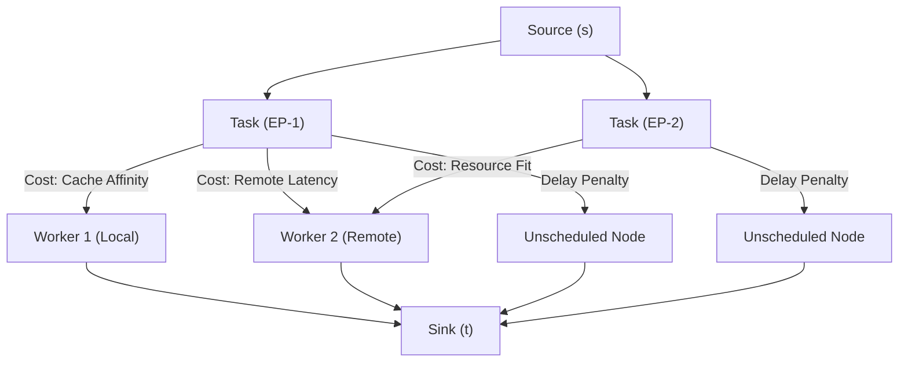

# ADR-0004: Learning-Augmented Build Scheduling

- **Status**: PROPOSED (DRAFT)
- **Date**: 2026-06-05
- **Deciders**: nrd
- **Source**: [Eos SAD §7](../architecture/eos-sad.md) |
  [Eos Scheduler Spec](../specs/eos-scheduler.md) |
  [Formal Model](../models/publishing-stack-layers.md)

---

**Document Classification**: Architecture Decision Record
**Audience**: Architects, Core Developers

---

## Context

The Eos scheduler currently uses tag-based set-containment
matching with Rendezvous hashing for cache affinity (SAD §7).
This is a correct baseline but leaves significant performance
on the table:

1. **No historical awareness**: Every build of atom X is
   treated identically regardless of whether X has been built
   a thousand times or never. The scheduler cannot distinguish
   a 2-second leaf compilation from a 30-minute monolithic
   link step until it's already running.

2. **No derivation DAG awareness**: When evaluation produces a
   derivation DAG, the scheduler sees a flat set of uncached
   derivations. It does not consider the graph structure when
   selecting which derivations to schedule as top-level build
   entries — missing opportunities to colocate tightly coupled
   subgraphs on the same machine.

3. **No multi-resource awareness**: Jobs are dispatched based
   on tag match and capacity, without considering whether the
   job's resource profile aligns with the worker's currently
   available resources. This causes fragmentation.

### The Derivation DAG Problem

This is the core scheduling challenge. A Nix evaluation
produces not a single derivation but a **directed acyclic
graph** of derivations — the top-level derivation and all
its transitive build dependencies:

```
top-level.drv
├── dep-a.drv
│   ├── dep-c.drv  (cached ✓)
│   └── dep-d.drv
├── dep-b.drv
│   ├── dep-d.drv  (shared with dep-a)
│   └── dep-e.drv  (cached ✓)
└── dep-f.drv
```

After filtering cached derivations, the remaining uncached
nodes form the **uncached sub-DAG**. The key insight from
Nix/snix's execution model is:

> **Scheduling a derivation for build automatically builds
> all its transitive dependencies.** The builder resolves
> the full dependency chain internally — there is no need
> to explicitly schedule each transitive node.

This means the scheduler's job is not to partition every
uncached node into groups. Its job is to **select optimal
entry points** (peaks) into the uncached DAG:

- Each entry point, when scheduled to a worker, causes the
  builder to transitively build everything below it on that
  same machine — with full locality (no cross-machine
  artifact transfers for transitive outputs).
- The scheduler tracks only the entry points, not every
  individual derivation in the graph.
- Parallelism comes from scheduling multiple entry points
  to different workers simultaneously.

The scheduling question becomes: **which derivations should
be the entry points, and which workers should execute them?**

#### Entry Point Selection

Naive approach (schedule only the top-level derivation):

- One worker builds the entire DAG sequentially
- Zero parallelism — all transitive dependencies serialize

Naive approach (schedule every uncached leaf independently):

- Maximum parallelism but redundant work — multiple workers
  may attempt to build the same shared dependency (dep-d
  appears under both dep-a and dep-b)
- Requires synchronization to avoid duplicate builds
- No locality benefit: outputs of shared dependencies must
  transfer through the global store

Optimal approach (select strategic entry points):

- Identify subgraph roots that capture useful amounts of
  transitive work without excessive overlap
- Schedule entry points that share dependencies to the same
  worker when possible (colocating dep-a and dep-b means
  dep-d builds once, locally)
- Assign heavy entry points to capable workers based on
  historical profiles or developer metadata

### The Atom-Id Advantage

Unlike generic build systems where task identity is fragile,
atom-id = `digest(anchor, label)` is **cryptographically
stable across versions**. Build #1 and build #1000 of atom X
share the same atom-id. This gives us a high-quality
prediction oracle:

- **Duration**: atom X consistently takes ~45s to evaluate,
  ~120s to build
- **Resources**: atom X consistently uses ~2GB RAM during
  build
- **DAG shape**: atom X's derivation DAG is structurally
  similar across versions (same dependencies, same depth)
- **Cache behavior**: atom X's dependencies are 90% cached
  after the first build

No ML training is needed — the atom protocol provides the
stable identifier that makes historical tracking trivially
reliable.

### Developer Metadata (Cold-Start Signal)

For atoms the scheduler has never encountered, developers
MAY provide scheduling hints via atom metadata tags:

```toml
[atom.metadata.scheduling]
expected-build-duration = "30m"
expected-build-memory   = "8GiB"
build-weight            = "heavy"
requires                = ["big-parallel", "kvm"]
```

This fills the cold-start gap. A developer publishing a
Chrome-scale build can signal "this is an extremely heavy
build that needs a capable machine" before the scheduler
has ever seen it. After the first build, historical profiles
take over and the metadata becomes a fallback.

**Priority order**: Historical profile (most data) >
developer metadata (domain knowledge) > system defaults
(conservative fallback).

---

## Decision

Augment the tag-based scheduler with four capabilities, each
grounded in academic prior art:

### 1. Historical Build Profiles (Unified Derivation Model)

Everything is a derivation. An atom is a derivation with
extra metadata (atom-id, developer scheduling hints), not a
separate classification. The profile store reflects this:

```
P[drv_name] → {
    build_duration:  ExponentialMovingAverage,
    build_memory:    ExponentialMovingAverage,
    build_cpu_cores: ExponentialMovingAverage,  // average or peak cpu cores
    output_size:     ExponentialMovingAverage,

    // enrichment (present when derivation is also an atom)
    atom_id:        Option<AtomId>,
    atom_metadata:  Option<SchedulingMetadata>,
}
```

Profiles are keyed by **derivation name** (the `name` field
from `StorePath`, e.g., `openssl-3.0.12`). Derivation names
are human-readable and structurally stable — the same
package produces similarly-named derivations across versions.

When a derivation that appears as a transitive dependency in
one atom's DAG is also an independently-published atom, the
scheduler recognizes this: the derivation name matches an
existing profile, and the atom-id (if present) provides
cross-version stability and access to developer-provided
scheduling metadata.

After each completed build, update `P[drv_name]` with
observed metrics.

**Prediction resolution** for a derivation:

1. **Exact match**: `P[drv_name]` — exact derivation name match (historical).
2. **Cross-version aggregate**: Aggregate EMA of the `atom_id` group — if the derivation is an atom, query the secondary index to aggregate historical profiles from other versions of the same atom (calibrating prediction for version bumps like `openssl-3.0.12` → `openssl-3.0.13`).
3. **Developer metadata**: `P[drv_name].atom_metadata` — developer-provided hints (if derivation is an atom).
4. **Defaults**: System defaults — conservative fallback.

**Cross-version querying**: The `atom_id` field is a
secondary index, not just a passive annotation. Grouping
profiles by `atom_id` gives the full historical trajectory
of an atom across versions — how build duration, memory, CPU,
and DAG shape have evolved over time. This is essential for
trend detection (is this atom's build getting heavier?),
EMA calibration, and operator visibility. Derivation names
change with versions (e.g., `openssl-3.0.12` →
`openssl-3.0.13`), but the atom-id groups them coherently.

This unified model avoids the complexity of maintaining
separate atom-level and derivation-level stores. A
derivation that is also an atom simply has richer metadata
in the same profile entry.

**Prior art**: Learning-augmented algorithms framework
(Mitzenmacher & Vassilvitskii, arXiv:2006.09123). Historical
profiles and developer metadata serve as the "prediction" in
the consistency/robustness/smoothness framework.

### 2. Entry Point DAG Construction and Dispatch

When evaluation produces a derivation DAG, the scheduler
constructs an **entry point DAG** — a coarsened dependency
graph where each node is an entry point (a derivation that
will be scheduled as a top-level build invocation) and edges
represent inter-entry-point ordering constraints.

#### 2a. Construction

```
Derivation DAG
    → (filter cached) →
Uncached Sub-DAG
    → (select entry points) →
Entry Point DAG
    → (topological dispatch) →
Worker Assignments
```

1. **Receive** the uncached sub-DAG from the evaluator
   (derivations whose outputs are not in the artifact store)

2. **Select entry points** — identify derivations that will
   serve as top-level build invocations. Entry points are
   selected **top-down** to cover the uncached sub-DAG:

   Nix derivation DAGs are highly detailed — many leaves
   are trivial (patches, source fetches, fixed-output
   derivations). Scheduling every leaf as an entry point
   would create a flood of tiny jobs whose completion
   blocks higher-level entry points, causing excessive
   scheduling overhead with no locality benefit. Instead,
   entry points are selected to **cover** the leaves
   beneath them:
   - **Start from the top-level derivation** and walk
     downward through the uncached sub-DAG
   - **Split at strategic points**: a node becomes a
     separate entry point (rather than being absorbed into
     its parent's transitive scope) if:
     - It is a **troublesome node** — predicted duration
       or resource usage above threshold (from `P[drv_name]`,
       developer metadata, or `requiredSystemFeatures`)
     - It is a **convergence point** — high fan-in node
       where many dependency paths converge. Making it an
       explicit entry point prevents multiple downstream
       builders from redundantly building it.
     - Its **subgraph cost** (aggregate predicted duration
       of all uncached transitives below it) exceeds a
       threshold, meaning it represents enough work to
       justify independent scheduling
   - **Everything else** is absorbed into the nearest
     covering entry point's transitive scope — the builder
     handles trivial leaves, patches, and fetches
     internally as part of the entry point's build.

     **Merging constraint (Relaxed)**: Since the formal model relaxes
     entry-point coverage to a relation, a non-entry-point derivation is
     permitted to exist in multiple entry points' transitive scopes
     simultaneously. At runtime, the builder's store-path locks deduplicate
     the build of this shared node. To optimize scheduling efficiency and
     avoid redundant worker load reservations, the selection heuristic
     _may_ choose to promote high fan-in convergence points to standalone
     entry points. However, there is no mathematical constraint forcing
     this promotion, preventing the macroscopic scheduling DAG from
     shattering under dense dependencies.

3. **Derive inter-entry-point dependencies** — if entry
   point A's transitive subgraph depends on the output of
   entry point B's subgraph, then A depends on B in the
   entry point DAG. This includes the user's top-level
   derivation: it depends on ALL sub-entry-points whose
   outputs it transitively needs.

   ```
   Entry Point DAG (derived from uncached sub-DAG):

   EP-top (user's top-level derivation)
   ├── depends on: EP-a (troublesome: heavy link step)
   │   └── depends on: EP-d (convergence point)
   ├── depends on: EP-b
   │   └── depends on: EP-d (shared)
   └── (EP-f absorbed into EP-top — trivial fetch)

   Dispatch order: {EP-d} → {EP-a, EP-b} → {EP-top}
   ```

4. **Assign entry points to workers** using the scoring
   function (§3). Entry points that share dependencies are
   preferentially colocated on the same worker to avoid
   redundant transitive builds.

#### 2b. Dispatch Protocol

Entry points are dispatched in **topological order** of the
entry point DAG:

1. **Root entry points** (no dependency on other entry
   points in the EP DAG) are dispatched immediately.

2. **When an entry point completes**, the scheduler:
   - Records its outputs as available in the artifact store
   - Checks which downstream entry points now have ALL their
     dependency entry points completed
   - Dispatches newly-unblocked entry points to workers

3. **The user's top-level derivation** is dispatched last —
   only after all its sub-entry-points have completed and
   their outputs are available. This ensures the top-level
   builder does not start building things already being
   worked on by other builders.

4. **Shared dependency protection**: If entry points A and B
   both depend on entry point D, D is built exactly once.
   Neither A nor B is dispatched until D completes. This
   prevents the scenario where A's and B's builders both
   independently attempt to build D's subgraph.

The scheduler tracks only the entry point DAG — not
individual derivations within each entry point's transitive
scope. The builder handles all transitive work below each
entry point internally, on the assigned worker, with full
locality.

**Two-level deduplication**: Dedup operates at two independent levels:

- **Entry point level (singleflight - Track B optimization)**: The scheduler's
  in-flight map deduplicates across concurrent requests that select the same
  entry point (same derivation hash). Since this is a pure software-level
  optimization rather than a protocol correctness invariant, it is omitted
  from the formal Track A correctness model. If implemented in software, the
  coalescing logic must isolate failure domains: it must distinguish between
  deterministic build failures (which can be safely broadcast to subscribers)
  and transient infrastructure failures (e.g., worker crash, disk failure).
  If the build owner fails due to infrastructure, subscribers must not inherit
  the failure; they must be re-dispatched to a healthy worker.
- **Derivation level (store locks - Track A correctness)**: Within a builder,
  snix's `PathInfoService` acquires exclusive locks on output store paths.
  If two builders (from different entry points or different requests) attempt
  to build the same transitive derivation, the second blocks on the lock
  and uses the first's result. This catches overlaps that the entry-point-level
  singleflight cannot — e.g., different entry point selections with shared
  transitives.

**Prior art**: Graphene/DagPS (Grandl et al., OSDI 2016) —
troublesome task identification and pre-allocation in
multi-resource space-time.

### 3. Multi-Criteria Placement Scoring

For each feasible worker `w` and entry point `e`, compute:

```
score(w, e) = α · affinity(w, e)
            + β · resource_fit(w, e)
            + γ · availability(w)
```

Where:

- **affinity(w, e)**: Local Rendezvous Hash score for atom
  content locality. Measures likelihood that worker `w`
  already has entry point `e`'s source tree and transitive
  inputs cached locally.

- **resource_fit(w, e)**: Capacity-normalized resource alignment
  between the entry point's predicted resource vector $\mathbf{r}_e$ and
  the worker's available capacity vector $\mathbf{a}_w$, normalized by the
  worker's total capacity vector $\mathbf{c}_w$ (as established in Tetris):
  $$\text{resource\_fit}(w, e) = \sum_{i \in \{\text{cpu}, \text{mem}, \text{disk}\}} \left( \frac{r_{e,i}}{c_{w,i}} \cdot \frac{a_{w,i}}{c_{w,i}} \right)$$
  Normalizing each dimension by total worker capacity $c_{w,i}$ converts
  raw resource values (e.g., CPU cores vs. memory bytes) into unitless, comparable
  fractions in $[0,1]$ before combination. This prevents large byte ranges from
  dominating CPU count while preserving the absolute magnitude of tasks to steer
  heavy builds to capable workers (preventing the magnitude erasure of cosine similarity).

- **availability(w)**: Headroom ratio:
  `1 - (w.current_load / w.max_capacity)`
  Prefers workers with more spare capacity (dimensionless $\in [0,1]$).

Weights `α`, `β`, `γ` are operator-tunable. To protect against adversarial or
highly inaccurate predictions, the effective weight of the resource fit term
is dynamically decayed based on the exponential moving average (EMA) of the absolute
relative prediction error:
$$\beta_e = \beta \cdot e^{-\lambda \cdot \text{EMA}(|\eta_e|)}$$
where $\text{EMA}(|\eta_e|)$ is the running average of the absolute relative prediction
error magnitude for that atom/derivation group, and $\lambda > 0$ is a decay
constant. If predictions are systematically incorrect (even if stable and having zero variance),
$\text{EMA}(|\eta_e|)$ grows, causing $\beta_e \to 0$ and safely falling back to the
prediction-free baseline. Operators running homogeneous clusters may set $\beta = 0$.

**Prior art**: Tetris (Grandl et al., SIGCOMM 2014) —
multi-resource dot-product alignment heuristic.

#### 3a. Operational Tuning and Sensitivity Analysis

Production scheduling performance is highly sensitive to the prediction decay constant ($\lambda$) and the entry-point coarsening thresholds.

##### Prediction Decay Constant ($\lambda$) Tuning

The decay constant $\lambda$ governs the rate at which the resource-fit optimization term degrades under prediction errors. A primary design goal is balancing responsiveness to systematic prediction error against resilience to ambient noise (e.g., I/O jitter, network drops, or CPU throttling):

- **High Sensitivity ($\lambda \gg 1$)**: Setting $\lambda$ too high causes the scheduler to treat minor ambient variance as a systematic failure. A transient network slowdown during a build will temporarily inflate $\text{EMA}(|\eta_e|)$, causing $\beta_e \to 0$ rapidly. The scheduler will discard valuable historical profiles and fall back to the prediction-free baseline prematurely, resulting in suboptimal multi-resource bin-packing and increased cluster fragmentation.
- **Low Sensitivity ($\lambda \approx 0$)**: Setting $\lambda$ too low makes the scheduler sluggish to react to true systematic prediction errors (e.g., when a package version bump drastically changes its dependency tree or memory usage, or when developer-provided cold-start metadata is highly inaccurate). The scheduler will continue to place tasks using incorrect estimates, leading to resource overloading, queue stalls, and load imbalance.

To tune $\lambda$, operators should align it with the expected coefficient of variation ($CV$) of healthy build execution times. Let $CV = \sigma_{\text{ambient}} / \mu_{\text{duration}}$ represent the standard deviation of ambient duration jitter under nominal conditions. The decay constant should satisfy:

- $e^{-\lambda \cdot CV} \approx 1$ (nominal jitter does not decay weight).
- $e^{-\lambda \cdot E_{\text{sys}}} \approx 0$ for a systematic error magnitude $E_{\text{sys}}$ (e.g., $E_{\text{sys}} \ge 1.0$, corresponding to a $100\%$ or greater estimation error).

##### Entry-Point Coarsening Thresholds

The entry-point selection heuristic determines which nodes in the uncached sub-DAG are promoted to standalone entry points ($S$) and which are merged into transitive parent scopes. The thresholds for promote-vs-merge (subgraph cost threshold, convergence/fan-in threshold, and resource limits) dictate the scheduling granularity:

- **Aggressive Coarsening (High Thresholds)**: Too few entry points are promoted. Trivial dependencies, convergence points, and even heavy derivations are absorbed into a small number of top-level tasks. This serializes execution, forcing individual workers to build large subgraphs sequentially and starving the rest of the cluster of parallel execution opportunities.
- **Weak Coarsening (Low Thresholds)**: Too many entry points are promoted. The scheduler shatters the DAG into a high volume of tiny tasks (e.g., short compile tasks, small script runs). This leads to:
  1. High scheduling queue overhead.
  2. Destruction of input cache locality, as sub-DAG nodes are scattered across different workers rather than executing on the same machine.
  3. Contention and latency on store-level locks (`PathInfoService`), as multiple workers block waiting for shared transient outputs to sync.

Production environments should calibrate coarsening thresholds to the _scheduling latency_ of the cluster. The minimum subgraph cost threshold must be significantly larger than the average round-trip scheduling latency (dispatch + worker pickup overhead) to ensure that the parallel execution benefit outweighs the coordination cost.

### 4. Local Rendezvous Hashing (LRH)

Replace standard Highest Random Weight (HRW) hashing with
Local Rendezvous Hashing, which restricts candidate
selection to a cache-local window of `C` neighbors on a
virtual ring:

- Near-optimal load balance (comparable to multi-probe
  consistent hashing)
- ~6.8× higher throughput than standard HRW by exploiting
  CPU cache locality during hash computation
- 0% excess churn under topology-fixed failures
- O(log|R| + C) lookup complexity

**Prior art**: Local Rendezvous Hashing
(arXiv:2512.23434, 2025).

### 5. Computational Complexity

The entire scheduling pipeline runs in **polynomial time**,
linear in the DAG size plus the product of entry points
and workers. No phase has exponential or super-polynomial
cost.

| Phase                 | Operation                                     | Complexity                               |
| :-------------------- | :-------------------------------------------- | :--------------------------------------- |
| DAG construction      | Topological sort + cache filtering            | $O(\|V'\| + \|E'\|)$                     |
| Entry point selection | Greedy top-down walk with fan-in/cost checks  | $O(\|V'\| + \|E'\|)$                     |
| EP DAG derivation     | Transitive closure on selected set            | $O(\|S\|^2)$ worst case                  |
| Scoring (per EP)      | Evaluate $\text{score}(w, e)$ for all workers | $O(\|W\| \cdot d)$                       |
| Full dispatch loop    | Score + assign all $\|S\|$ entry points       | $O(\|S\| \cdot \|W\| \cdot d)$           |
| LRH lookup            | Per-assignment cache affinity                 | $O(\log\|R\| + C)$                       |
| Singleflight check    | Hash map lookup/insert                        | $O(1)$ amortized                         |
| EMA update            | Per-completion profile update                 | $O(1)$                                   |
| **Total pipeline**    | **One scheduling pass**                       | $O(\|V'\| + \|E'\| + \|S\| \cdot \|W\|)$ |

Where:

- $\|V'\|, \|E'\|$ = uncached sub-DAG nodes and edges
- $\|S\|$ = selected entry points ($\|S\| \leq \|V'\|$,
  typically $\|S\| \ll \|V'\|$ due to coarsening)
- $\|W\|$ = number of candidate workers
- $d$ = resource dimensions (constant, typically 3:
  CPU, memory, disk)
- $\|R\|$ = LRH ring size, $C$ = cache-local window
- EP DAG derivation is $O(\|S\|^2)$ in the worst case
  (all-pairs reachability on the coarsened set) but
  typically much smaller since $\|S\| \ll \|V'\|$

**Key property**: The NP-hard optimal entry point
selection is sidestepped by the greedy heuristic, which
runs in $O(\|V'\| + \|E'\|)$. The tradeoff is between
selection quality (captured by $\alpha$ in Theorem 2) and
computational cost. A global MILP solver could potentially
find a better $\alpha$ but at exponential cost —
unacceptable when the scheduling decision itself must
complete in sub-second time.

**Implementation note**: The dominant cost in practice is
the scoring loop $O(\|S\| \cdot \|W\|)$. For a cluster
of 100 workers and a DAG coarsened to 50 entry points,
this is 5,000 score evaluations per scheduling pass —
trivially fast. At federated scale ($\|W\| > 1000$), the
min-cost flow formulation (§Future Work) replaces the
per-pair scoring with a global flow optimization.

---

## Guarantees

The learning-augmented framework provides three formal
properties, now backed by machine-checked proofs
(Lean 4, Track B) and model-checked protocol verification
(TLA+, Track A). See `docs/models/lean/` and
`docs/models/tla/`.

### Consistency (Machine-Checked — Theorem 2)

When historical predictions are $\varepsilon$-accurate
($|d(s) - \hat{d}(s)| \leq \varepsilon \cdot \hat{d}(s)$),
the heuristic assignment $\sigma_H$ satisfies:

$$
M(\sigma_H) \leq \alpha \cdot \frac{1 + \varepsilon}
{1 - \varepsilon} \cdot M(\sigma^*)
$$

where $\alpha$ is the heuristic's base approximation ratio
on perfectly-predicted inputs, and $\sigma^*$ is the optimal
offline assignment. For small $\varepsilon$, this simplifies
to $\alpha \cdot (1 + 2\varepsilon + O(\varepsilon^2))$.

This bound cleanly separates two concerns: heuristic quality
($\alpha$, a function of DAG structure and scoring function)
and prediction degradation ($(1+\varepsilon)/(1-\varepsilon)$,
a function of profile accuracy). The implementation can
independently tune each axis.

**Implementation note**: After each build, compute observed
$\varepsilon$ from `|d_actual - d_predicted| / d_predicted`
and track it via EMA. This provides a live monitorable
metric for how close the system is to the proven bound.

### Robustness (Machine-Checked — Theorem 3)

When predictions are arbitrarily wrong ($\eta \to \infty$),
the system self-heals:

1. **Assignment stability** (Lemma 3.1): If the prediction
   perturbation satisfies $2P < \Delta_{\min}$ (twice the
   perturbation is less than the baseline scoring gap), then
   $\sigma_H = \sigma_{\text{base}}$ — the heuristic makes
   the same assignment as the prediction-free baseline.

2. **EMA convergence**: Under sustained prediction error
   $\eta \geq \eta_0 > 0$, the EMA of error magnitudes
   satisfies $\text{EMA}_n \geq (1 - \gamma^n) \eta_0 +
   \gamma^n E_0$, causing the prediction weight $\beta_e$
   to decay geometrically toward zero.

Together: bad predictions → EMA grows → $\beta_e$ decays →
perturbation shrinks → eventually $2P < \Delta_{\min}$ →
assignment equals baseline. The convergence is automatic
and requires $O(\ln(\beta R_{\max}/\Delta_{\min}))$
observations.

### Smoothness

As prediction error increases gradually (incremental version
changes, slowly shifting build profiles), scheduling quality
degrades proportionally via the $(1+\varepsilon)/(1-\varepsilon)$
factor, not catastrophically. When error becomes sustained,
the EMA decay mechanism automatically collapses the scoring
function to the prediction-free baseline.

---

## Optimality Assessment

The formal proofs (§Appendix) establish that the algorithm
is **correct** (Track A) and achieves **bounded quality**
relative to an optimal offline schedule on a fixed DAG
(Track B). But "bounded" is not "optimal." This section
documents the specific tradeoffs.

### Where the Algorithm Departs from Optimality

To achieve $O(\|V'\| + \|E'\| + \|S\| \cdot \|W\|)$
greedy dispatch (§5), the design makes four intentional
mathematical compromises relative to a theoretical
omniscient MILP solver:

1. **Graph coarsening blindspot**: Finding the optimal
   antichain cover of a weighted DAG to minimize
   distributed makespan is NP-hard. The entry point
   selection uses a greedy heuristic — it cannot foresee
   if bundling a subgraph will accidentally serialize
   tasks that could have been parallelized, or fragment
   what should be colocated. This gap is captured by
   $\alpha$ in Theorem 2.

2. **Myopic dispatch**: The moment an entry point becomes
   `ready`, it is assigned to the highest-scoring worker.
   Greedy dispatch cannot hold a worker idle in
   anticipation of an imminent high-priority entry point.
   Example: a 2-core leaf assigned to a 128-core worker
   via cache affinity, blocking a critical 120-core entry
   point that unblocks 5 seconds later. An optimal offline
   scheduler (HEFT-style) computes the temporal chain and
   intentionally delays assignment.

3. **Submodular lock contention**: The relaxed coverage
   mapping permits non-entry-point derivations to exist in
   multiple entry points' transitive scopes. When two
   workers concurrently build entry points with shared
   transitives (e.g., `openssl`), the store-level lock
   causes one to block. The blocked worker's reserved
   CPU/memory sits idle. A global solver could calculate
   submodular overlap costs and perfectly stagger or route
   tasks to eliminate lock-wait time.

4. **Federation topology blindness**: LRH measures logical
   hash-ring distance, not physical WAN bandwidth or
   inter-cluster latency. Transferring a 50GB artifact
   from Tokyo to Virginia incurs massive wall-clock
   penalties invisible to the scoring function. The
   deferred min-cost flow formulation (§Future Work)
   addresses this by encoding federation topology as edge
   costs.

### Why It Is Highly Efficacious for This Domain

The algorithm exploits three domain-specific realities
that close most of the gap to theoretical optimality:

1. **Nix granularity solution**: Nix derivation DAGs are
   wildly bimodal — a few colossal linchpin tasks plus
   thousands of trivial micro-tasks (patches, fetches,
   hooks). Academic schedulers choke on this; scheduling
   10,000 micro-tasks across a network incurs RPC overhead
   that dwarfs compute time. Entry point coarsening forces
   the distributed scheduler to handle only macroscopic
   peaks, offloading trivial leaves to the builder's
   native transitive execution with perfect local data
   locality and zero network overhead.

2. **Atom-id prediction oracle**: The hardest part of DAG
   scheduling is predicting task durations. Advanced
   systems (Decima) use graph neural networks requiring
   expensive training. Because Nix evaluation is pure and
   `atom-id = digest(anchor, label)` is cryptographically
   stable across versions, a cheap EMA over historical
   observations achieves the performance of a sophisticated
   learning system. The atom protocol IS the prediction
   oracle.

3. **Fail-safe packing**: The $\beta_e$ decay mechanism
   (§3) guarantees that when predictions fail, the scoring
   function smoothly degrades to a cache-affinity baseline
   rather than actively making adversarial placements that
   crash workers via OOM kills — the primary cause of
   CI/CD bottlenecking in production.

### The Simulation Gap

Formal proofs validate bounds on **fixed, abstract DAGs**
but cannot validate that the heuristic thresholds
(troublesome node cost, convergence fan-in limit, subgraph
cost threshold) are well-calibrated for **real Nix
derivation shapes**. The $\alpha$ factor in Theorem 2
absorbs heuristic quality — the proofs guarantee bounded
quality for any $\alpha$ but do not tell us what $\alpha$
is in practice.

Bridging this gap requires trace-driven simulation:

1. Extract real derivation DAGs from `nixpkgs` (e.g.,
   `chromium`, `kde-plasma`, `linux`) as trace corpus
2. Extract actual build durations and resource profiles
   from Hydra/Cachix as ground truth
3. Implement the entry point selection + scoring in a
   single-threaded Rust simulator
4. Sweep heuristic thresholds and measure simulated
   makespan against an HRW-only baseline

If the simulator demonstrates order-of-magnitude DAG
reduction without serializing the critical path, the
algorithm's practical efficacy is confirmed beyond what
formal proofs alone can establish.

---

## Rejected Alternatives

### GNN + Reinforcement Learning (Decima)

Decima (Mao et al., SIGCOMM 2019, arXiv:1810.01963) uses
graph neural networks to embed DAG structure and an RL agent
to make scheduling decisions. Rejected because:

1. **No simulator**: Decima requires a faithful cluster
   simulator for RL training. Building one is substantial
   engineering effort outside our core mission.
2. **No production deployments**: Even the authors only
   demonstrated on a 25-node prototype. No known production
   use.
3. **Opaque scheduling**: RL policies are non-interpretable.
   Debugging "why was this job placed here?" requires
   inspecting neural network weights.
4. **Generalization failure**: RL policies trained on one
   workload distribution don't generalize to another.
   Workload shifts require retraining.
5. **Unnecessary**: Atom-id stability gives us the prediction
   oracle that Decima needs a simulator to learn. Historical
   profiles with the learning-augmented framework provide
   the same adaptive benefit with provable guarantees and
   deterministic, debuggable behavior.

### Peer-to-Peer Work Stealing

No production build system uses inter-worker work stealing
for coarse-grained build tasks. Builds are non-migratable —
the cost of abort-and-re-execute exceeds the benefit of
rebalancing. The locality-aware gain function from SLAW
(Guo et al., IPDPS 2010) is valuable as a placement
heuristic (the `resource_fit` scoring term), not as a
runtime stealing mechanism.

Additionally, Nix's execution model (builder transitively
resolves dependencies internally) means there is no
meaningful "steal" granularity — you cannot steal a
transitive dependency mid-build.

### MILP Solver (TetriSched)

TetriSched (Tumanov et al., EuroSys 2016) uses Mixed Integer
Linear Programming for global rescheduling. Adds a solver
dependency (CPLEX/Gurobi/SCIP) and solving time may exceed
scheduling time at smaller scales. Rejected for the initial
implementation but may be revisited if the MILP formulation
aligns well with the formal model (§Appendix).

### Min-Cost Flow (Firmament) — Deferred, Not Rejected

Firmament (Gog et al., OSDI 2016) models scheduling as
min-cost max-flow on a directed graph. Flow network encodes
tasks, machines, racks, locality, fairness, and anti-affinity
as edge costs. Incremental MCMF solving achieves sub-second
placement at 10,000+ machines.

This was initially dismissed on the assumption of small
cluster sizes. That assumption is wrong. The target
architecture includes **federated build sharing between
clusters** — potentially global-scale decentralized build
distribution for open-source ecosystems. At that scale,
min-cost flow's ability to encode complex placement
constraints (data locality, trust boundaries, federation
policies) as edge costs in a single optimization is
compelling.

**Status**: Deferred to a follow-up ADR. The initial
implementation uses the heuristic scoring function (§3).
Min-cost flow is a candidate replacement for the scoring
function when:

- Cluster sizes exceed ~1000 workers
- Federation introduces cross-cluster placement decisions
- The formal model (§Appendix) identifies properties that MCMF
  can guarantee and the heuristic cannot

---

## Consequences

### Positive

- **Predictable improvement**: Repeated builds of the same
  atoms (the common case in CI/CD) benefit from historical
  awareness without any configuration.
- **DAG-aware locality**: Entry point selection colocates
  related subgraphs on the same worker. The builder handles
  all transitive work internally with full locality.
- **Reduced scheduler tracking**: The scheduler tracks entry
  points, not individual derivations. The builder's internal
  dependency resolution handles the rest.
- **Resource efficiency**: Multi-resource scoring reduces
  fragmentation, improving effective cluster utilization.
- **Graceful degradation**: Cold starts with developer
  metadata degrade to informed estimates. Cold starts without
  metadata degrade to conservative defaults. Never worse than
  the current baseline.
- **Deterministic and debuggable**: No ML inference in the
  scheduling loop. Historical profiles are inspectable.
  Scheduling decisions are reproducible given the same state.

### Negative

- **Storage overhead**: Historical build profiles must be
  persisted. EMA per atom-id is small (~100 bytes), but
  scales with the number of distinct atoms.
- **Entry point quality is heuristic**: The selection
  algorithm uses greedy heuristics, not a provably optimal
  algorithm. Quality depends on prediction accuracy and
  DAG structure.
- **Tuning surface**: Three operator-tunable weights (α, β,
  γ) plus entry point selection thresholds. Sensible defaults
  should cover most cases.

### Risks

- **Store-level transitive dedup**: Two entry points on
  different workers whose transitive scopes share
  derivations will both attempt to build the shared
  derivations. The store-level lock mechanism
  (snix `PathInfoService`) prevents redundant work — the
  second builder blocks until the first completes and uses
  the cached result. This is correct but adds latency
  (blocking wait). Mitigation: the convergence point
  promotion rule in entry point selection minimizes shared
  non-EP derivations, reducing how often store-level dedup
  is needed.
- **EMA lag**: Exponential moving average adapts slowly to
  sudden changes in build characteristics. Mitigation:
  configurable decay factor; operators can flush profiles.
- **Chain pathology**: A deep linear dependency chain has
  only one useful entry point (the top). This serializes
  the build on one worker. Mitigation: this is inherent to
  the dependency structure — there IS no parallelism to
  extract from a linear chain. The scheduler correctly
  identifies this.

### Implementation Notes

Derived from formal verification (§Appendix) and the
optimality assessment above:

1. **Critical path priority**: When multiple entry points
   become `ready` simultaneously, the dispatcher should
   sort them by estimated critical-path contribution
   (longest weighted path to the DAG root) before assigning.
   Greedy FIFO readiness ordering risks assigning trivial
   entry points to capable workers, blocking imminent
   critical tasks. The critical path computation is
   $O(\|S\|)$ on the coarsened DAG (a single reverse
   topological pass with max-aggregation).

2. **Store lock contention monitoring**: When overlapping
   coverage causes store-level lock blocking, the blocked
   worker's reserved resources are idle. The implementation
   should track lock-wait duration as a per-entry-point
   metric and feed it back into the convergence-point
   promotion threshold — high contention on a specific
   transitive dependency is a signal to promote it to an
   explicit entry point.

3. **Federation-aware transfer cost**: The $\tau(s', s)$
   transfer time in the formal model should be populated
   from actual inter-cluster RTT measurements (e.g., via
   periodic pings or artifact store latency probes), not
   from a constant default. For intra-cluster assignments,
   $\tau \approx 0$. For cross-region assignments, $\tau$
   may dominate makespan — the scoring function's
   `affinity` term partially captures this via LRH but
   does not model WAN bandwidth constraints.

4. **Coverage properties as debug assertions**: The four
   `EosModel` properties (total coverage, self-coverage,
   transitive containment, downward closure) from the Lean
   proof should be implemented as `debug_assert!` checks on
   the output of the entry point selection algorithm. These
   are $O(\|S\| \cdot \|V'\|)$ and should be gated behind
   a debug or test build flag.

5. **ε-monitoring**: After each completed build, compute
   the observed prediction error $\varepsilon = |d - \hat{d}|
   / \hat{d}$ and report it as a metric. The consistency
   bound $(1+\varepsilon)/(1-\varepsilon)$ is a live,
   monitorable quantity — operators can directly observe how
   close the system is to the proven worst-case ratio.

---

## Prior Art

| Technique                       | Source                                  | Application                            |
| :------------------------------ | :-------------------------------------- | :------------------------------------- |
| Troublesome task pre-allocation | Graphene (OSDI 2016)                    | Entry point identification             |
| Multi-resource dot-product      | Tetris (SIGCOMM 2014)                   | Placement scoring                      |
| Learning-augmented framework    | Mitzenmacher & Vassilvitskii (2020)     | Consistency/robustness guarantees      |
| Greedy stochastic scheduling    | Gupta et al. (Math OR 2020)             | Greedy with predictions is competitive |
| Permutation predictions         | Lindermayr & Megow (SPAA 2022)          | Robustness bounds                      |
| Local Rendezvous Hashing        | arXiv:2512.23434 (2025)                 | Cache-local HRW replacement            |
| Multi-resource DAG bounds       | Kedad-Sidhoum et al. (arXiv:2106.07059) | Approximation ratio bounds             |
| Request coalescing/singleflight | Fitzpatrick (groupcache), BuildBuddy    | Cross-request deduplication            |
| Build systems formalization     | Mokhov et al. (ICFP 2018)               | Cloud build memoization model          |

### Open Research Area

No academic work addresses scheduling with content-addressed
storage semantics, where:

- Build outputs are globally shared via a content-addressed
  store (output locality is trivial)
- Build inputs (atom source trees) have per-worker locality
  (input locality is the scheduling concern)
- Task identity is content-addressed and stable across
  versions (atom-id)
- The builder internally resolves transitive dependencies,
  reducing the scheduler's responsibility to entry point
  selection

This intersection of CAS, stable identity, and DAG entry
point selection is a potential novel contribution.

---

## Open Questions

### Resolved

1. **DAG visibility** — RESOLVED. The snix evaluator
   accumulates the full derivation DAG as a side-effect in
   `KnownPaths` (owned by `SnixStoreIO`). After evaluation:
   - `known_paths.get_derivations()` iterates all derivations
   - `Derivation.input_derivations` provides dependency edges
     (`BTreeMap<StorePath, BTreeSet<String>>`)
   - `PathInfoService.get(digest)` provides per-derivation
     cache checks
   - `KnownPaths` enforces a topological ordering invariant
     (all input derivations registered before dependents)

   The Eos scheduler can therefore introspect the full DAG
   after evaluation completes: walk `input_derivations` edges,
   query `PathInfoService` for each node, and construct the
   uncached sub-DAG and entry point DAG proactively.

2. **Dynamic re-evaluation** — RESOLVED (unnecessary).
   Because evaluation is deterministic (invariant
   `[eos-eval-pure-eval]`) and derivation hashes are
   content-addressed, the uncached sub-DAG is fully
   determined at construction time. When entry point D
   completes, the downstream cache state is exactly what
   was predicted — D's outputs are now cached, and this was
   already factored into the entry point DAG's dependency
   edges. Re-evaluation would produce the same result.
   The entry point DAG is constructed once and dispatched
   topologically without re-computation.

3. **Entry point granularity** — RESOLVED (algorithmic, not
   a static parameter). Granularity is determined per
   derivation by analyzing the subgraph below each candidate
   entry point:
   - **Aggregate predicted cost**: sum historical build
     durations for all uncached transitive dependencies
     below the candidate (using both atom-level and
     derivation-level profiles — see Q5 resolution)
   - **Subgraph shape**: depth (critical path length) and
     width (max parallelism within the subgraph)
   - A candidate becomes an explicit entry point if:
     - Its aggregated cost exceeds a threshold (it's
       "worth" scheduling independently)
     - It has high fan-in (convergence point — many
       downstream nodes depend on it)
     - It is a troublesome node (heavy resource profile)
     - Its subgraph is deep enough that internal parallelism
       would be wasted on a single builder

   Small, tightly-coupled subgraphs are absorbed into their
   parent entry point. Large, loosely-coupled subgraphs are
   split at convergence points.

4. **Historical profile schema** — RESOLVED (unified
   derivation model). Everything is a derivation at the
   base layer. An atom is a derivation with extra metadata
   (atom-id, developer scheduling hints), not a separate
   classification. One profile store keyed by derivation
   name (`P[drv_name]`), with optional atom enrichment.

   This eliminates the two-table split (atom-level vs
   derivation-level) that added classification complexity
   without clear benefit. A derivation appearing as a
   transitive dep in one DAG and as an independent atom
   in another context shares the same profile entry —
   the scheduler recognizes it automatically via name
   match and uses the atom metadata if available.

5. **Cross-request deduplication** — RESOLVED (singleflight
   pattern as a Track B optimization). This is a well-understood,
   production-proven pattern called **request coalescing** (Go: "singleflight",
   Bazel backends: "action merging", CDN: "request collapsing").

   Mechanism: maintain a concurrent map of in-flight entry
   point builds keyed by derivation hash:

   ```
   in_flight: Map<DrvHash, SharedFuture<BuildResult>>
   ```

   When dispatching an entry point:
   1. Check artifact store → HIT: skip, already built
   2. Check `in_flight` map → IN-FLIGHT: subscribe to the
      existing future, await the result
   3. Neither: insert a new future into `in_flight`, dispatch
      the build to a worker, broadcast the result to all
      subscribers on completion, remove from map

   **Failure Domain Isolation (Crucial)**: To preserve sequential request
   equivalence (bisimulation), the coalesced future must differentiate between
   deterministic build failures and transient infrastructure/worker failures. If a
   build owner fails due to an infrastructure issue (e.g. worker network dropout,
   hardware failure, or disk crash), the scheduler must not propagate this failure
   to subscribers. Instead, the subscribers must safely transition back to
   `ready` and be re-dispatched independently to a healthy worker.

   **Prior art**: BuildBuddy's action merging (Bazel RBE),
   Nix's store-level output path locks, Go's
   `golang.org/x/sync/singleflight`, Varnish's request
   coalescing, Dask's automatic DAG deduplication. Also
   formalized in Mokhov, Mitchell & Peyton Jones,
   "Build Systems à la Carte" (ICFP 2018) under "cloud
   builds" — shared computation via content-addressed
   memoization.

   **Key design decisions**:
   - **Scope**: Single-node in-memory map (sufficient with
     centralized scheduler — our architecture)
   - **Failure**: If in-flight build fails deterministically, all waiters get
     the error. If it fails due to infrastructure, waiters are re-dispatched.
   - **Cancellation**: If original requester cancels but
     other waiters exist, the build continues (reference
     counting on the shared future)
   - **Eviction**: Entries removed from `in_flight`
     immediately on completion/resolution — this is not a cache, only
     concurrent dedup.

---

## Relationship to Other ADRs

- **ADR-0002**: Defines the worker boundary. This ADR assumes
  workers are independent processes communicating via Cap'n
  Proto (per ADR-0002). The scheduling algorithm runs in
  the daemon.
- **ADR-0003**: Defines deployment modes. In monolithic mode,
  the DAG entry point selection still applies (scheduling
  across threads), but cross-machine transfer costs are zero.
  The algorithm degrades gracefully: `affinity` and
  `resource_fit` still provide value; only the transfer cost
  component becomes irrelevant.

---

## Appendix: Formal Verification Results

The scheduling model has been formally verified through a
two-track approach. The formal model is defined in
`docs/models/eos-scheduling.md`.

### Track A: Protocol Correctness (TLA+)

The dispatch protocol was model-checked across four DAG
topologies (linear chain, diamond fork-join, convergence,
independent) using TLC with weak fairness.

**Verified properties:**

| Property                | Type     | Status |
| :---------------------- | :------- | :----- |
| Ordering soundness (P1) | Safety   | ✅     |
| Capacity safety (P4)    | Safety   | ✅     |
| Artifact completeness   | Safety   | ✅     |
| Progress (P5)           | Liveness | ✅     |
| Completion prop. (P6)   | Liveness | ✅     |

Key finding: `CascadeFail` is **required** for liveness.
Without active failure propagation, dependent tasks hang
in `pending`/`ready` indefinitely after a dependency fails.
This must be implemented as a mandatory transition, not an
optional recovery mechanism.

See `docs/models/tla/` for specifications and topology
model instantiations.

### Track B: Optimization Quality (Lean 4)

Four theorems machine-checked with Mathlib. Zero `sorry`
placeholders, zero custom `axiom` declarations.

| Theorem | Statement                                                                             | Status        |
| :------ | :------------------------------------------------------------------------------------ | :------------ | --------- | ----- | ------------------------ | --- |
| Thm 1   | Valid entry point selection exists (identity witness)                                 | ✅            |
| Thm 2   | $M(\sigma_H) \leq \alpha \cdot \frac{1+\varepsilon}{1-\varepsilon} \cdot M(\sigma^*)$ | ✅            |
| Thm 3   | Assignment stability under perturbation; EMA convergence                              | ✅            |
| Thm 4   | Singleflight saves $                                                                  | \bigcup V'\_i | \leq \sum | V'\_i | $, equality iff disjoint | ✅  |

All assumptions enter as explicit hypotheses on theorem
signatures (non-negative durations, $\varepsilon < 1$,
well-founded DAG order) or as type-level constraints
(`Fintype`, `DecidableEq`). These correspond to inherent
properties of the Rust type system and physical
non-negativity.

Key finding: Theorem 2's inductive step requires
$\tau(s', s) \geq 0$ (transfer times are non-negative).
The implementation must not encode cache time savings as
negative transfer times — these are separate concerns.

See `docs/models/lean/` for proof sources.

### Remaining Open Items

1. **Federation liveness (P7)**: Requires real-time bounds
   not expressible in TLA+ temporal logic. Mitigate with
   configurable timeouts and worker reassignment.
2. **Graph coarsening optimality**: The entry point
   selection problem is NP-hard. Theorem 2 bounds
   assignment quality on any fixed DAG, cleanly separating
   it from DAG decomposition quality ($\alpha$).
3. **μ-makespan transient bound**: During EMA convergence,
   the quantitative makespan penalty is not mechanized.
   Low risk: the transient is geometrically short and
   capacity safety (Track A) holds throughout.

## Future Work: Federated Scale via Min-Cost Max-Flow (MCMF)

While the multi-criteria placement heuristic (§3) is highly suitable for medium-sized, homogeneous clusters, large-scale federated deployments (scaling past 1,000+ nodes across disparate administrative or geographical boundaries) introduce complex constraints. At this scale, we propose exploring a flow-based scheduling model based on the Quincy (SOSP 2009) and Firmament (OSDI 2016) architectures as a successor to the heuristic scoring model.

### Graph Formulation

Instead of evaluating independent scores for each task-worker pair, scheduling is modeled as a Min-Cost Max-Flow (MCMF) optimization problem on a directed graph $F = (V_F, E_F)$. The network is constructed dynamically at each scheduling iteration:

1. **Sources and Sinks**: A global source node $s$ injects flow, and a global sink node $t$ consumes it.
2. **Task Nodes**: Each ready entry point $e \in S$ is represented by a node. Edges from the source $s$ to each task node $e$ have capacity $1$ and cost $0$.
3. **Worker Nodes**: Each worker $w \in W$ is represented by a node.
4. **Placement Edges**: Edges are added from task nodes to candidate worker nodes. The capacity is $1$. The cost of this edge encodes all scheduling preferences:
   - **Locality Cost**: Lower cost is assigned if the candidate worker $w$ has cached input files (LRH ring affinity).
   - **Resource Fit Cost**: Tetris-style resource alignment is encoded as a cost term (higher alignment = lower cost).
   - **Federation latency cost**: Higher costs are assigned to edges crossing geographic or regional network boundaries.
5. **Cluster and Federation Nodes**: Intermediate aggregator nodes represent local clusters, racks, or geographical regions. They can enforce hierarchy-aware placement and bound cross-region bandwidth.
6. **Trust and Policy Boundaries**: Trust constraints can be modeled directly in the topology. For example, if a task $e$ requires a high-trust builder (e.g., for signed artifact compilation), placement edges are only constructed to workers belonging to the trusted sub-network. Edges to untrusted public peer nodes are omitted or assigned a penalty cost representing verification overhead.
7. **Unschedulable/Delay Nodes**: To allow tasks to wait for local resources rather than being immediately dispatched to a suboptimal remote worker, tasks connect to the sink $t$ via "unscheduled" nodes. The cost on these edges represents the penalty of delaying the task.



### Advantages of MCMF at Federated Scale

- **Global Optimization**: Rather than scheduling tasks greedily one-by-one (which can lead to bad placements for later tasks due to capacity exhaustion), MCMF solves placement globally across all ready tasks in a single optimization pass.
- **Expressive Policy Encoding**: Locality, resource capacity, federation topology, and trust boundaries are unified into a single mathematical abstraction (costs and capacities) rather than balancing separate, competing heuristic terms.
- **Incremental Solver Performance**: Firmament demonstrated that by using incremental MCMF solvers (e.g., cost-scaling algorithms like CS2), the solver can reuse the previous iteration's solution, achieving sub-second scheduling times for tens of thousands of tasks on 10,000+ machines. This eliminates the scalability bottlenecks typically associated with flow network solvers.
