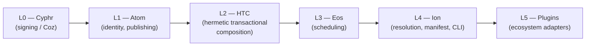

# ADR-0005: Hermetic Transactional Composition — The Post-Nix Substrate

- **Status**: PROPOSED (DRAFT)
- **Date**: 2026-07-05
- **Deciders**: nrd
- **Source**: [The Post-Store Substrate](../../.scratch/2026-07-03-post-store-substrate.md)
  | [Composition Substrate Architecture](../../.scratch/2026-07-04-composition-substrate-architecture.md)
  | [Substrate Roadmap](../../.scratch/2026-07-04-substrate-roadmap.md)
  | [HTC SAD](../architecture/htc-sad.md)
- **Supersedes**: [ADR-0002](0002-decoupling-snix-backend.md) §Tier 3
  (Evaluation via Remote Eval Workers), wholesale, including the eval worker
  pool | [ADR-0001](0001-monorepo-workspace-architecture.md) §Decision
  `requires`-field claim and the `NeedsEvaluation` `BuildPlan` variant
  (partial) | [ADR-0004](0004-learning-augmented-scheduling.md) plan/drv-DAG
  framing (partial — the verified scheduling theory carries a
  theory-transfers carve-out, see below)
- **Related**: [ADR-0001](0001-monorepo-workspace-architecture.md),
  [ADR-0002](0002-decoupling-snix-backend.md),
  [ADR-0003](0003-composable-deployment-modes.md),
  [ADR-0004](0004-learning-augmented-scheduling.md),
  [Atom SAD](../architecture/atom-sad.md), [Ion SAD](../architecture/ion-sad.md),
  [HTC SAD](../architecture/htc-sad.md)

---

**Document Classification**: Architecture Decision Record
**Audience**: Architects, Core Developers

---

## Context

Every prior ADR in this stack (0001–0004) was written assuming a Nix-shaped
runtime: an evaluator producing a DAG of derivations, a store keyed by
input-addressed hashes embedded in the artifacts themselves, and snix as
"the" backend. That assumption is no longer load-bearing, and holding onto it
in doctrine while abandoning it in direction is worse than either extreme —
it is exactly the "doctrine absence" root cause this ADR exists to close:
the substrate vision existed only in scratch notes, with no ADR, no SAD,
and no layer slot, while five ADR-doctrine loci across the corpus asserted
an eval subsystem as central design.

### The self-reference obstruction

The reason to leave Nix's model rather than incrementally patch it is
structural, not aesthetic. A collision-resistant hash has no accessible
fixed point: an artifact cannot embed a pointer to its own content hash, so
any system that embeds hash-pointers *inside* artifacts (as Nix's store
paths do — `RPATH`, shebangs, baked-in dependency paths) is structurally
obstructed from being purely content-addressed. Nix's own fix for this
(content-addressed derivations, [RFC 62][rfc62]) has been unstabilized since
2019 fighting exactly this obstruction with hash-rewriting and
self-reference normalization that breaks signatures. Move the pointers
*beside* the artifact instead of inside it — into a separate, signed,
content-addressed binding object — and the obstruction dissolves by
construction rather than by patching.

[rfc62]: https://github.com/NixOS/rfcs/blob/master/rfcs/0062-content-addressed-paths.md

### Forces

- **The store path conflates five roles.** Storage key, build-time binding,
  runtime binding, runtime-closure discovery, and conflict-free
  co-installation are five separable concerns Nix fuses into one path
  string. Decomposed, four of the five have production-proven independent
  replacements (a pure CAS; a composed FHS view; a signed name→digest
  composition object; per-composition scoping); the fifth (closure
  discovery) is the one honest debt this substrate owes and must build.
- **Every piece this substrate needs already exists in production,
  separately.** `snix-castore`'s Merkle trees (blake3, chunked, file-level
  dedup), the OCI/bwrap sandbox in `snix-build`, composefs+fs-verity
  (kernel-complete since 6.7, shipping in bootc/OSTree), and 25 years of
  distro-grade interface extraction (rpm `elfdeps`, `dpkg-shlibdeps`,
  `libabigail`). Nobody has composed them into one package substrate.
- **Axios's own lock is already the composition primitive, one layer up.**
  The keystone lock decided 2026-06-28 — `(set, label) → {version,
  publish_czd}`, name-anchored, never remotely resolved, store-keyed by
  `blake3(publish_czd)` — is structurally identical to the runtime
  composition object this ADR introduces: a name → signed-content-pointer
  map, itself content-addressed. Dropping the hashed `id` in that decision
  was the right call at a deeper level than argued at the time: it made
  atom's layer isomorphic to the substrate the whole stack should stand on.
  It's bindings all the way down.
- **Eos already schedules over input identity, not over Nix specifically.**
  The Graham/PEFT dispatch theory and its TLA⁺/Lean proofs never inspected
  what a DAG node *was*, only that nodes are pure actions forming a DAG. The
  re-scope this ADR makes (atom-level nodes instead of derivation-level
  nodes) is a substitution the theory was already agnostic to.
- **The doctrine currently contradicts the direction in four places.**
  ADR-0002 §Tier 3 calls remote-evaluation scheduling "the key architectural
  differentiator from the Nix ecosystem" — the roadmap deletes
  the evaluation scheduler and any MVP dependency on `snix-eval`/the Nix
  language outright. ADR-0001's cryptographic chain claims the lock's
  `requires` field captures "the full graph" — the decided
  2-value lock carries no such field. ADR-0004's atom-id-as-prediction-oracle
  argument states `atom-id = digest(anchor, label)` — the
  keystone identity decision made `AtomId` the abstract pair, not a digest of
  it. `layer-boundaries.md` has no slot for compositions, manifests, or
  build records to be owned by — its own ownership rule demands
  this be resolved before implementation, which is what the layer
  designation below does.

## Decision

### 1. Five nouns, one function [htc-five-nouns-one-function]

The substrate's entire vocabulary: an **atom** is signed intent (sources +
lock — already defined at L1, unchanged by this ADR); a **tree** is a
castore Merkle output; an **interface manifest** is a derived, static fact
(provides/requires, keyed by analyzer and blob — §4 explains why
dynamically observed facts are a separate object, not part of this one);
a
**composition** is a signed, content-addressed binding of conventional names
to content digests — the closure object, the successor to the drv-closure;
a **view** is a composition mounted at runtime. The **one function** is
`build: (atom closure, toolchain composition, action params) → output
tree`, executed by upstream's own, unmodified build process inside a
materialized FHS view. `build` is deterministic and hermetic (the same
three inputs always produce the same result, success or failure) — it is
**not** total: an unmodified upstream build can fail for the same reasons
it would fail outside this substrate, and the substrate makes no claim
otherwise. An **action** is one invocation of `build`; it is not a sixth
persistent noun, it is the function applied — the identity of that
application is defined next. There is no interpreted composition language:
compositions are pure data, and the only function over them is `build`.
Full schemas: HTC SAD §2.

### 2. Action identity replaces the drv hash [htc-action-identity]

```
action_id = H( atom_czd_closure_root       // what to build (signed intent)
             , toolchain_composition_root  // what to build WITH
             , action_params )             // target system, variant flags
```

Same inputs ⇒ same cache slot, the eos scheduler's cache-key primitive
(replacing the drv/plan hash everywhere it was used as such in ADR-0001/
ADR-0004). The atom closure pins sources and dependency intent; the
toolchain composition joins it in the identity exactly as a Nix derivation's
builder is part of its own hash. Full derivation: HTC SAD §1.

### 3. Per-entry constraint strength, not an object-level mode [htc-constraint-strength]

A composition entry's identity is never ambiguous — the composition root is
always a Merkle commitment over exact digests. What varies is the
**constraint** the composer accepted when binding that entry: an
exact-digest constraint (the degenerate case, equivalent to Nix's
guarantee) or an ABI-satisfaction constraint (a provider whose interface
manifest satisfies the bound consumers' requires, with the satisfaction
proof recorded in provenance). There is no split-object policy toggle on
the composition as a whole — constraint strength is a per-entry attribute,
exactly as version-range vs. exact-pin is a per-dependency attribute in a
lock file, not a lock-wide mode. This corrects an earlier framing in the
source architecture notes that described the choice as an object-level
policy toggle; the corrected, adopted model is per-entry. Full schema: HTC
SAD §2.1, §6.5.

### 4. Interface manifests are binding-free [htc-manifest-binding-free]

An interface manifest is `{subject: tree_digest, provides: [(ns, name,
iface_digest)], requires: [(ns, name, needs)]}` — never a foreign artifact
hash. It is keyed `(ns, analyzer_czd, subject_digest)` (§5), not by
`subject` alone: analysis is a pure function of *(analyzer, blob)*, not of
the blob in isolation, since a newer analyzer version can extract
different facts from the same bytes. **Dynamically observed facts are not
part of this object.** A manifest's static provides/requires are
memoizable exactly once per `(analyzer, subject)` pair; observed facts
(§6.3) come from a specific check-phase run against a specific mounted
composition and are not a pure function of the blob at all, so they cannot
share that memoization story. They are tracked as a separate, run-scoped
observation record consumed directly by the closure computer ([htc-closure-
computation], §12) rather than folded into the manifest. One manifest can
satisfy many compositions, each with its own root; bindings exist only
inside compositions, never inside manifests. Full schema and the
ELF/Python analyzer algorithms: HTC SAD §2.2, §6.

### 5. Analyzers are atoms [htc-analyzers-are-atoms]

Interface analysis is not a privileged system stage; an analyzer's
execution is an ordinary eos action (the same `build`-shaped invocation as
any other), and its semantics (namespace, satisfaction relation) register
in an ion-style namespace registry, mirroring the lock's own plugin
mechanism. The static provides/requires facts an analyzer produces are
keyed `(ns, analyzer_czd, subject_digest)` (§4) — recomputable,
provenance-clean, and correctly versioned as the analyzer itself evolves,
since a new analyzer version is a new key rather than an overwrite of the
old one's facts. Dynamically observed facts are a separate, run-scoped
record, not part of this keying scheme (§4). Full detail: HTC SAD §3,
§6.1–§6.2, §6.3.

### 6. Atom-DAG re-scope; executor becomes a trait [htc-atom-dag-executor-trait]

Eos schedules a DAG of **atoms** (package-scale actions), not a DAG of
derivations produced by an evaluator. There is no evaluation stage, no
eval-cache key, no eval worker pool: the DAG is read directly off locks
(atom nodes, lock edges), pre-coarsened by construction (within-atom
parallelism is delegated to upstream's own build system, e.g. `make -j`).
`snix` (or a successor) becomes one **executor** behind a trait, not the
scheduler's assumed backend. **The scheduling theory is unaffected**: the
Graham/PEFT dispatch discipline and its TLA⁺/Lean proofs (ADR-0004 §Decision
onward, verified body untouched by this ADR — see the ADR-0004 supersession
note below) never depended on node identity being a derivation; they
transfer to atom-level nodes unchanged. This deletes the evaluation
scheduler entirely as a subsystem — it is not deferred, it is removed from
the MVP's design surface. Full detail: HTC SAD §4, §7.

### 7. Fetch sets are lock plugin entries; a record/replay proxy executes them [htc-fetch-set-lock-plugin]

The governing rule for every "where does X live" question in this
architecture: **lock = everything needed before the build (intent); atom
metadata = everything derived after the build (fact).** Non-atom fetch
dependencies (source tarballs, crates, npm packages) are input-pinning, so
they are lock-side, declared the same way every other non-atom dependency
type already is: a `[[deps]]` array entry dispatched by its `type` field
(`type = "fetch"`, illustratively carrying `url`, a CAS `blob` digest, and
a normalized `method` — the exact field set beyond `type` is P2/P4 design
work, not settled by this ADR), using ion's pre-existing
`[lock-type-extension-mechanism]` (ion-sad §6.5, `[lock-dep-type-
dispatch]`) — built for exactly this shape, not a new lock-schema shape of
its own. Execution
is a content-addressing HTTP(S) CONNECT proxy with two modes: **record**
(first build, explicitly impure — every response body becomes a CAS blob,
every request→blob tuple is written back into the lock, mechanically, like
`cargo update`) and **replay** (every subsequent build — the proxy serves
only the recorded map; anything unrecorded is a refused connection, logged).
The build still believes it downloaded something; hermeticity holds because
network becomes the pure function `request → pinned bytes`. Full detail and
implementation notes (TLS CA injection, protocol-aware handlers, mirror
normalization): HTC SAD §4.

### 8. No Nix language, no nixpkgs in the MVP [htc-no-nix-mvp]

The composition substrate ships with no interpreted composition/expression
language and no dependency on `nixpkgs` as a package corpus. A
passthrough-snix executor (linking `snix-eval` to run legacy Nix
expressions) MAY exist as an **optional legacy escape hatch** for
interoperating with existing Nix-expression content — it is explicitly not
the plan, not the default, and not required for the MVP's `eka
add → resolve → lock → build → analyze → compose → run` path. Any
`compose`/lock-schema surface that still bakes in a Nix-shaped assumption
(the `[compose]` NixTrivial variant, `ion-manifest.md`'s `TrivialAtom=Nix`)
remains valid **only** as the passthrough-snix executor's on-ramp, pending
the P2 re-derivation of successor compose semantics (recorded as a P2 debt
— not resolved by this ADR; the spec re-derivation is out of
this ADR's non-goals).

### 9. Layer designation: L2, "Hermetic Transactional Composition" (HTC) [htc-layer-designation]

**Resolved 2026-07-05 (nrd).** The stack gains a new layer and renumbers in
full:



Eos moves from L2 to L3, ion from L3 to L4, plugins from L4 to L5. The
shorthand for the paradigm (the outside-facing category name, for use
beyond this stack's own layer numbering) is **composition-addressing** —
the property every layer of this substrate shares: a signed,
content-addressed binding of names to content, applied recursively from the
source layer (atom) through the artifact layer (composition) to, eventually,
the execution layer. Every layer-owning document (`layer-boundaries.md`,
`ADR-0001`'s stack diagram, `AGENTS.md` glossaries) that still shows the old
4-layer numbering is stale against this decision; realigning them is
follow-up work outside this ADR's file scope (Non-Goal: this ADR
does not itself edit `layer-boundaries.md` or any spec file).

### 10. The GPL seam: wire-first, fork-vs-upstream deferred [htc-gpl-seam-wire-first]

**Resolved 2026-07-05 (nrd).** snix's castore and build components run as
**independent processes**, spoken to over gRPC — never linked in-process
into this substrate's own binaries going forward. The current `eos-snix`
posture (linking `snix-eval`/`snix-glue`/`nix-compat` in-process, per
ADR-0002 §Tier 3's "coupling budget") is **explicitly not directional**; it
survives only as part of the optional passthrough-snix executor (§8). What
remains genuinely open, and is **deferred to P3** rather than decided here,
is *which* wire-first implementation: speaking gRPC to unmodified upstream
snix binaries, or forking-and-simplifying snix (castore + build only, with
non-trivial modifications) to serve a narrower, purpose-built protocol
surface. Fork-and-simplify is named as the **likely** path — the licensing
seam is already pre-cut (snix's protos are MIT; the GPL obligations attach
to linking the crates, not to speaking their wire protocol) — but the
formal call is implementation-time work, registered as an open item below,
not a decision this ADR makes. ADR-0002 Tiers 1, 2, and 4 (store access via
gRPC, build dispatch via gRPC with a Cap'n Proto shim, compile-time-only
type dependencies) are **unaffected** and continue to hold as the
optional-snix-executor's own spec — this ADR widens the
seam they already established rather than reversing it.

### 11. Materialization: three tiers over one composition object [htc-materialization-tiers]

Observe (castore FUSE — the build/check-phase tier and the unbypassable
observation point for read-set logging), Fast (composefs/EROFS + fs-verity —
production runtime, O(1) layers, kernel-enforced tamper evidence exceeding
Nix's NAR-substitution-time-only guarantee), and Export (plain copy / OCI
image / tarball — interop and deployment elsewhere). Full detail: HTC SAD
§5.

### 12. Runtime closure computation replaces store-path grepping [htc-closure-computation]

`roots = requires(requested artifacts)`; a fixpoint resolves each `Required`
against a `Provided` in the candidate set, pulling in each chosen
provider's own requires; the result is augmented with check-phase-observed
facts and minimized to drop unbound candidates. The result is a *justified*
runtime composition — every entry present because a named require binds to
it, the justification graph itself storable — replacing Nix's
over-approximate, under-approximate, unexplainable hash-grep. A missing
dependency at Fast-tier runtime is a **closure fault**: fail-closed, logged
with the exact unsatisfied require. Full derivation: HTC SAD §6.4.

## Simplicity and Volatility Boundaries (Hickey/Lowy Audits)

1. **Spatial Simplicity (Hickey Audit):**
   - **Decomplecting the store path.** Nix's store path fuses storage
     key, build-time binding, runtime binding, and identity into one
     string. This ADR separates them into a pure CAS (storage), a signed
     composition (binding), and a mounted view (execution) — three
     independently reasoned-about objects instead of one overloaded one.
   - **Five nouns, one function replace a million-line corpus.** What a newcomer must
     hold in their head is atom / tree / interface manifest / composition /
     view + the one function `build` — no lazy functional language, no
     `stdenv`/`cc-wrapper`/patchelf lore, no fixed-output exceptions, no
     `nixpkgs`. Interface manifests are the only genuinely new concept, and
     they make *explicit* what Nix left as implicit lore (ABI compatibility
     via mass rebuilds, `outputs.dev` splitting conventions).
2. **Temporal Volatility (Lowy Audit):**
   - **Two independent tracks, cleanly separated by volatility.** Atom
     stabilization (P1) and substrate construction (P3, the hermetic FHS
     builder) run concurrently because they change for entirely different
     reasons — atom's volatility is protocol conformance, the substrate's
     is build-execution mechanism. Neither blocks the other; ion extraction
     (P2) and the eos re-scope (P5) are what join the two tracks later.
   - **The executor is the volatility boundary for build mechanism.**
     Sandboxing technology (bwrap/OCI today, capability runtimes tomorrow)
     changes independently of the scheduling theory it serves; the
     executor trait (§6) is exactly where that axis is isolated, the same
     insulation ADR-0002 already established for the eval/build split, now
     drawn one layer higher.

## Consequences

### Positive

- The self-reference obstruction that has stalled Nix's own
  content-addressed derivations for seven years dissolves by construction,
  not by patching.
- composefs+fs-verity gives kernel-enforced *runtime* closure integrity —
  strictly stronger than Nix's NAR-verification-at-substitution-time-only
  guarantee.
- LEGO-style substitution (an ABI-compatible security patch swapped into a
  composition, satisfaction proof recorded, new root, zero rebuilds)
  becomes a first-class, machine-checked operation instead of Guix-grafts
  binary patching.
- Early cutoff and file-level dedup, both structurally unavailable to
  input-addressed Nix, come for free from a name-based Merkle-tree CAS.
- Existing ecosystem artifacts (distro packages, upstream release
  tarballs, PyPI wheels) are ingestible on day one with zero rebuilds —
  the adoption wedge does not require anyone to build natively on the
  substrate first.
- Deletes the evaluation-scheduler subsystem outright, resolving at the
  root the corpus's largest cluster of doctrine/design contradictions —
  roughly a dozen blocking loci across `eos-sad.md` and its specs that
  assert the eval subsystem as central design (amending those documents
  themselves is out of this ADR's own file scope, but this re-scope is
  what makes their resolution possible).
- The verified scheduling theory (Graham/PEFT bounds, TLA⁺ models, Lean
  theorems) transfers unchanged — none of that work is stranded.

### Negative

- Interface manifests are a genuinely new mechanism this substrate must
  build and hardens over time; there is no free ride from Nix's grep-based
  closure hack, which — however crude — was automatic.
- Symbol/version-level ABI satisfaction is necessary but not sufficient
  (struct-layout changes at the same symbol/version escape it); DWARF
  type-level analysis is a named stage-2 hardening, not shipped in v0.
- The substrate is Linux-first (user namespaces, overlayfs, fs-verity);
  macOS/Windows require different executors (sandbox-exec/VM), out of
  scope for v0.
- Record-mode fetch proxying faces TLS interception friction with tooling
  that pins certificates, and upstream fetch nondeterminism (mirrors,
  redirects) means re-recording can drift — loud fetch-set diffs by
  design, the same epistemics as a Nix FOD hash bump.
- Host-probing configure scripts see exactly the toolchain composition
  (hermeticity pins what they can find, so outputs stay stable per action
  identity), but divergent feature auto-detection — a probe finding an
  optional dependency present and silently enabling a feature — is real
  and this model does not eliminate it. It becomes variant management,
  expressible only via explicit action params, not a native guarantee the
  substrate provides for free.

### Risks Accepted

- The GPL-seam implementation call (fork-and-simplify vs. speak-upstream-
  protocol) is deferred past this ADR; committing to wire-first plumbing
  now without that call made carries some rework risk if the eventual
  choice implies a different protocol shape than what P3 first builds
  against.
- composefs's kernel mount is a genuinely new privilege consideration
  (§Open Items) that ADR-0003's "the store doesn't need root" argument did
  not anticipate, because that argument was about store *writes*, not
  runtime view *mounts*.
- Packages that violate either of the two upstream conventions this model
  leans on (fetch separable from build; staged install via `DESTDIR`-style
  prefixes) require the one conventional patch this model still allows —
  rare, but not zero.

## Open Items

- **Composefs mount privilege vs. ADR-0003's zero-root claim.** ADR-0003
  argues no daemon needs root because the snix store doesn't need root
  privileges to *write*. Mounting a composefs/EROFS view at runtime is a
  kernel mount operation, which needs either elevated privilege or a user
  namespace — a consideration ADR-0003 did not evaluate because it predates
  this materialization mechanism. Resolve when P3/P4 reach the Fast-tier
  mount path.
- **`snix-castore` naming collision.** `snix-castore` already has a
  `composition.rs` (unrelated: service dependency-injection configuration).
  This substrate's composition object needs a distinct proto/package name
  before P3 implementation begins.
- **Signed-metadata-append hardening**: builder ≠ claim-owner
  signer authorization, a fact-append vs. moved-tip-warning carve-out (the
  atom-sad §8.6 "warn + optional czd bump" path currently fires on every
  routine fact append), and a fact-kind convention. This is the substrate's
  fact-publication channel (build records, interface manifests) and has
  quietly become load-bearing; design campaign: **P1**.
- **Lock fetch-plugin liveness and preservation semantics**:
  `ion-resolution.md`'s `[no-stale-lock-entry]`/`[plugin-dep-sanitization]`
  would purge tool-recorded fetch entries with no manifest declaration
  unless given owner-derived liveness or a tool-authored-entry class; and
  `lock-file-schema.md`'s `deny_unknown_fields` strictness needs either a
  compiled-in fetch-type registry or a preservation mode to coexist with
  ion-sad §6.5's "dispatches by type and preserves them." Design campaign:
  **P2/P4**.
- **GPL seam fork-vs-upstream, formally.** §10 resolves the posture
  (wire-first); the specific implementation choice is deferred to **P3**.
- **Toolchain-composition provenance and lock pinning.** `action_id` (§2)
  commits to `toolchain_composition_root` as an input, but no lock entry
  type exists for pinning a toolchain composition — by this ADR's own
  lock = intent rule (§7), a toolchain composition is exactly the kind of
  before-the-build intent that belongs lock-side, and today it does not
  have one. Design campaign: **P2/P5**.

## Alternatives Considered

### Alt 1: Continue with in-process `snix-eval` and a Nix-native drv DAG (status quo)

Rejected. This is the structurally-obstructed self-reference problem
restated, not avoided — Nix's own attempt to fix it (ca-derivations,
[RFC 62][rfc62]) has been stalled for seven years for exactly this reason.
It also retains the embedded-pointer failure modes this ADR eliminates: the
GPU-driver problem (`/run/opengl-driver`) and Guix-grafts-style binary
patching for security fixes.

### Alt 2: Adopt Nix's `ca-derivations` (RFC 62) directly rather than leave the store-path model

Rejected. The obstruction RFC 62 fights is structural (hash-rewriting and
self-reference normalization break signatures), not an engineering gap
axios is better positioned to close than upstream Nix has been for seven
years. A name-based substrate dissolves the problem rather than patching
around it.

### Alt 3: Full snix upstream linking in-process, accepting GPL3 obligations

Deferred, not chosen for the MVP — contradicts the wire-first posture (§10)
this ADR adopts. The specific fork-vs-upstream call needs implementation-
time evidence (the actual size and stability of the castore+build subset
this substrate needs) unavailable at doctrine time; recorded as an open
item for P3 rather than foreclosed here.

### Alt 4: Ship a capability-runtime (WASI) execution tier now, skipping the FHS/composefs stage

Deferred to the post-MVP horizon. Hermetic-by-construction execution is the
eventual ceiling (the composition object is designed to survive this
transition intact, becoming the capability grant), but no production
ecosystem builds `./configure && make`-shaped software against it today.
The FHS view is what makes today's unmodified upstream builds work now.

### Alt 5: Trace-only closure discovery (Vesta/BuildXL/Riker-style), no declared closure

Rejected as the sole mechanism. Declaration is what makes the guarantee
*enforceable* before the fact (the sandbox denies out-of-closure reads);
pure tracing only *measures* after the fact. The substrate uses both:
declaration is the contract, observation is the measurement, and their
delta is a first-class prunable-bloat artifact — an analysis Nix has no
analogue for.

## Supersede ADR-0001 §Decision (partial)

The cryptographic-chain and `BuildPlan` framing in ADR-0001's Decision
section is superseded where it asserts a Nix-shaped evaluation stage; the
workspace/trait/store-taxonomy architecture (three independent Cargo
workspaces, `AtomSource`/`AtomRegistry`/`AtomStore`, `BuildEngine` as an
associated-type trait) is **vindicated, not superseded** — the associated-
type escape hatch (`type Plan`) is precisely what this substrate exercises
by substituting a composition-shaped plan-equivalent.

- ~~`AtomId → Version → Revision → Plan → Output` labeled `(czd)` under
  `AtomId`~~ (§The cryptographic chain diagram) and ~~`AtomDigest` listed
  in the `atom-id` crate's responsibility column~~ (§atom/ table) →
  **CONTRADICTS** the keystone identity decision, the identical defect
  struck in ADR-0004's supersession below: `AtomId` is the abstract pair
  `(anchor, label)`, not a digest of it, and there is no `AtomDigest` of
  identity (atom-sad §6.1, `[identity-content-addressed]`).
- ~~"Each atom's lock entry carries a `requires` field listing
  content-addressed digests of its transitive dependencies, so the lock
  file captures the full graph"~~ (§The cryptographic chain, restated
  verbatim and unannotated in §Consequences/Positive) → the decided
  2-value lock (`(set, label) → {version, publish_czd}`, 2026-06-28
  keystone) carries no `requires` field of this shape; the DAG is read
  directly off lock edges per [htc-atom-dag-executor-trait] (§6), not
  carried inside a single entry. (Both occurrences of this claim are
  struck — the Decision-section instance already carried an inline note
  before this pass; the Consequences-section restatement did not and now
  does.)
- ~~`"Plan" is the abstract term. For the snix engine, a plan is a
  derivation (.drv)`~~ (§Decision, the cryptographic-chain prose) → the
  MVP plan-equivalent is the atom **action**, identified by `action_id`
  ([htc-action-identity], §2). The `BuildEngine::Plan` associated-type
  design is vindicated by this substitution, not broken by it.
- ~~`NeedsEvaluation { atom: AtomRef }` — nothing cached~~ (§Decision, the
  `BuildPlan` enum) → the three-variant `BuildPlan` cache ladder collapses
  to two rungs (`Cached`/`NeedsBuild`) for the primary executor;
  `NeedsEvaluation` survives only inside the optional passthrough-snix
  executor (§8).
- ~~`Cyphr (L0) → Atom (L1) → Eos (L2) → Ion (L3) → Plugins (L4)`~~
  (§Decision, the workspace-layer diagram) → the full 6-layer stack per
  [htc-layer-designation] (§9).
- ~~`eos-snix | Snix-specific store and evaluator implementations`~~ and
  ~~"snix is the default backend"~~ (§eos/ table; §ArtifactStore prose) →
  "evaluator implementations" is dead scope under this ADR; "snix is the
  default backend" inverts to "an executor implementing the executor
  trait is one of possibly several backends," entangled with the
  GPL-seam decision (§10).

## Supersede ADR-0002 §Tier 3 (wholesale)

Tier 3 (Evaluation via Remote Eval Workers), its Cap'n Proto `EvalWorker`
interface, the eval worker pool, and every consequence claimed on Tier 3's
behalf ("the key architectural differentiator from the Nix ecosystem",
"eval parallelism eliminating the single-evaluator bottleneck") are
superseded wholesale by [htc-atom-dag-executor-trait] (§6) and
[htc-no-nix-mvp] (§8): there is no evaluation stage in the MVP to schedule
workers for.

Tiers 1, 2, and 4 — store access via gRPC, build dispatch via gRPC with a
Cap'n Proto shim, compile-time-only type dependencies — are **not**
superseded; they hold, scoped to the optional passthrough-snix executor,
and this ADR's [htc-gpl-seam-wire-first] (§10) widens rather than reverses
the seam they established. The backend-agnostic clause the ADR itself
states, in §Backend-Agnostic Shim Topology — "\[the snix gRPC affordance\]
is an affordance of snix's service-oriented architecture, not a design
requirement of Eos" — is carried forward as continuity evidence: this ADR
is the seam ADR-0002 already left room for.

The `NeedsEvaluation`-adjacent scheduler-integration text (two worker
pools, `ifdSystems` metadata, IFD topology) is superseded along with Tier 3;
one worker pool (build) remains, and IFD has no substrate analogue (there
is no evaluator to perform import-from-derivation within).

## Supersede ADR-0004 (partial — theory-transfers carve-out)

The **verified theory body is untouched by this ADR**: the TLA⁺ models
(P1–P15), the Lean theorems (Thms 1–7), the PEFT/OCT dispatch algorithm,
and the delay-credit fairness discipline are node-agnostic and carry over
to atom-DAG scheduling unchanged, exactly as [htc-atom-dag-executor-trait]
(§6) states. What is superseded is the plan/drv-DAG *framing* those proofs
are described through:

- ~~`atom-id = digest(anchor, label) is cryptographically stable across
  versions`~~ (§The Atom-Id Advantage, restated once more in §Why It Is
  Highly Efficacious for This Domain, item 2 "Atom-id prediction oracle")
  → **CONTRADICTS** the
  keystone identity decision: `AtomId` is the abstract pair `(anchor,
  label)`, not a digest of it (atom-sad §6.1, `[identity-content-
  addressed]`). The argument's substance — that atom identity is stable
  across builds and therefore a high-quality prediction key — survives
  unchanged over the pair; only the digest formula is wrong and is struck.
- ~~terminology note casting "plan" as the `[derivation]`-equivalent unit
  the scheduler operates on~~ (the ADR's opening terminology note) → the
  scheduler's unit under this ADR is the atom **action**, identified by
  `action_id` ([htc-action-identity], §2), not a plan produced by
  evaluating a Nix expression.
- ~~`Scheduling a plan for build automatically builds all its transitive
  dependencies. The builder resolves the full dependency chain
  internally`~~ (§The Plan DAG Problem) → under the executor trait, the
  executor builds exactly one atom action; the entry-point/coarsening
  apparatus this premise motivated is reclassified from a core scheduling
  mechanism to a refinement path available *within* an atom action
  (upstream's own `make -j`) and, separately, a mechanism the optional
  passthrough-snix executor still needs for its own legacy DAG shape.
- ~~profiles keyed by the plan's `plan_name` (its `StorePath`-derived,
  version-stable identifier)~~ (§1. Historical Build Profiles) → the
  natural profile key under this ADR is the atom pair / `action_id`, not a
  `StorePath`-derived name.
- ~~FOD (fixed-output plan) locality note~~ (§Implementation Notes, the
  "Fixed-output plan (FOD) locality" item) → restated as fetch-heavy atom actions; the
  `egress_bandwidth` resource-vector insight transfers directly (an action
  whose scope contains many `type = "fetch"` `[[deps]]` entries has a
  duration dominated by fetch time, exactly as argued).
- ~~`KnownPaths` DAG-visibility resolution, "the snix evaluator accumulates
  the full plan DAG as a side-effect"~~ (§Open Questions, "DAG visibility")
  → the scheduler's answer to "where does the DAG come from" changes from
  "introspect the evaluator's `KnownPaths`" to "read the DAG directly off
  the locks" per [htc-atom-dag-executor-trait] (§6); the two-level
  cache-filter mechanism this resolution describes (in-memory
  completed-node index plus a store shim) is unaffected and still applies
  against the atom-DAG.

This ADR adds a **Related** field to ADR-0004's header and seven inline
notes at exactly the loci this document's own IBC named — the note text is
additive, appended alongside each cited claim, never replacing it. Three
of those seven loci fall inside the ADR's nominal theory-body span (the
atom-id restatement in the optimality discussion, the FOD-locality item,
and the DAG-visibility resolution); the theorem statements, proofs, and
algorithm descriptions themselves are not edited anywhere — only a note is
appended beside each cited claim. Line numbers are deliberately omitted
above: ADR-0004 is a 2000+ line document and any number cited here would
drift out of sync with the next unrelated edit to that file. The quotes
and section names above are what actually ground each strike.

## Related Documents

- [HTC Software Architecture Document](../architecture/htc-sad.md) — full
  architectural elaboration of every Decision clause above
- [Atom Software Architecture Document](../architecture/atom-sad.md) —
  §6.5/§6.7, the lock↔composition isomorphism this ADR generalizes
- [Ion Software Architecture Document](../architecture/ion-sad.md) — §6.6,
  the minimal-pointer handoff this substrate's executor trait consumes
  unchanged
- [ADR-0001: Monorepo Workspace Architecture](0001-monorepo-workspace-architecture.md)
- [ADR-0002: Snix Integration via Service Boundaries](0002-decoupling-snix-backend.md)
- [ADR-0003: Composable Deployment Modes](0003-composable-deployment-modes.md) —
  its zero-root argument is qualified by this ADR's composefs open item
- [ADR-0004: Learning-Augmented Build Scheduling](0004-learning-augmented-scheduling.md) —
  its verified theory body transfers to atom-DAG scheduling unchanged
