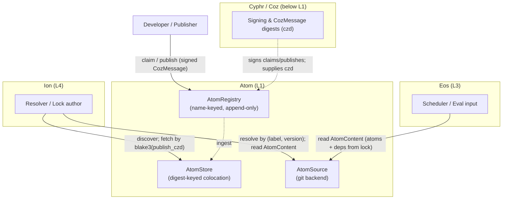
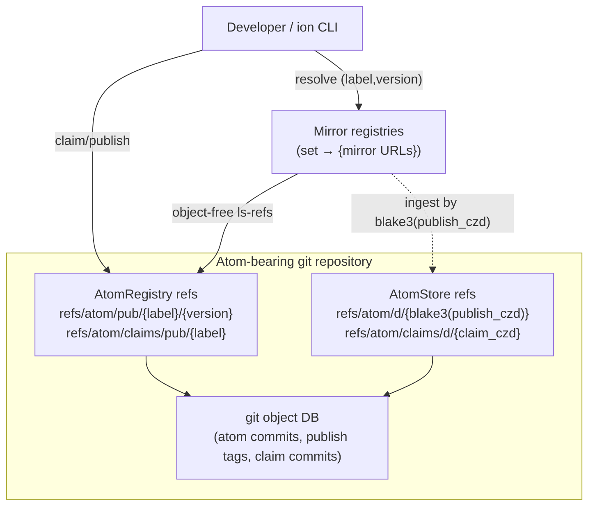
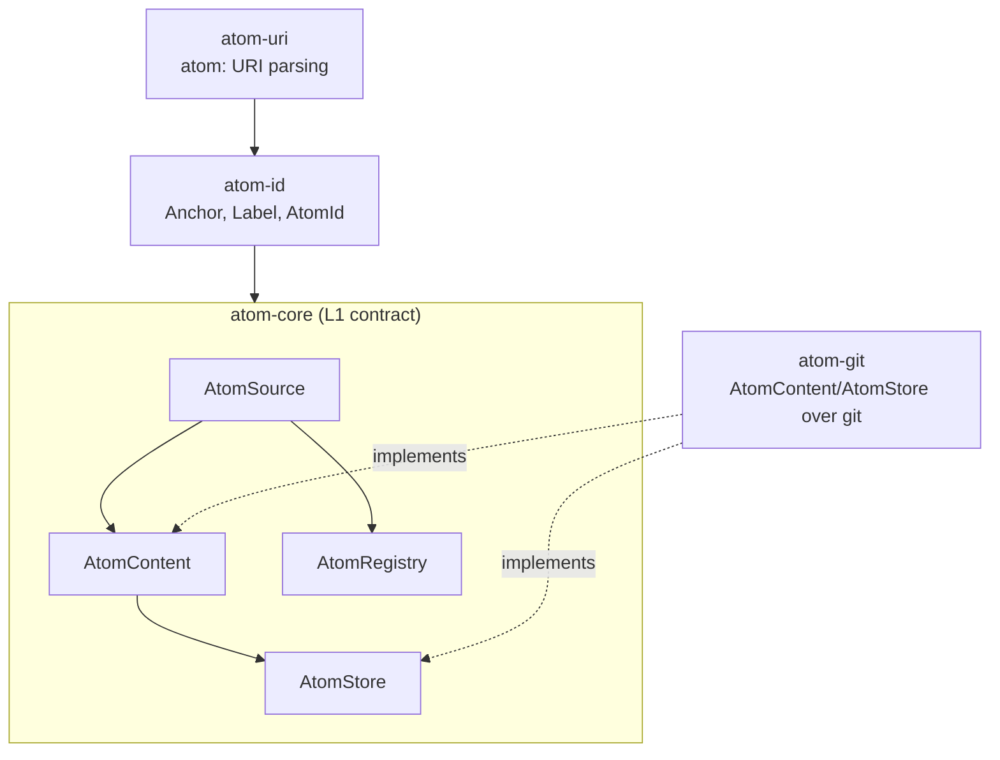

<!--
  Atom Software Architecture Document (SAD) — L1.

  This document is the authoritative source of truth for the Atom layer.
  The specifications under docs/specs/ (atom-transactions.md, atom-sourcing.md,
  git-storage-format.md) derive from this document; on conflict, this document
  takes precedence and the spec is realigned. ADRs record architectural changes
  and are landed in the same commit as the SAD edit they justify.

  Maintained as Architecture-as-Code. Diagrams are Mermaid.js, inline.

  Settled design inputs: the keystone resolution (AtomId = abstract (anchor,label)
  pair; 2-value name-anchored lock; blake3(publish_czd)-keyed store; algorithm
  agility deleted from identity, retained only in the Coz czd).
-->

# Atom Software Architecture Document (SAD)

## 1. Context

### 1.1 System Purpose

Atom is the **identity and publishing foundation** (L1) of the Axios decentralized
publishing stack. It answers exactly one question authoritatively: _what is this
thing, who owns it, and which immutable bytes does a given version resolve to_ —
without a central registry and without trusting the publisher.

Atom owns:

- **Identity** — the `AtomId = (anchor, label)` pair: a stable, algorithm-free,
  permanent name for an atom across all its versions and ownership changes.
- **Ownership** — the signed claim→publish protocol (via Coz) that binds an owner
  to an identity and makes every _published_ atom cryptographically accountable.
- **Content-addressed storage** — append-only publish/claim history over git
  objects, plus a digest-addressed store for cross-source colocation.
- **Discovery** — object-free version enumeration over advertised refs, and the
  set→mirrors indirection that makes resolution decentralized.

Atom does **not** own: evaluation or build (L3, eos), dependency resolution or the
lock file as a whole (L4, ion), or key management and signing primitives (Cyphr/Coz,
below L1). Atom defines the identity contract those layers consume; it never
consumes them.

### 1.2 External Actors



### 1.3 System Boundaries

| Boundary      | Inside Atom                                                                             | Outside Atom                                                                    |
| :------------ | :-------------------------------------------------------------------------------------- | :------------------------------------------------------------------------------ |
| **Identity**  | `AtomId = (anchor, label)`; anchor = `czd(charter₀)`, the founding charter's coz digest | Key material, signature primitives (Coz/Cyphr)                                  |
| **Ownership** | claim/publish protocol; claim/publish chains; the owner→identity binding                | Owner identity _systems_ (Coz `tmb`, Cyphr `PR`) — `Owner` is opaque            |
| **Storage**   | git-object encoding; registry + store ref layout; ingest                                | Build execution, artifact store (L3)                                            |
| **Discovery** | object-free ref advertisement; set→mirrors indirection                                  | Version _semantics_ (`VersionScheme` is a trait; ecosystem adapters live above) |
| **Lock**      | the atom-required lock contribution (`[lock-entry-sufficient]`)                         | The lock file as a whole, resolution, plugin/non-atom deps (L4)                 |

### 1.4 Layer Discipline

Atom is the bottom layer. `atom-*` crates **MUST NOT** depend on `eos-*` or `ion-*`.
Ion (L4) and Eos (L3) depend on atom; the reverse is forbidden
(`layer-boundaries.md` `[boundary-downward-only]`). The L3/L4 export surface is
`AtomContent` (a forgetful functor over `AtomStore` that drops `ingest`/`contains`);
consumers never see store-mutating operations.

### 1.5 Store / Registry Taxonomy

Registry and store are **two ref namespaces over one git object database**, with
deliberately different semantics. They never collide; a single repository MAY serve
both namespaces, but they are not conflated.

|                | AtomRegistry                         | AtomStore                           |
| :------------- | :----------------------------------- | :---------------------------------- |
| **Purpose**    | resolution + acquisition by _name_   | content-addressed _colocation_      |
| **Keyed by**   | `label` / `version` (human-readable) | `blake3(publish_czd)` (digest)      |
| **Ref prefix** | `refs/atom/{pub,claims/pub,src}/…`   | `refs/atom/{d,dev,claims/d}/…`      |
| **Mutability** | append-only (tag/claim chains)       | accumulating; digest refs immutable |
| **Discovery**  | object-free `ls-refs` enumeration    | by digest only (no enumeration)     |

Registries are what make decentralized bulk resolution possible (enumerate a
project's atoms in one object-free query). Stores exist to hold and fetch atoms by
digest across sources. **Not every store is a registry** (a bare mirror serves
digests without resolution), and there is **no requirement that a registry also be a
store** — the lock acquires content via the name namespace and reads everything else
from the atom's self-describing git object (§6.7).

## 2. Container View



### 2.1 AtomRegistry

The append-only, name-keyed publishing surface. `claim()` stakes ownership of an
`(anchor, label)`; `publish()` records a new signed publish tag at
`refs/atom/pub/{label}/{version}`. Implements `AtomSource` for object-free discovery.
Within a single registry, `label` is unique (`[registry-ref-label-unique]`).

### 2.2 AtomStore

The digest-keyed colocation surface. Atoms ingested from any number of sources/forks
coexist, keyed by `blake3(publish_czd)` — cryptographically distinct publishes
occupy distinct refs by construction, so colocation needs no coordination. Implements
`AtomContent` (and `AtomStore`'s `ingest`/`contains`). A local store doubles as the
resolution cache: an atom fetched once is content-addressed for reuse.

### 2.3 AtomSource (Git Backend)

`atom-git` implements `AtomContent`/`AtomStore` over a git repository: it reads atom
commits, walks publish tag chains and claim chains, and verifies the anchor against
the set's founding charter (`Anchor := czd(charter₀)`). The git object DB is the
substrate; the registry/store refs are views over it.

### 2.4 Mirrors

A _set_ (atoms sharing an anchor) carries a list of interchangeable mirror
registries. Repo identity is the **anchor**, not a URL; mirrors are interchangeable
because cross-mirror anchor/digest consistency is the tamper guard
(`[set-anchor-bijection]`, `[atom-version-identity]`). Mirrors are registries
(name-keyed); a consumer never resolves a czd directly from a mirror — it resolves by
name and computes/reads digests locally.

## 3. Component View



### 3.1 atom-core — Trait Surface

Defines the four traits and their algebraic relationships (`atom-core/src/lib.rs`):

- **`AtomSource`** (:139) — discovery/metadata observation: resolve an atom's
  availability and metadata.
- **`AtomContent`** (:205) — extends `AtomSource` with content access. The forgetful
  map `F_content → F_source` drops the content observer; this is the **L3/L4 export
  surface** (`publishing-stack-layers.md §2.1a`).
- **`AtomRegistry`** (:231) — extends `AtomSource` with the signed `claim()`/
  `publish()` operations (append-only).
- **`AtomStore`** (:271) — extends `AtomContent` with `ingest(dyn AtomContent)` and
  `contains()`. `ingest` takes `AtomContent`, not `AtomSource` — a store ingests
  _content_, not merely discovery handles.

### 3.2 atom-id — Identity Primitives

`Anchor`, `Label`, and `AtomId = (anchor, label)`. The `AtomId` is the **pair
itself** — not a hash of it. No digest type is exported for identity (see §6.1).

### 3.3 atom-uri — URI Parsing

Parses `atom:` URIs into the coordinates `(registry/set, label, version|revision)`.
The URI is a locator, not the identity (`[uri-not-metadata]`).

### 3.4 atom-git — Git Bridge

Implements `AtomContent`/`AtomStore` over git objects per `git-storage-format.md`:
charter-based anchor verification (`Anchor := czd(charter₀)`), atom-commit
snapshots, publish tag chains, claim chains, and the registry/store ref layouts.

## 4. Core Lifecycles

### 4.1 Claim and Publish

Publishing is gated on ownership: an unclaimed atom MUST NOT be published, so every
published atom has a coherent cryptographic owner. Ordering is enforced by data flow
(`claim()` returns a `czd` that `publish()` requires) and by temporal vector
(`publish.now > claim.now`).

```mermaid
sequenceDiagram
  participant Dev as Developer
  participant Coz
  participant Reg as AtomRegistry
  Dev->>Coz: sign ClaimPayload{anchor,label,owner,key}
  Coz-->>Dev: claim CozMessage (claim_czd)
  Dev->>Reg: claim(message)
  Note over Reg: [no-unclaimed-publish] — claim MUST exist first
  Reg-->>Dev: claim_czd (refs/atom/claims/pub/{label} → claim commit)
  Dev->>Coz: sign PublishPayload{anchor,label,version,dig,src,path,claim:claim_czd,now}
  Coz-->>Dev: publish CozMessage (publish_czd)
  Dev->>Reg: publish(message)
  Note over Reg: PRE — claim non-revoked (chain tip); now>claim.now; key authorized by owner
  Reg-->>Dev: refs/atom/pub/{label}/{version} → publish tag → atom commit
```

### 4.2 Resolve and Acquire (name-anchored)

Acquisition is **name-anchored**: registries are name-keyed, and a published version
is the moving tip of an append-only publish tag chain peeling to an immutable atom
commit. The lock pins `publish_czd`; resolution locates that pin within the chain.

```mermaid
sequenceDiagram
  participant Ion as Consumer (ion)
  participant Set as set → mirrors
  participant Reg as Registry (mirror)
  participant Store as Local AtomStore
  Ion->>Set: look up mirrors for set (anchor)
  Ion->>Reg: ls-refs refs/atom/pub/{label}/* (object-free)
  Reg-->>Ion: refname→OID (versions advertised)
  Ion->>Reg: fetch refs/atom/pub/{label}/{version} (tip of tag chain)
  Reg-->>Ion: publish tag chain → atom commit
  Note over Ion: locate pinned publish_czd in the chain;\nverify peeled content sha == payload.dig
  Ion->>Store: ingest by blake3(publish_czd)
  Note over Ion: moved tip ⇒ "metadata updated / key rotated" warning + optional czd bump (non-fatal)
```

Content reproducibility is guaranteed by the chain-invariant core
`(label, version, dig, src, path)` (`[tag-chain-semantic-immutable]`): the chain may
grow (appended signing/`meta`), but the bytes a version resolves to cannot change.

### 4.3 Ingest

`store.ingest(source)` pulls an atom's objects (commit, tag chain, claim) into a
store, keyed by `blake3(publish_czd)`. Ingest preserves identity and content exactly
(`[ingest-preserves-identity]`, `[coz-bit-perfect]`): `resolve(store) ⊇
resolve(source)` for the ingested atom (`[store-accumulates]`).

## 5. State Machine Models

### 5.1 Publish Tag Chain

```mermaid
stateDiagram-v2
  [*] --> Published: initial publish (tag → atom commit)
  Published --> Published: metadata update\n(new tag → previous tag; old tag persists)
  note right of Published
    [tag-chain-immutable]: updates append, never rewrite.
    (label,version,dig,src,path) invariant across the chain;
    only signing meta / key / meta.* may differ.
  end note
```



### 5.2 Claim Chain

```mermaid
stateDiagram-v2
  [*] --> Claimed: claim (refs/atom/claims/pub/{label} → claim commit)
  Claimed --> Claimed: reclaim / key rotation\n(new claim parented to previous; tip ref advances)
  Claimed --> Superseded: meta.supersedes:"revoke"\n(new claim in chain carries revocation)
  note right of Claimed
    [single-active-claim-registry]: ≤1 active claim/AtomId;
    [claim-replacement-transition]: chain to previous, old publishes stay valid.
    Revocation is verify-time: walk to the active claim at the chain tip.
  end note
```



## 6. Cross-Cutting Concerns and System Invariants

### 6.1 Identity is the Abstract Pair

**Invariant `[identity-content-addressed]`**: an atom's identity (`AtomId`) MUST be
determined solely by the pair `(anchor, label)`, and MUST NOT depend on any key,
signature, signed message, or hash algorithm. The `AtomId` is **not a hash of
`(anchor, label)`** — it is the pair. ("Content-addressed" here means the _anchor_ is
a content hash and identity is permanent; it does **not** mean the id is a digest.)
There is no `AtomDigest` of identity and no store-chosen algorithm agility at this
layer. **Invariant `[identity-stability]`**: the `AtomId` MUST NOT change across
versions, ownership transfers, or key rotations.

### 6.2 The Anchor

**(Amended 2026-07-08 — the charter.)** The anchor is the coz digest of the
atom-set's founding charter transaction: `Anchor := czd(charter₀)`
(atom-transactions.md `[charter-anchor]`) — backend-agnostic, since a charter
is a coz object regardless of backend. This replaces the earlier
genesis-commit derivation; the genesis commit is not lost — the charter's
`src` transitively pins it (a revision hash commits to its entire ancestry) —
but it no longer _is_ the anchor. The anchor is: **immutable**
(`[anchor-immutable]` — successor charters chain without changing it),
**content-addressed over a signed, owned payload**
(`[anchor-content-addressed]`), **unique** (distinct charters yield distinct
anchors; two charters over the same history are two deliberately distinct
sets, `[charter-fork-distinction]`), and **resolvable** — a consumer locates
and verifies the founding charter from the source without trusting the
publisher; selecting among candidate charters is the consumer's recorded
trust decision (`[anchor-resolvable]`, supersedes `[anchor-discoverable]`).
Git hash agility is handled by the charter, not by silence: a SHA-256 re-hash
rewrites history, so continuity across it is an explicit successor charter
(`[anchor-hash-agile]`, `[charter-succession]`); absent succession, the
re-hashed repository is a distinct atom-set.

### 6.3 Ownership: Claim Before Publish

**Invariant `[no-unclaimed-publish]`**: a publish MUST NOT exist for an `AtomId` with
no verifiable claim. The claim (a signed `CozMessage`) binds an opaque `Owner` to the
identity; `[owner-abstract]` keeps the owner framework-agnostic (Coz `tmb`, Cyphr
`PR`). The publish→claim binding (`[publish-chains-claim]`,
`[publish-claim-coherence]`) is the sole mechanism tying a publish to its owner.

### 6.4 Claim Chains and Revocation (consolidated)

Revocation and re-ownership are **fully specified across the storage and sourcing
specs** and are consolidated here:

- Claims form an append-only **chain**: a replacement claim's commit is parented to
  the previous, and `refs/atom/claims/pub/{label}` advances to the tip
  (`[single-active-claim-registry]`, `[claim-replacement-transition]`). Reclaiming
  with new keys is the normal key-rotation path; existing publishes remain valid
  under the claim they referenced.
- **Revocation is carried in publish/claim tag metadata** —
  `meta.supersedes: "update" | "revoke"`, `meta.superseded-by` — and carries
  cryptographic assurance precisely because the new claim chains to the previous
  (`git-storage-format.md` §extensible-meta).
- Evaluation is **verify-time at the chain tip**: a resolver walks the claim chain;
  the tip is the active claim. Two mirrors advertising the same atom@version with the
  same `dig` but different `czd` are reconciled by chain ancestry — newest-in-chain
  wins; genuinely distinct ownership is a conflict and is rejected
  (`[czd-divergence-handling]`). Revocation is therefore an online check at the
  claim-chain tip, **not** a lock field.

### 6.5 The Lock Contribution (2-value)

The atom-required lock entry (`[lock-entry-sufficient]`, `[lock-capture]`) is keyed
by `AtomId = (set, label)` and carries exactly two values: the resolved `version` and
the **bare** `publish_czd` (original algorithm — the lock represents the _actual_
cryptographic security the signature covers). `set` resolves to mirrors via a shared
`[sets] → mirrors` table.

- **No hashed `id`** — the `(set, label)` pair _is_ the identity and the map key.
- **No `rev`** — the atom commit is peelable from the `publish_czd`'s tag chain.
- **`dig` is not stored** — it lives in the signed publish payload (the czd-pinned
  source of truth); on acquisition the peeled content-addressed sha **MUST equal**
  `payload.dig`, or there is tampering.

`blake3` wraps `publish_czd` **only** as the store-key reduction (§6.6), never in the
lock.

### 6.6 Store Keying

The store is keyed **flat** by `blake3(publish_czd)` — a uniform single-algorithm
keyspace reducing the multihash `czd` for multi-signer colocation. There is no
`{version}` delimiter (version lives inside the signed publish; git dedups content by
OID; the registry handles enumeration). Distinct publishes ⇒ distinct keys ⇒
colocation without coordination (`[store-claim-disambiguation]`, recast off
`claim_czd`).

### 6.7 The Export Contract (self-describing git object)

The atom's **git object is self-describing**: the publish tag carries the signed
`CozMessage` (version, `dig`, `src`, `path`, and `claim` → owner) and peels to the
atom commit (the content). Consumers read **behind the `publish_czd`**, not from
copied lock fields:

- **Eos** reads what it needs (`dig`, the content tree, version) directly from the
  atom's git object via `AtomContent`.
- **Ion** may derive wire-handoff fields from that same object at resolution time.

Nothing about the atom is copied into the lock beyond the `(set, label) →
{version, publish_czd}` pointer. The L3/L4 boundary is `AtomContent` (the forgetful
functor dropping store-mutating observers). _Note:_ `ion-eos-contract.md`
`[handoff-atom-fields]` carries only the minimal pointer `(set, label, version,
publish_czd)`; eos reads `rev`/`dig`/content from the self-describing git object.
(Earlier drafts mandated eos _receive_ `rev`/`id` — that over-specification has
been realigned.)

### 6.8 Discovery is Object-Free

Version discovery is an `ls-refs` advertisement over `refs/atom/pub/{label}/{version}`
returning `refname→OID` with no object download — the standard git protocol-v2
primitive. This is spec-mandated; axios's own implementation is a build task (the
PoC's `get_atoms` proves the pattern). See Appendix D.

## 7. Wire and Storage Formats

| Concern                                                            | Governing spec              |
| :----------------------------------------------------------------- | :-------------------------- |
| Git object encoding (atom commits, publish/claim tags, ref layout) | `git-storage-format.md`     |
| Claim/publish protocol, payloads, identity, verification           | `atom-transactions.md`      |
| Sourcing, mirror sets, the lock contribution                       | `atom-sourcing.md`          |
| `atom:` URI grammar                                                | `aliased-url-resolution.md` |
| Signing, `CozMessage`, `czd`                                       | Coz (below L1)              |

## 8. Failure Modes

| #   | Failure                                              | Behavior                                                             |
| :-- | :--------------------------------------------------- | :------------------------------------------------------------------- |
| 8.1 | Claim name collision (label taken in registry)       | claim rejected (`[registry-ref-label-unique]`)                       |
| 8.2 | Publish without/with-revoked claim                   | publish invalid (`[no-unclaimed-publish]`, verify-time tip check)    |
| 8.3 | Peeled content sha ≠ payload.dig                     | tamper/funny-business — reject the fetched atom                      |
| 8.4 | Mirror divergence (same atom@version, different dig) | conflict, reject (`[no-conflicting-digest]`)                         |
| 8.5 | Distinct-ownership czd divergence                    | reject unless same claim chain (`[czd-divergence-handling]`)         |
| 8.6 | Moved publish-tag tip (metadata appended)            | non-fatal: warn "metadata updated / key rotated" + optional czd bump |

## 9. Known Gaps and Future Explorations

| #   | Gap                                                                                                                                                          | Notes                                                                                                                                                                                                                                                                                                      |
| :-- | :----------------------------------------------------------------------------------------------------------------------------------------------------------- | :--------------------------------------------------------------------------------------------------------------------------------------------------------------------------------------------------------------------------------------------------------------------------------------------------------- |
| 1   | Object-free discovery unbuilt in axios                                                                                                                       | spec-mandated; PoC `get_atoms` proves the pattern                                                                                                                                                                                                                                                          |
| 2   | FsSource sentinel anchor value/encoding unconstrained                                                                                                        | local atoms; needs a protocol-level constant                                                                                                                                                                                                                                                               |
| 3   | `rev` peel mechanism (locate commit from `publish_czd`; GC of an old chain tip)                                                                              | specify the failure mode when a serving mirror has GC'd                                                                                                                                                                                                                                                    |
| 4   | Cross-ecosystem `VersionScheme` adapters                                                                                                                     | trait surface defined; concrete adapters are above L1                                                                                                                                                                                                                                                      |
| 5   | Signed metadata append as the substrate's fact-publication channel (build records, interface manifests — HTC/L2, per ADR-0005 §Open Items, htc-sad.md §6.10) | Builder ≠ claim-owner signer authorization is unspecified; every routine fact append currently trips §8.6's "moved tip / optional czd bump" warning path, which needs a fact-append carve-out; a fact-kind convention is also open. Design campaign **P1**. No change to §4.2/§8.6 semantics in this pass. |

## 10. Scope Boundaries

Out of scope for the atom layer:

- **Build/evaluation** (L3/eos) and the artifact store.
- **Dependency resolution, the lock file as a whole, plugin/non-atom deps** (L4/ion).
- **Key management and signing primitives** (Cyphr/Coz) — `Owner` and `czd` are
  opaque to atom.
- **Concrete version semantics** — `VersionScheme` is a trait; ecosystem adapters are
  above L1.

## Appendix A: Terminology

| Term           | Definition                                                                       |
| :------------- | :------------------------------------------------------------------------------- |
| Anchor         | `czd(charter₀)` — the founding charter's coz digest; immutable atom-set identity |
| AtomId         | The abstract pair `(anchor, label)` — the identity, not a hash                   |
| Atom-set       | Atoms sharing a common anchor                                                    |
| Label          | Human-readable atom name (UAX #31)                                               |
| Owner          | Opaque identity digest (Coz `tmb`, Cyphr `PR`)                                   |
| Claim          | Signed `CozMessage` binding `Owner` → `(anchor, label)`                          |
| Publish        | Signed `CozMessage` recording a version; references a claim `czd`                |
| czd            | Coz message digest (multihash); `publish_czd`, `claim_czd`                       |
| dig            | Hash of the reproducible atom snapshot (in the publish payload)                  |
| Revision (rev) | A specific commit in source history (peelable from the tag chain)                |
| Version        | Abstract version via `VersionScheme` (ecosystem-agnostic)                        |

## Appendix B: Crate Map

| Layer | Crate       | Kind           | Purpose                                                          |
| :---- | :---------- | :------------- | :--------------------------------------------------------------- |
| L1    | `atom-core` | Contract       | Traits: `AtomSource`, `AtomContent`, `AtomRegistry`, `AtomStore` |
| L1    | `atom-id`   | Contract       | Identity primitives: `Anchor`, `Label`, `AtomId`                 |
| L1    | `atom-uri`  | Contract       | `atom:` URI parsing                                              |
| L1    | `atom-git`  | Implementation | `AtomContent`/`AtomStore` over git objects                       |

## Appendix C: Specification Cross-Reference

| SAD Section            | Governing Specification                                                                                                                    |
| :--------------------- | :----------------------------------------------------------------------------------------------------------------------------------------- |
| §4.1 Claim/Publish     | [atom-transactions.md](../specs/atom-transactions.md) §Transitions                                                                         |
| §4.2 Resolve/Acquire   | [atom-sourcing.md](../specs/atom-sourcing.md), [git-storage-format.md](../specs/git-storage-format.md)                                     |
| §4.3 Ingest            | [atom-transactions.md](../specs/atom-transactions.md) `[ingest-preserves-identity]`                                                        |
| §5.1 Publish Tag Chain | [git-storage-format.md](../specs/git-storage-format.md) `[tag-chain-immutable]`, `[tag-chain-semantic-immutable]`                          |
| §5.2 Claim Chain       | [git-storage-format.md](../specs/git-storage-format.md) `[single-active-claim-registry]`, `[claim-replacement-transition]`                 |
| §6.1 Identity          | [atom-transactions.md](../specs/atom-transactions.md) `[identity-content-addressed]`, `[identity-stability]`                               |
| §6.2 Anchor            | [atom-transactions.md](../specs/atom-transactions.md) `[anchor-*]`                                                                         |
| §6.3 Ownership         | [atom-transactions.md](../specs/atom-transactions.md) `[no-unclaimed-publish]`, `[publish-claim-coherence]`                                |
| §6.4 Revocation        | [git-storage-format.md](../specs/git-storage-format.md) §meta; [atom-sourcing.md](../specs/atom-sourcing.md) `[czd-divergence-handling]`   |
| §6.5 Lock              | [atom-sourcing.md](../specs/atom-sourcing.md) `[lock-entry-sufficient]`, `[lock-capture]`                                                  |
| §6.6 Store Keying      | [git-storage-format.md](../specs/git-storage-format.md) store ref layout                                                                   |
| §6.7 Export Contract   | [publishing-stack-layers.md](../models/publishing-stack-layers.md) §2.1a; [ion-eos-contract.md](../specs/ion-eos-contract.md) (Appendix D) |
| §6.8 Discovery         | [atom-sourcing.md](../specs/atom-sourcing.md); [git-storage-format.md](../specs/git-storage-format.md) registry refs                       |

## Appendix D: Known Specification Drift

The keystone realignment — pair-only `AtomId` (no
`AtomDigest`/`[digest-algorithm-agile]`), the 2-value name-anchored lock, the flat
`blake3(publish_czd)` store, and name-anchored acquisition — has been applied across
`atom-transactions.md`, `atom-sourcing.md`, and `git-storage-format.md`, which are
aligned to this SAD. The 2026-07-08 charter amendment (`Anchor := czd(charter₀)`,
atom-transactions.md `[charter-anchor]`) has likewise been propagated across those
specifications and this SAD (§6.2). One deliberate, explicitly marked gap remains:
the git backend's storage encoding and ref layout for charter transactions is not
yet specified (`git-storage-format.md` Open Questions #6) — tracked as
atom-milestone design work, not silent drift. (The L4 consequences — the ion lock
cross-references and the eos handoff — are tracked by `ion-sad.md`.)

## Appendix E: Stale Documentation

| Document                   | Issue                                                                      | Corrected In                                                                                                                                    |
| :------------------------- | :------------------------------------------------------------------------- | :---------------------------------------------------------------------------------------------------------------------------------------------- |
| `alloy/atom_structure.als` | `identity_content_addressed` assertion name could be misread as hash-based | Clarifying comment added; name **kept** to match the retained `[identity-content-addressed]` spec tag + evaluator linkage; body already correct |
| `tla/AtomTransactions.tla` | none — comment accurately reads "deterministic function of (anchor,label)" | No change needed; body and comment already correct                                                                                              |
