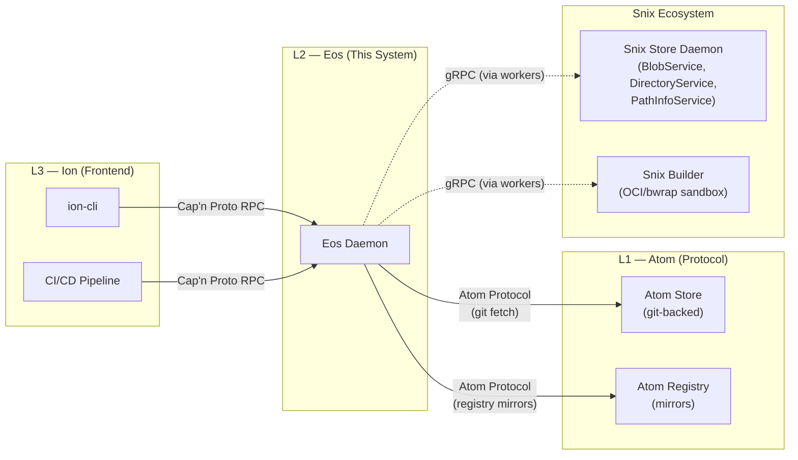
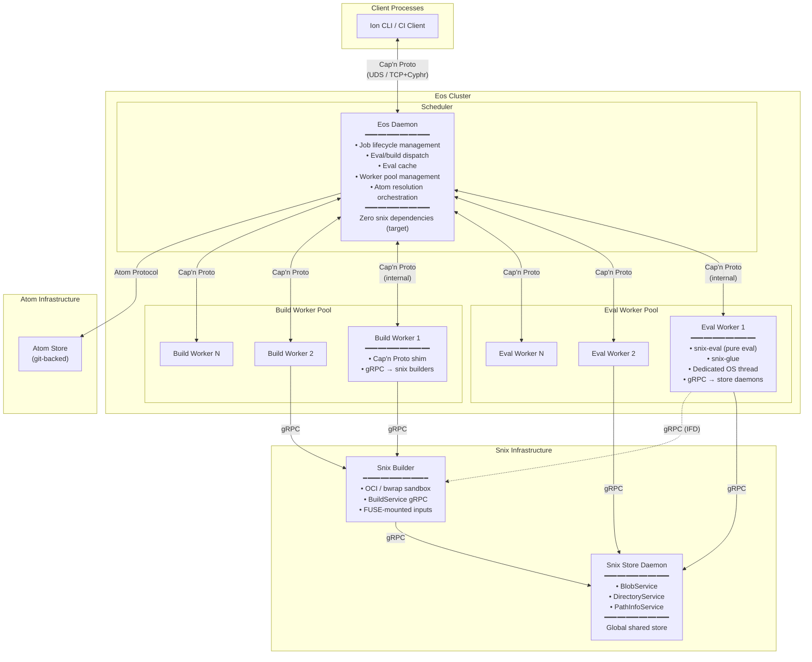
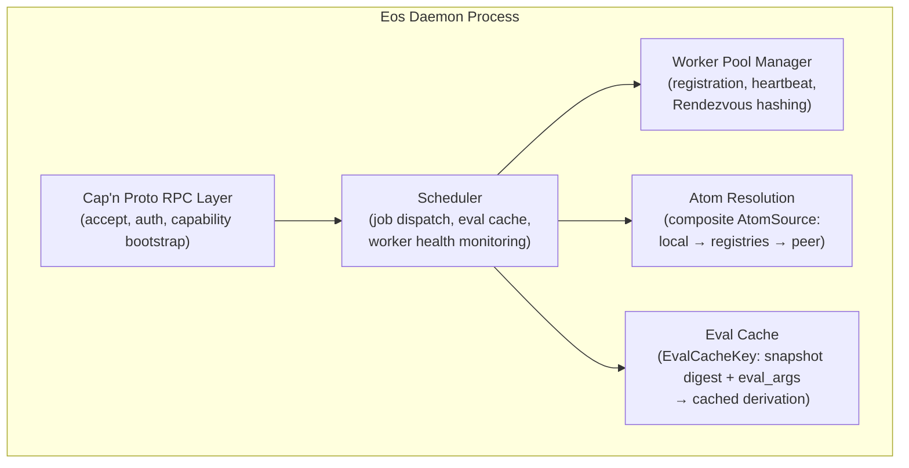
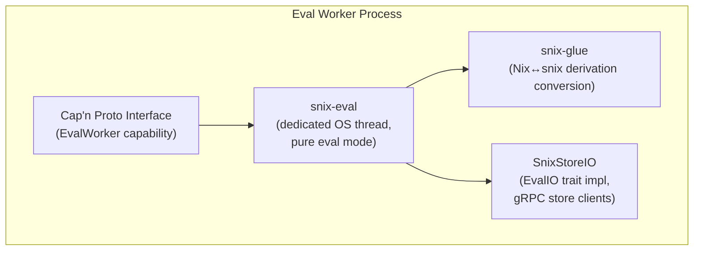
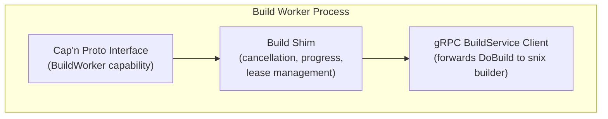
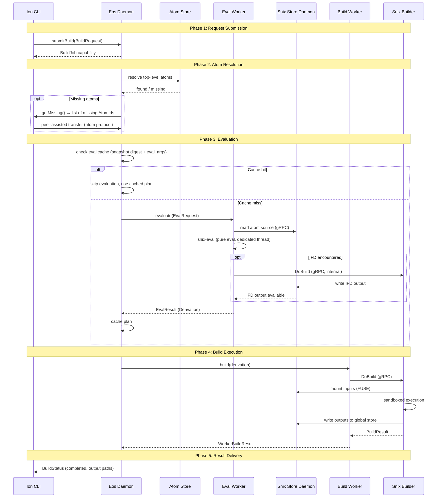
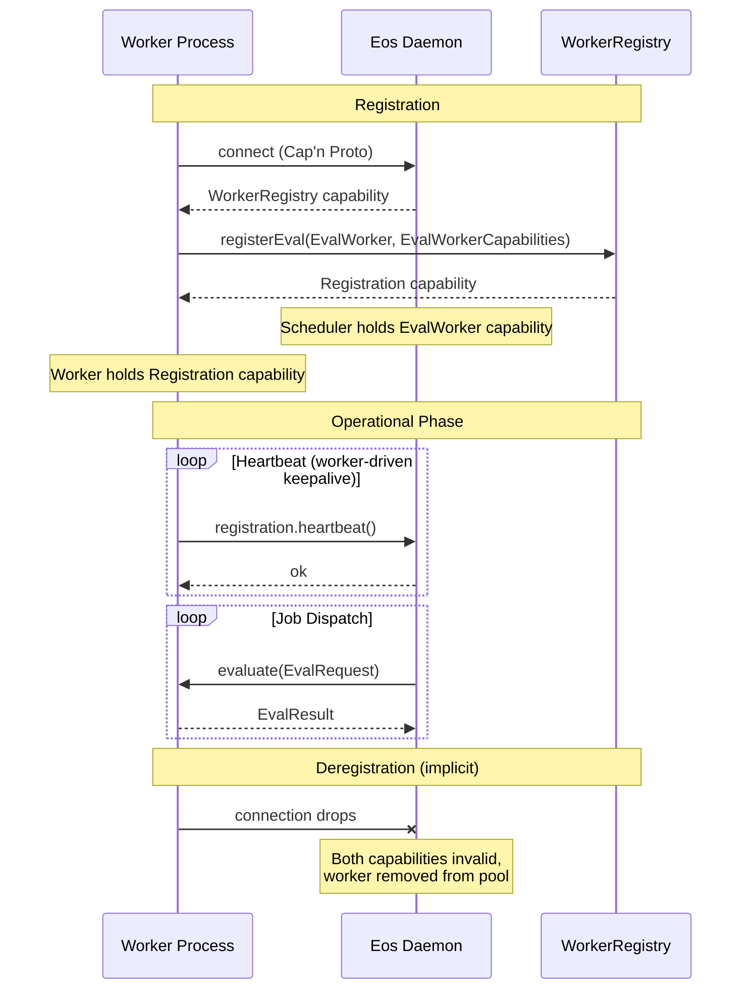
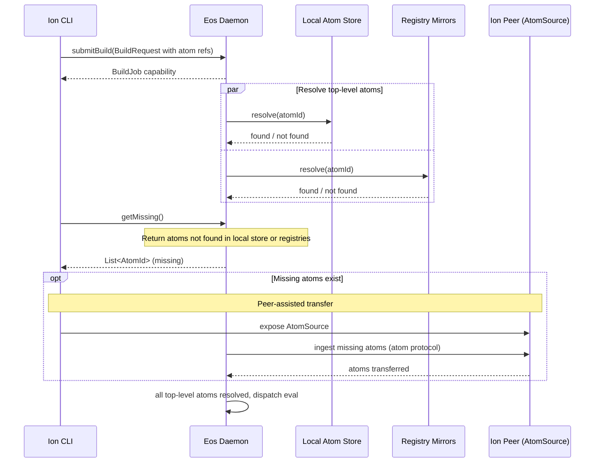
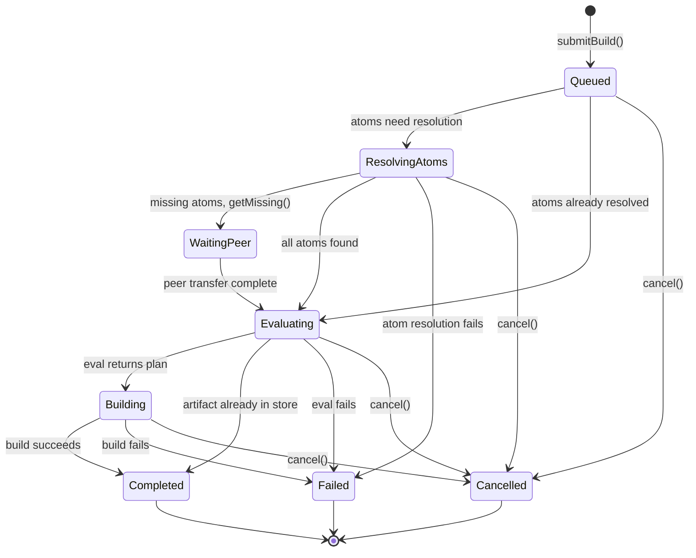
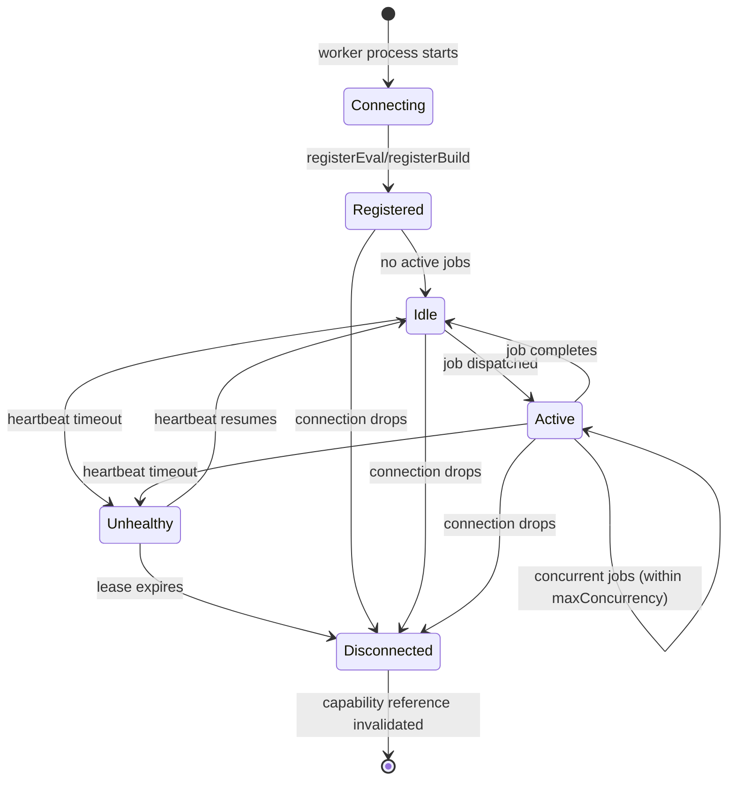

# Eos Software Architecture Document (SAD)

<!--
  This document is the authoritative source of truth for the Eos (L2) layer
  architecture. Specifications derive from this document. ADRs record changes
  to the architecture described here. When a conflict exists between this
  document and a specification or ADR, this document takes precedence and the
  conflicting artifact must be updated.

  Maintained as Architecture-as-Code alongside the codebase. Diagrams are
  Mermaid.js, embedded inline. When an ADR changes the system's trajectory,
  this SAD is updated in the same commit to reflect the new state.
-->

## 1. Context

### 1.1 System Purpose

Eos is the evaluation and build engine layer (L2) of the Axios
decentralized publishing stack. It receives evaluation requests from
clients (typically Ion, the L3 CLI frontend), evaluates Nix expressions
against atom source trees to produce build plans (derivations), executes
those plans in sandboxed build environments, and populates a
content-addressed artifact store with the results.

Eos is designed to operate as a distributed cluster, scaling evaluation
and build capacity independently across heterogeneous machines. It does
not own atoms (L1 concern) or dependency resolution (L3 concern).

### 1.2 External Actors



### 1.3 System Boundaries

| Boundary                  | Inside Eos                                                                 | Outside Eos                                                |
| :------------------------ | :------------------------------------------------------------------------- | :--------------------------------------------------------- |
| **Evaluation**            | Dispatching eval requests to workers, caching plans                        | Nix language semantics (snix's concern)                    |
| **Building**              | Dispatching derivations to builders, tracking progress                     | Sandbox implementation (snix builder's concern)            |
| **Atom Resolution**       | Layered resolution of top-level atoms (atom store → registries → ion peer) | Atom identity, signing, verification (L1 concern)          |
| **Dependency Resolution** | Not an Eos concern                                                         | Lock file resolution, SAT solving (L3/Ion concern)         |
| **Artifact Storage**      | All workers use the global shared store                                    | Store implementation, GC, replication (snix store concern) |
| **IFD**                   | Scheduler knows which eval workers have IFD-capable builders               | IFD execution is internal to snix evaluator                |

### 1.4 Layer Discipline

Dependencies flow strictly downward: Ion (L3) → Eos (L2) → Atom (L1).

- Eos MUST NOT import Ion types or depend on Ion crates.
- Atom MUST NOT import Eos types or depend on Eos crates.
- The Eos daemon crate (`eos-daemon`) has zero snix dependencies.
  All snix interaction occurs through eval workers and build workers
  via gRPC/Cap'n Proto.

### 1.5 Deployment Modes

| Mode              | Description                                                                                                           | Status            |
| :---------------- | :-------------------------------------------------------------------------------------------------------------------- | :---------------- |
| **Embedded**      | BuildEngine compiled directly into `ion-cli`. No daemon process, no workers. Evaluation and build execute in-process. | Default (current) |
| **Client-Server** | Ion connects to `eosd` daemon via Cap'n Proto RPC. Daemon dispatches to eval/build worker pools.                      | Future (ADR-0002) |

The embedded mode is the development default — `ion build` works
without any process management. The client-server mode (this SAD's
primary focus) enables distributed evaluation and build scaling.

Both modes share the same `BuildEngine` trait interface. The
embedded mode uses a concrete `SnixEngine` directly; the client
mode uses a `RemoteEngine` that delegates to the daemon.

### 1.6 Store Taxonomy

The system uses three functionally distinct store types:

| Store             | Layer | Semantics                                          | Interface                                  |
| :---------------- | :---- | :------------------------------------------------- | :----------------------------------------- |
| **AtomRegistry**  | L1    | Append-only, signed, distributed publishing        | `claim()`, `publish()`                     |
| **AtomStore**     | L1    | Mutable working store, collects atoms from sources | `ingest()`, `import_path()`                |
| **ArtifactStore** | L2    | Content-addressed build output blobs (snix store)  | `store()`, `fetch()`, `check_substitute()` |

All three share a common read super-trait `AtomSource` with
`resolve()` and `discover()`. The **AtomStore** and
**ArtifactStore** are distinct and MUST NOT be conflated:

- **AtomStore**: Contains source trees (atom content). Backed by
  git. Used during atom resolution and evaluation.
- **ArtifactStore**: Contains build outputs (derivation results).
  Backed by snix's BlobService/DirectoryService/PathInfoService.
  This is the "global shared artifact store" referenced throughout.

---

## 2. Container View

The Eos system involves three Eos-owned process types (daemon,
eval workers, build workers) and two infrastructure dependencies
(snix store daemons, snix builders) that communicate via two
transport protocols:



### 2.1 Eos Daemon (Scheduler)

The central coordination process. Stateless except for ephemeral
in-flight job state. Manages two worker pools, dispatches evaluation
and build jobs, maintains the eval cache, and orchestrates atom
resolution.

**Key constraint (target state, per [ADR-0002](../adr/0002-decoupling-snix-backend.md))**:
The daemon will have **zero snix dependencies**. It will not link
against snix-eval, snix-store, snix-build, or any snix crate. All
snix interaction will be mediated by workers via gRPC. The current
codebase has coupling violations being migrated (see Appendix D).

**Transports**:

- Client-facing: Cap'n Proto RPC over UDS (v1) or TCP+Cyphr (future)
- Worker-facing: Cap'n Proto RPC (internal cluster network)

**State**:

- `eval_workers: Map<WorkerId, WorkerStatus>` — registered eval workers
- `build_workers: Map<WorkerId, WorkerStatus>` — registered build workers
- `eval_queue: Map<JobId, Job>` — pending/in-flight eval jobs
- `build_queue: Map<JobId, Job>` — pending/in-flight build jobs
- `eval_cache: Map<EvalCacheKey, CachedPlan>` — memoized evaluation results

### 2.2 Eval Workers

Long-lived external processes that run snix evaluation. Each eval
worker:

- Runs `snix-eval` in **pure evaluation mode** on a dedicated OS thread
- Connects to snix store daemons via gRPC for store access
- Communicates with the scheduler via Cap'n Proto (`EvalWorker` interface)
- Returns computed derivations (ATerm bytes) to the scheduler
- MAY have IFD builders configured (via gRPC `BuildService` handle)

**Pure evaluation confinement**: The evaluator is confined to the
atom's encapsulation boundary. It MUST NOT import code or data
external to the atom being evaluated. Content-addressed fetches
(where a hash is pre-declared) are permitted — they are safe by
construction. This language-level confinement eliminates the need
for OS-level process sandboxing (Bubblewrap, Birdcage) during
evaluation.

**IFD handling**: If the eval worker has IFD builders configured,
IFD builds are dispatched internally via `SnixStoreIO`'s
`BuildService` gRPC handle. The scheduler does not orchestrate
IFD — it only knows which eval workers have IFD capability (and
for which systems) so it can route appropriately.

**Lifecycle**: Started by external orchestrators (systemd,
process-compose, Kubernetes). The scheduler does NOT manage worker
lifecycles. Workers register via Cap'n Proto capability passing.

### 2.3 Build Workers

Long-lived external processes that wrap snix's gRPC
`BuildService.DoBuild()` in a Cap'n Proto shim. Each build worker:

- Receives derivations from the scheduler via Cap'n Proto
- Forwards to snix builders via gRPC `BuildService`
- Adds cancellation, progress streaming, and lease management
- Reports results back to the scheduler

**Sandboxing**: Build sandboxing is the snix builder's concern.
The build worker shim does not implement sandboxing — it delegates
to the snix builder which applies platform-appropriate isolation
(OCI runtime, Bubblewrap, or future alternatives).

**Lifecycle**: Same as eval workers — externally managed, registers
via Cap'n Proto capability passing.

### 2.4 Snix Store Daemon (Global Shared Artifact Store)

The snix store daemon provides three independent gRPC services:

- `BlobService` — content-addressed blob storage
- `DirectoryService` — Merkle tree directory structure
- `PathInfoService` — store path metadata and root nodes

**Critical invariant**: All eval workers, build workers, and snix
builder instances in the cluster MUST be configured to use the
**same** network store daemon. Artifacts accumulated anywhere in
the cluster — whether produced by a top-level build, an IFD build,
or an ingestion — are instantly available to all other workers via
the shared store. This eliminates redundant builds and enables the
cluster to function as a unified build cache.

Latency of store access is an operational concern managed by
network topology (e.g., co-locating workers and store daemons in
the same availability zone).

### 2.5 Snix Builders

Separate processes that execute derivation builds in sandboxed
environments. They:

- Expose gRPC `BuildService` for build dispatch
- Mount castore inputs via FUSE
- Apply platform-appropriate sandboxing (OCI/bwrap on Linux)
- Write build outputs to the global shared store

Builders are NOT managed by the Eos scheduler. They are
infrastructure managed by cluster operators.

---

## 3. Component View

### 3.1 Eos Daemon — Internal Components



**Scheduler**: The core dispatch loop. Receives eval/build requests,
consults the eval cache, dispatches to available workers via
Rendezvous hashing, tracks job lifecycle, handles cancellation and
progress streaming.

**Worker Pool Manager**: Maintains the set of registered workers
and their capabilities. Handles registration (via capability
passing), deregistration (implicit via capability drop), and
health monitoring (heartbeat + lease expiry).

**Atom Resolution**: Implements the layered `FindMissing` pattern
for top-level atoms. Checks local atom store, then registry
mirrors, then falls back to ion peer for dev-only atoms.

**Eval Cache**: Memoizes evaluation results by plan digest. The
cache is consulted before dispatching to an eval worker. Cache
hits skip evaluation entirely.

### 3.2 Eval Worker — Internal Components



**snix-eval**: The Nix evaluator. Runs on a dedicated OS thread
(not a Tokio task) because evaluator types (`Value`, `NixString`,
`Evaluation`) are `!Send`/`!Sync` due to `Rc<Closure>`.

**snix-glue**: Converts between Nix `Derivation` types and snix's
internal representation. Provides `derive_derivation()` for
Nix-to-snix conversion.

**SnixStoreIO**: Implements the `EvalIO` trait, bridging
synchronous eval callbacks to async gRPC store operations via
`handle.block_on()`. Also holds the optional `BuildService` gRPC
handle for IFD.

### 3.3 Build Worker — Internal Components



---

## 4. Core Lifecycles

### 4.1 Evaluation and Build Lifecycle

The end-to-end lifecycle follows the `BuildPlan` coproduct —
each atom ref resolves to one of three variants:

| Variant                     | Meaning                   | Action                   |
| :-------------------------- | :------------------------ | :----------------------- |
| `Cached(outputs)`           | Artifact exists in store  | Return immediately       |
| `NeedsBuild(plan)`          | Plan cached, build needed | Dispatch to build worker |
| `NeedsEvaluation(atom_ref)` | Nothing cached            | Eval then build          |

This three-variant cache-skipping model is the system's core
value proposition — each stage of the cryptographic chain is
independently verifiable and skippable.

The end-to-end lifecycle of a build request from Ion to artifact:



### 4.2 Worker Registration Lifecycle

Workers are external processes that self-register with the daemon:



### 4.3 Atom Resolution (FindMissing Pattern)



**Atom access during evaluation**: Once top-level atoms are in the
atom store, the eval worker executes the top-level atom from the
atom store (e.g., via a git URI). The atom's _dependencies_ (locked
in the atom's lock file) are fetched by snix from lock-specified
mirrors using normal Nix fetching semantics. Eos does not resolve
transitive dependencies — this is internal to snix's evaluation model.

---

## 5. State Machine Models

### 5.1 Job Lifecycle



### 5.2 Worker Lifecycle



---

## 6. Cross-Cutting Concerns and System Invariants

### 6.1 Global Shared Artifact Store

**Invariant `[snix-global-artifact-store]`**: All eval workers,
build workers, and snix builder instances in the cluster MUST be
configured to use the same network artifact store (snix store
daemon). Artifacts accumulated anywhere in the cluster — whether
produced by a top-level build, an IFD build, or an ingestion —
MUST be instantly available to all other workers.

This is the critical efficiency invariant that makes the cluster
function as a unified build cache. It is also the primary advantage
of snix's store model over legacy Nix: snix's network-native store
eliminates the need for store-to-store copying between machines.

**Operational concern**: Store access latency is managed by
network topology (co-locating workers and store daemons in the
same availability zone). This is an operator responsibility, not
an Eos architectural concern.

### 6.2 Pure Evaluation Confinement

**Invariant `[eos-eval-pure-eval]`**: Eval workers MUST run snix
in pure evaluation mode. Pure eval confines the evaluator to the
atom's encapsulation boundary:

- The evaluator MUST NOT import code or data external to the atom
- Content-addressed fetches (with pre-declared hash) are permitted
  — they are safe by construction (fail if content doesn't match)
- This language-level confinement eliminates the need for OS-level
  process sandboxing during evaluation

**Consequence**: No Bubblewrap, Birdcage, or namespace management
is required for eval workers. This significantly reduces
operational complexity.

### 6.3 Import-from-Derivation (IFD)

**Invariant `[snix-ifd-store-population]`**: IFD is an internal
concern of the snix evaluator and builder. The Eos scheduler does
not orchestrate IFD builds — they occur inside the eval worker's
`SnixStoreIO` wiring.

**Scheduler awareness**: The scheduler knows which eval workers
have IFD capability and for which systems (via `ifdSystems` in
the worker's registration). This allows the scheduler to route
eval requests for atoms that may trigger IFD to workers whose IFD
builders match the derivation's target system.

**Operator topology**: IFD builders are configured by operators.
Options include:

- Using existing cluster builders (simple, may obscure workload)
- Dedicated IFD-only builders (isolates IFD load)

Regardless of topology, the invariant is: **IFD build outputs
MUST populate the global cluster artifact store**.

**Snix's async advantage**: Unlike the Nix C++ implementation
which blocks entirely during IFD, snix handles IFD asynchronously
— it can continue evaluating other derivations while waiting for
an IFD build. This makes IFD less severe in the snix model.

### 6.4 Build Sandboxing

Build sandboxing is delegated to the snix builder process:

- **Linux**: OCI runtime (`crun`/`runc`) or Bubblewrap (`bwrap`)
- **macOS**: No native sandbox (only `DummyBuildService` upstream)
- **Remote**: Delegation to remote builder endpoints

The Eos daemon and build worker shims perform zero sandboxing.
Network containment is enforced by the builder — builds MUST NOT
access the network unless the derivation is a fixed-output
derivation with a pre-computed hash.

### 6.5 Eval Cache

The scheduler maintains an eval cache keyed by `EvalCacheKey`:

```
EvalCacheKey = (snapshot_digest: Digest, eval_args: Vec<(String, String)>)
```

Before dispatching an evaluation to a worker, the scheduler
computes the `EvalCacheKey` from the request and checks the
cache. If the key has been previously evaluated, the cached
derivation is returned without worker dispatch.

`eval_args` (from `[compose.args]`) is opaque to the daemon —
it is included in the cache key because different args produce
different derivations, but the daemon does not interpret the
values.

The eval cache is ephemeral in-flight state — it is not persisted
across daemon restarts. The artifact store is the durable source
of truth.

### 6.6 Content Addressing and Verification

All data in the system is content-addressed:

- **Atoms**: `atom-id = digest(anchor, label)` — globally unique
- **Plans**: Identified by plan digest (`Digest` trait, currently Blake3)
- **Artifacts**: Content-addressed blobs in the snix store
- **Store paths**: Computed from plan inputs and outputs

The atom protocol verifies integrity on ingestion — the store
does not accept unverified atoms regardless of their source.
Content-addressed fetches during evaluation are safe by
construction.

The cryptographic chain:

```
AtomId → Version → Revision → Plan → Output
 (czd)    (semver)   (commit)  (plan) (artifact)
```

Each step is independently verifiable and cacheable. If a plan
exists → skip evaluation. If an artifact exists → skip build.
This enables cache-skipping at every stage.

### 6.7 Substitution and Trust Model

Eos supports artifact substitution from untrusted peers using a
Trustix-style Web of Trust (WoT) model:

**OriginAttestation**: Cached artifacts carry a signed attestation
from the builder that produced them — `builderId` (Principal Root),
`planHash`, `outputDigest`, `signature`, and `timestamp`.

**SubstitutionService**: Peers expose a `query()` + `fetchArtifact()`
interface. Before accepting a substituted artifact, the daemon:

1. Verifies the content digest matches the expected digest from
   the verified plan
2. Validates OriginAttestations against the configured trust policy

**Trust policies** (deployment-configurable):

- Trust-on-first-use
- Named-builder (whitelist specific Principal Roots)
- M-of-N threshold (require M of N trusted builders to agree)
- Double-build (N=2, build on two distrusted workers, verify
  output identity for reproducibility auditing)

**Invariant `[eos-trustless-substitution]`**: Content digest of
fetched artifact MUST match expected digest from verified plan.
Reject on mismatch regardless of trust policy.

### 6.8 Formal Model Backing

The architecture is formally validated by coalgebraic analysis
documented in [publishing-stack-layers.md](../models/publishing-stack-layers.md).

Key validated properties:

- **Trait hierarchy soundness**: Forgetful functor from `AtomStore`
  to `AtomContent` preserves bisimulation
- **BuildPlan IS protocol structure**: `CacheSession ≅ BuildSession`
  — the three-variant cache-skipping model is isomorphic to the
  session type protocol
- **Deployment mode interchangeability**: Embedded and client-server
  modes are bisimilar (same `BuildEngine` observations)
- **Ingest preserves identity**: `resolve(store, id) ⊇ resolve(source, id)`
- **Scheduling is correctness-invariant**: Two schedulers are
  bisimilar if they produce the same final outputs; scheduling
  is optimization, not semantics

### 6.9 Scheduler Invariants

The following cross-cutting scheduler invariants apply globally:

**Job deduplication `[eos-scheduler-deduplication]`**: At most one
active job per `JobId`. `JobId = plan_digest(plan)`. Duplicate
submissions append the client to the existing job's subscriber
set rather than creating a new job. This means multiple Ion
instances submitting the same lock file get the same build.

**Lazy fetching `[eos-scheduler-lazy-fetching]`**: Workers MUST
NOT fetch source or inputs until a job is assigned to them. The
scheduler orchestrates atom resolution (§4.3) before dispatch;
workers receive pre-resolved references.

**Lease management `[eos-scheduler-lease-expiry]`**: Every RUNNING
job is covered by a `Lease` with `granted_at` and `expires_at`
timestamps. If a lease expires (worker failed to renew), the
scheduler revokes the lease, dissociates the job from the worker,
and re-queues it to QUEUED state for reassignment.

**State isolation `[eos-scheduler-state-isolation]`**: The scheduler
MUST NOT depend on L3 (Ion) internal state. It is a pure consumer
of structured `eos-core` types. No manifest parsing, no lock file
interpretation.

**Concurrency limits `[eos-scheduler-concurrency-limits]`**: RUNNING
jobs on a worker MUST NOT exceed the worker's configured capacity.

---

## 7. Worker Registration and Capability Model

### 7.1 Design Principles

Worker registration follows Cap'n Proto's capability-passing model:
the worker connects to the daemon, obtains a `WorkerRegistry`
capability, and passes _itself_ as an `EvalWorker` or `BuildWorker`
capability along with its metadata. The scheduler holding the
capability reference IS the registration. Capability drop (worker
disconnect) IS deregistration.

### 7.2 Worker Capabilities

Workers advertise metadata at registration. The metadata differs
by worker kind because eval workers and build workers have
fundamentally different scheduling predicates:

**Build workers advertise**:

- `systems: List<Text>` — Nix system identifiers this builder
  handles (e.g., `x86_64-linux`, `aarch64-linux`). A builder MAY
  support multiple systems. The derivation's `system` attribute
  must be in this list. **This is a hard scheduling predicate.**
- `supportedFeatures: List<Text>` — Nix `requiredSystemFeatures`
  this builder satisfies (e.g., `kvm`, `big-parallel`). Scheduling
  uses subset match: derivation's required features ⊆ worker's
  supported features. **This is a hard scheduling predicate.**
- `speedFactor: UInt32` — Relative speed for scheduling priority.
  Higher = preferred. **Soft scheduling hint.**

**Eval workers advertise**:

- `ifdSystems: List<Text>` — Systems the eval worker's IFD
  builder(s) can handle. Empty if IFD is not configured. The
  scheduler uses this to route eval requests that may trigger
  IFD to workers whose IFD builders match the derivation's target
  system. **Soft scheduling predicate** (IFD may not occur).
- `speedFactor: UInt32` — Same as build workers.

**Not in capabilities** (operational config, not scheduling
predicates):

- `maxConcurrency` — How many parallel jobs a worker can handle.
  Used for load management (admission control), not job routing.
  Configured by the operator, not advertised as a capability.

### 7.3 Scheduling Algorithm

**Build dispatch**:

1. Filter by `system`: derivation's `system` ∈ worker's `systems`
2. Filter by `supportedFeatures`: derivation's `requiredSystemFeatures` ⊆ worker's `supportedFeatures`
3. Filter by capacity: worker has available job slots
4. Filter by health: worker is healthy (heartbeat within deadline)
5. Rank by Rendezvous hash (input affinity for cache hits)
6. Tie-break by `speedFactor` and `cached_paths` overlap

**Eval dispatch**:

1. Filter by capacity and health (same as build)
2. Prefer workers whose `ifdSystems` includes the target system
   (for IFD routing), but do not hard-filter (IFD may not occur)
3. Rank by Rendezvous hash
4. Tie-break by `speedFactor`

### 7.4 Health Monitoring

Two-tier health model:

- **Level 1 (implicit)**: Cap'n Proto detects broken connections
  automatically. Both capability references (scheduler's worker
  cap and worker's registration cap) become invalid. This
  provides instant crash detection.
- **Level 2 (explicit, keepalive)**: Workers periodically call
  `registration.heartbeat()` on the `Registration` capability
  returned at registration time. The scheduler tracks
  `last_heartbeat` per worker. If `now - last_heartbeat >
heartbeat_deadline`, the worker is marked unhealthy. No new
  jobs are dispatched to unhealthy workers, and their leases
  are revoked.

The keepalive model (worker→scheduler) is deliberately chosen
over ping (scheduler→worker) because:

- **No false positives under load**: The scheduler's health
  check is a passive timestamp sweep, never blocked waiting
  for worker responses. An overloaded scheduler cannot
  accidentally mark healthy workers as unhealthy.
- **Worker self-awareness**: A worker that fails to send its
  heartbeat (connection error, timeout) knows immediately
  that something is wrong and can self-isolate.
- **Metadata piggybacking**: Workers can include load metrics
  with their heartbeats (future extension via `updateMeta()`).

---

## 8. Transport and Security

### 8.1 Transport Architecture

Two independent transport layers:

| Surface                | Protocol        | Transport               | Auth                                   |
| :--------------------- | :-------------- | :---------------------- | :------------------------------------- |
| Client → Daemon        | Cap'n Proto RPC | UDS (v1) / TCP (future) | Filesystem perms (v1) / Cyphr (future) |
| Daemon → Workers       | Cap'n Proto RPC | UDS or TCP              | Internal cluster trust                 |
| Workers → Snix Store   | gRPC            | TCP                     | Store daemon config                    |
| Workers → Snix Builder | gRPC            | TCP                     | Builder config                         |

### 8.2 Authentication

**v1 (UDS)**: Implicit filesystem permission-based authentication.
Clients connect via `UnixStream`. Authentication relies on
filesystem permissions — only authorized users can connect to
the socket.

**Future (TCP+Cyphr)**: Mutual authentication via Cyphr Principal
Roots. The connection handshake establishes identity before Cap'n
Proto RPC begins.

### 8.3 Cap'n Proto Interface Summary

**Client-facing** (defined in `eos.capnp`):

```capnp
interface EosDaemon {
  submitBuild(request :BuildRequest) -> (job :BuildJob);
  queryStatus(jobId :Data) -> (status :BuildStatus);
  getCapabilities() -> (...);
  discover() -> (discovery :AtomDiscovery);
}

interface BuildJob {
  attachProgress(callback :ProgressStream) -> ();
  cancel() -> ();
  getJobId() -> (jobId :Data);
  getMissing() -> (missingAtoms :List(AtomId));
}
```

**Worker-facing** (to be added):

```capnp
interface WorkerRegistry {
  registerEval(worker :EvalWorker,
    caps :EvalWorkerCapabilities)
    -> (registration :Registration);
  registerBuild(worker :BuildWorker,
    caps :BuildWorkerCapabilities)
    -> (registration :Registration);
}

# Returned to worker at registration time.
# Worker holds this capability and heartbeats on it.
# Dropping this capability = deregistration.
interface Registration {
  heartbeat() -> ();
  updateMeta(meta :WorkerMeta) -> ();
}

# Held by the scheduler. Methods invoked by scheduler.
interface EvalWorker {
  evaluate(request :EvalRequest) -> (result :EvalResult);
}

interface BuildWorker {
  build(request :WorkerBuildRequest)
    -> (result :WorkerBuildResult);
  cancel(jobId :Data) -> ();
  attachProgress(jobId :Data,
    callback :ProgressStream) -> ();
}
```

The bidirectional capability exchange:

- Worker passes `EvalWorker`/`BuildWorker` → scheduler holds it
- Scheduler returns `Registration` → worker holds it
- Both sides hold references to each other
- Connection break invalidates both (level 1 detection)
- Worker calls `registration.heartbeat()` periodically (level 2)

---

## 9. Failure Modes

### 9.1 Worker Failure During Job Execution

If a worker fails (crash, network partition) while executing a
job, the scheduler detects the failure via heartbeat timeout or
capability drop. The job is re-queued for dispatch to another
worker. Build outputs in the global store from partial execution
are orphaned (eligible for GC).

### 9.2 Eval Worker IFD Failure

If an eval worker encounters IFD but its configured IFD builder
cannot handle the derivation's system, the eval fails with a
recoverable error. The scheduler MAY retry on a different eval
worker whose `ifdSystems` includes the required system.

### 9.3 Atom Resolution Failure

If atom resolution fails (atom not in local store, not in
registries, and peer-assisted transfer fails or is not
available), the job fails with a resolution error. No partial
work is performed.

### 9.4 Store Unavailability

If the global shared store becomes unavailable, all workers are
effectively blocked. This is a cluster-wide failure. The
scheduler continues to accept requests but all dispatched jobs
will fail. Recovery requires restoring store availability.

### 9.5 Daemon Restart

The daemon holds only ephemeral in-flight state. On restart:

- All in-flight jobs are lost (clients must re-submit)
- Workers must re-register (capabilities are connection-scoped)
- The eval cache is cleared (cold start)
- The artifact store is unaffected (durable, external)

---

## 10. Deferred Architecture Decisions

### ADR-0003 (proposed): IFD Topology Recommendations

Formalizing operator guidance for IFD builder topology, monitoring
IFD builds outside the scheduler's visibility, and interaction
with eval cache invalidation.

### ADR-0004 (proposed): Caching and High Availability

Persistent eval cache, daemon replication, job recovery across
daemon restarts, and warm-standby failover.

---

## Appendix A: Terminology

| Term         | Definition                                                           |
| :----------- | :------------------------------------------------------------------- |
| **Anchor**   | Cryptographic commitment establishing atom-set identity              |
| **Atom-id**  | Content-addressed digest: `digest(anchor, label)`                    |
| **Atom-set** | Collection of atoms sharing a common anchor                          |
| **Label**    | Human-readable name for an atom within an atom-set                   |
| **Digest**   | Abstract content-addressed hash (algorithm not hardcoded)            |
| **Plan**     | Engine-specific build recipe (`BuildEngine::Plan` associated type)   |
| **Output**   | Engine-specific build result (`BuildEngine::Output` associated type) |
| **Artifact** | Content-addressed blob in an artifact store                          |
| **Revision** | A specific commit in source history                                  |

## Appendix B: Crate Map

| Layer | Crate        | Kind            | Purpose                                                     |
| :---- | :----------- | :-------------- | :---------------------------------------------------------- |
| L2    | `eos-core`   | Contract        | Engine traits: `BuildEngine`, `ArtifactStore`, `AtomIndex`  |
| L2    | `eos-daemon` | Implementation  | Scheduler, worker pools, RPC server (zero snix deps target) |
| L2    | `eos-proto`  | Contract (wire) | Cap'n Proto schema and generated code                       |
| L2    | `eos-snix`   | Implementation  | Snix backend: eval threading, store mapping, glue           |
| L2    | `eos`        | Implementation  | Orchestration: wires engine + store                         |
| L3    | `ion-eos`    | Bridge          | Client interface: Ion → Eos daemon via Cap'n Proto          |

## Appendix C: Specification Cross-Reference

| SAD Section          | Governing Specification                                                                                    |
| :------------------- | :--------------------------------------------------------------------------------------------------------- |
| §2.1 Daemon          | [eos-scheduler.md](../specs/eos-scheduler.md)                                                              |
| §2.2 Eval Workers    | [eos-snix-backend.md](../specs/eos-snix-backend.md)                                                        |
| §2.3 Build Workers   | [eos-build-engine.md](../specs/eos-build-engine.md)                                                        |
| §4.1 Build Lifecycle | [ion-eos-contract.md](../specs/ion-eos-contract.md)                                                        |
| §4.3 Atom Resolution | [ion-eos-contract.md](../specs/ion-eos-contract.md) §Content Delivery                                      |
| §6.1 Global Store    | [eos-snix-backend.md](../specs/eos-snix-backend.md) §Store Mapping                                         |
| §6.2 Pure Eval       | [eos-sandboxing.md](../specs/eos-sandboxing.md)                                                            |
| §6.4 Build Sandbox   | [eos-sandboxing.md](../specs/eos-sandboxing.md), [eos-snix-backend.md](../specs/eos-snix-backend.md)       |
| §6.7 Substitution    | [eos-network-protocol.md](../specs/eos-network-protocol.md) §Substitution                                  |
| §6.8 Formal Model    | [publishing-stack-layers.md](../models/publishing-stack-layers.md)                                         |
| §7 Worker Model      | [eos-scheduler.md](../specs/eos-scheduler.md), [eos-network-protocol.md](../specs/eos-network-protocol.md) |
| §8 Transport         | [eos-network-protocol.md](../specs/eos-network-protocol.md)                                                |
| Layer Discipline     | [layer-boundaries.md](../specs/layer-boundaries.md)                                                        |

## Appendix D: Known Layer Violations

The following are documented violations of the layer boundaries
that require migration work:

| #   | Violation                            | Location                    | Migration                          |
| :-- | :----------------------------------- | :-------------------------- | :--------------------------------- |
| 1   | Lock types in `eos` instead of `ion` | `eos/eos/src/lock.rs`       | Migrate to `ion/ion-lock/`         |
| 2   | `ion-eos` ad-hoc TOML parsing        | `ion-eos/src/lib.rs:78-92`  | Use lock types                     |
| 3   | Eos receives raw lock content        | `run_orchestrated_build()`  | Accept structured `eos-core` types |
| 4   | Eos daemon persists lock files       | `scheduler.rs`, `config.rs` | Remove lock file I/O               |
| 5   | Eos reimplements atom fetching       | `eos/eos/src/fetch.rs`      | Use `AtomSource` from L1           |

These are tracked in [layer-boundaries.md](../specs/layer-boundaries.md) §6.

## Appendix E: Stale Documentation

| Document        | Issue                                                 | Corrected In                                  |
| :-------------- | :---------------------------------------------------- | :-------------------------------------------- |
| `eos/AGENTS.md` | References bwrap/Birdcage for eval sandboxing         | SAD §6.2 (pure eval eliminates OS sandboxing) |
| `eos/AGENTS.md` | Lists "containerized sandbox subprocesses" for daemon | SAD §2.1 (daemon has zero snix deps)          |
