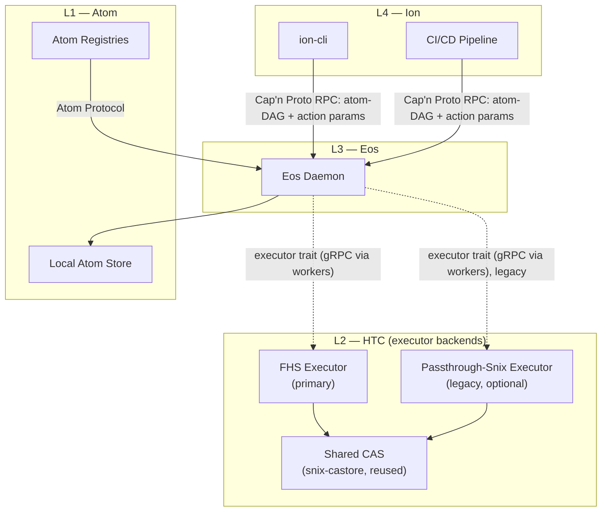
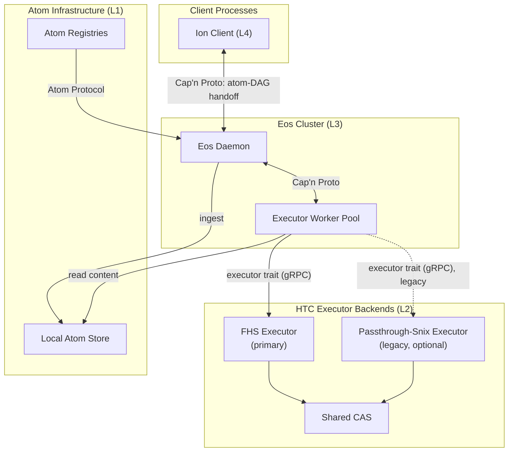
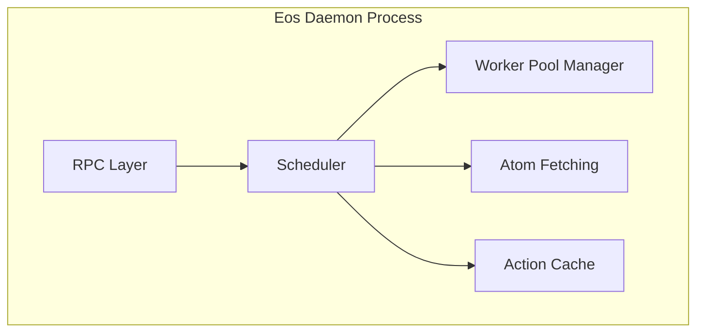
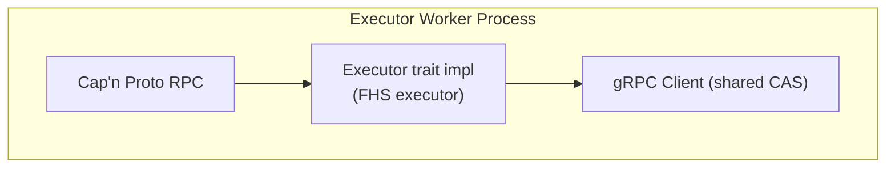
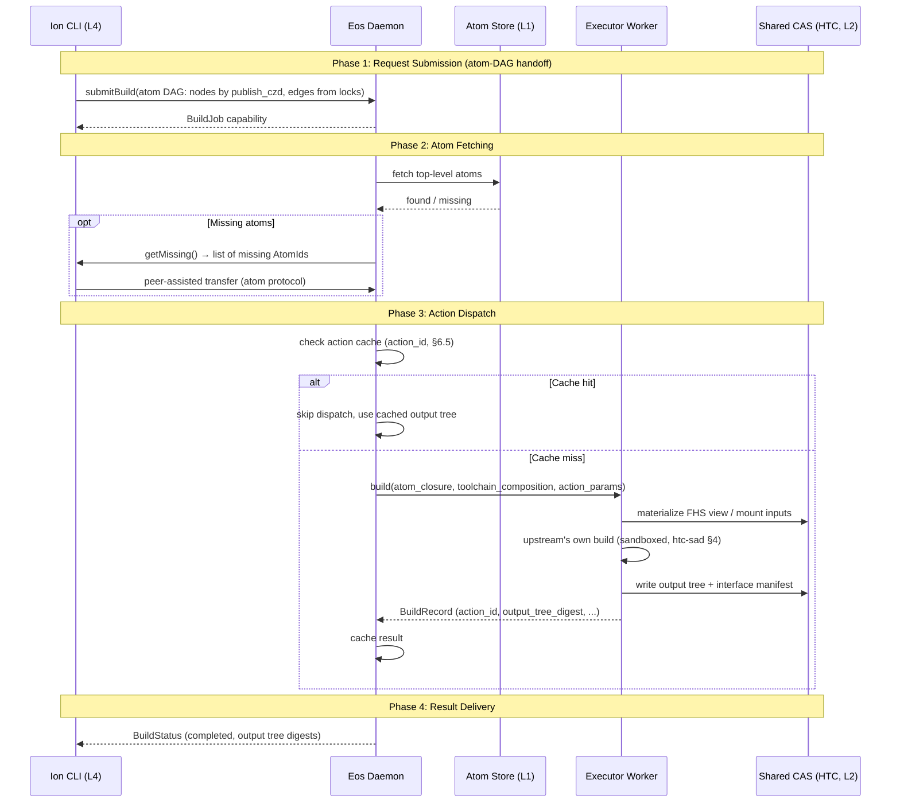
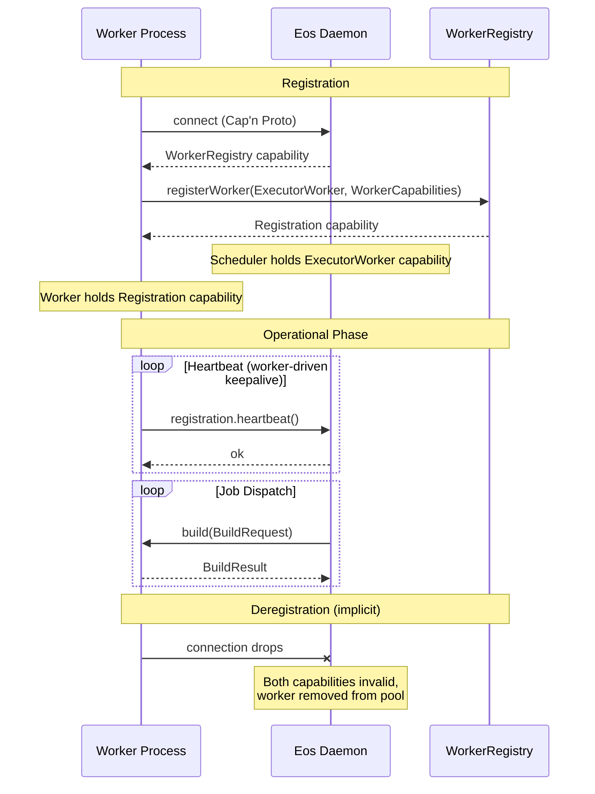
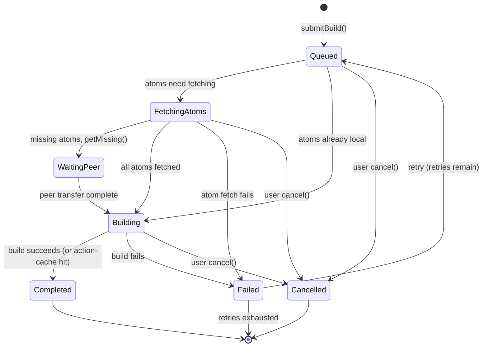
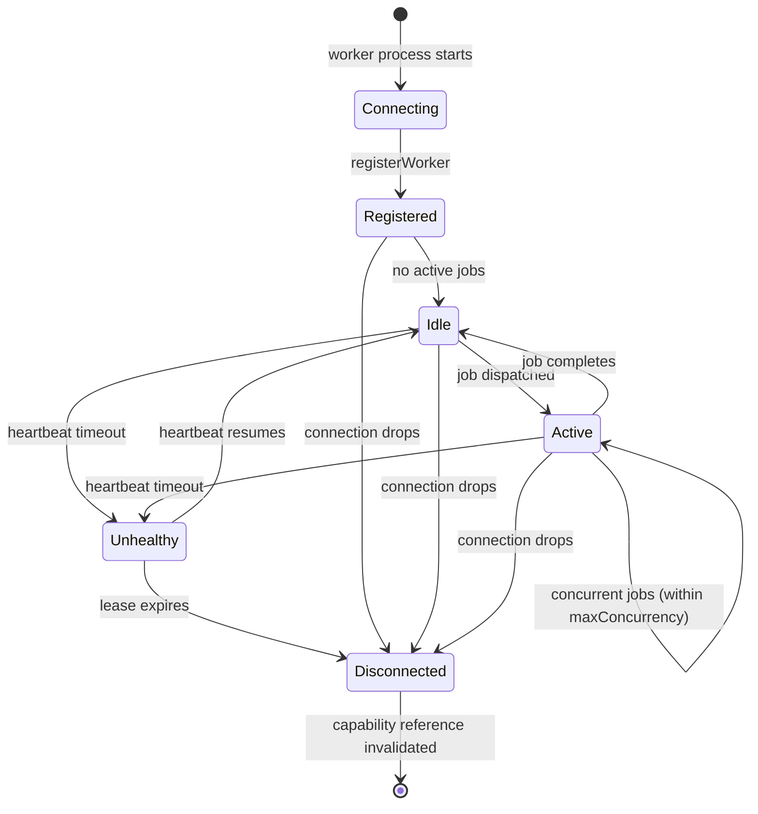

# Eos Software Architecture Document (SAD)

<!--
  This document is the authoritative source of truth for the Eos (L3) layer
  architecture. Specifications derive from this document. ADRs record changes
  to the architecture described here. When a conflict exists between this
  document and a specification or ADR, this document takes precedence and the
  conflicting artifact must be updated.

  Maintained as Architecture-as-Code alongside the codebase. Diagrams are
  Mermaid.js, embedded inline. When an ADR changes the system's trajectory,
  this SAD is updated in the same commit to reflect the new state.

  Settled design inputs: ADR-0005 (../adr/0005-hermetic-transactional-composition.md)
  — the atom-DAG re-scope, the executor trait, and the L3 layer designation
  ([htc-layer-designation], ADR-0005 §9); the HTC substrate SAD
  (htc-sad.md), which owns the build/composition contract (executor trait,
  action identity, the shared CAS) this document dispatches through and does
  not restate. Eos schedules; HTC executes.
-->

## 1. Context

### 1.1 System Purpose

Eos is the **atom-DAG scheduling layer** (L3) of the Axios decentralized
publishing stack. It receives a pre-coarsened atom DAG from Ion at build
submission — nodes are atoms identified by `publish_czd`, edges are the
dependency relationships already resolved into the lock (ion-sad §6.6, the
Eos Handoff) — and dispatches build **actions** to executor-trait workers,
which populate a shared, content-addressed artifact store (HTC's CAS) with
the results.

There is no evaluation stage. The DAG is not produced by evaluating an
expression against atom source trees; it is read directly off locks
(`[htc-atom-dag-executor-trait]`, ADR-0005 §6). Eos schedules; it does not
build. Building — the deterministic, hermetic function `build(atom closure,
toolchain composition, action params) → output tree` — is HTC's (L2)
contract, executed by workers implementing HTC's executor trait — the
FHS executor (materializes a composed FHS view, runs upstream's own build
under sandboxing; a formerly-named "optional passthrough-snix executor"
was removed by [ADR-0006](../adr/0006-execution-as-the-primitive.md) §3). Eos dispatches through that trait
without knowing or caring which implementation backs a given worker.

Eos is designed to operate as a distributed cluster, scaling build capacity
independently across heterogeneous machines. It does not own atoms (L1
concern), dependency resolution or the atom-DAG's construction (L4/Ion
concern), or the build/composition mechanism itself (L2/HTC concern — eos
dispatches through the executor trait, it does not implement `build`).

### 1.2 External Actors



### 1.3 System Boundaries

| Boundary                  | Inside Eos                                                                | Outside Eos                                                     |
| :------------------------ | :------------------------------------------------------------------------ | :---------------------------------------------------------------- |
| **Scheduling**            | Dispatching build actions to executor workers, action-id cache, DAG traversal ordering | The `build` function itself, sandboxing, FHS-view materialization (L2/HTC concern) |
| **Atom Fetching**         | Fetching top-level atoms into local store (registries → local → ion peer) | Atom identity, signing, verification (L1 concern)                |
| **Dependency Resolution** | Not an Eos concern                                                        | Lock file resolution, atom-DAG construction, SAT solving (L4/Ion concern) |
| **Artifact Storage**      | All workers use the global shared store (HTC's CAS)                       | Store implementation, GC, replication (L2/HTC concern)            |

### 1.4 Layer Discipline

Dependencies flow strictly downward: Ion (L4) → Eos (L3) → HTC (L2) → Atom
(L1).

- Eos MUST NOT import Ion types or depend on Ion crates.
- Atom MUST NOT import Eos types or depend on Eos crates.
- The Eos daemon crate (`eos-daemon`) has **zero executor-implementation
  dependencies** — no FHS-specific code, no snix code. All build execution
  occurs through workers implementing HTC's executor trait
  (`build(atom_closure, toolchain_composition, action params) → output
  tree`, htc-sad §3.5) via gRPC/Cap'n Proto. This mirrors `layer-
  boundaries.md`'s `[boundary-downward-only]` rule; eos depends on HTC only
  through the executor trait it dispatches through (htc-sad §1.4).

### 1.5 Deployment Modes

Eos supports composable deployment modes via Cargo feature flags
and dependency injection. All modes share identical codepaths —
the mode determines wiring, not logic. See
[ADR-0003](../adr/0003-composable-deployment-modes.md).

| Mode                | Description                                                                                                                          |
| :------------------ | :-------------------------------------------------------------------------------------------------------------------------------------- |
| **Monolithic Ion**  | `BuildEngine` compiled into `ion-cli`. Zero daemons, zero sockets. The executor trait is wired in-process (FHS executor). |
| **Monolithic Eos**  | Single `eosd` daemon with an executor implementation compiled in. Ion connects as a thin client. Simplifies multi-client single-host. |
| **Distributed Eos** | Ion → `eosd` → executor worker pool → executor backends (HTC's shared CAS + FHS executor). Each component independently scalable. |

All modes produce identical outputs (mode bisimilarity). The
monolithic modes are compiler features (Cargo feature flags),
not architectural modes — they MUST NOT modify codepaths.

### 1.6 Store Taxonomy

The system uses two functionally distinct store types (a third, `ArtifactStore`,
is owned one layer down):

| Store             | Layer      | Semantics                                          | Interface                                  |
| :---------------- | :--------- | :--------------------------------------------------- | :------------------------------------------- |
| **AtomRegistry**  | L1         | Append-only, signed, distributed publishing        | `claim()`, `publish()`                     |
| **AtomStore**     | L1         | Mutable working store, collects atoms from sources | `ingest()`, `import_path()`                |
| **ArtifactStore** | L2 (HTC)   | Content-addressed build output blobs (HTC's shared CAS — `snix-castore` `BlobService`/`DirectoryService`, reused, htc-sad §2.4) | `store()`, `fetch()`, `check_substitute()` |

Eos consumes atoms via `AtomContent` — the forgetful functor
that drops mutation observers (`ingest`, `contains`) from
`AtomStore` while retaining identity, metadata, and content
access. The daemon's atom-fetching component writes to its own
local `AtomStore` internally, but the inter-layer boundary is
`AtomContent` (read-only from the perspective of external atom
sources). Eos never writes to registries — publishing is a
developer concern.

The **AtomStore** and **ArtifactStore** are distinct and
MUST NOT be conflated:

- **AtomStore**: Contains source trees (atom content). Used
  during atom fetching and action dispatch.
- **ArtifactStore**: Contains build outputs (executor action
  results — output trees, HTC's CAS, htc-sad §2.4). Eos reads
  from it (cache checks); executor workers write to it. Eos MUST
  NOT write directly to the artifact store — artifact production
  is the executor's responsibility.

---

## 2. Container View

The Eos system involves two Eos-owned process types (daemon, executor
workers) and HTC's executor backends (the shared CAS, and the executor
implementations workers wrap) that communicate via two transport protocols:



### 2.1 Eos Daemon (Scheduler)

The central coordination process. Stateless except for ephemeral
in-flight job state. Manages one worker pool (executor workers), dispatches
build actions read off the atom DAG, maintains the action-id cache, and
orchestrates atom fetching.

**Key constraint (target state, per [ADR-0002](../adr/0002-decoupling-snix-backend.md)
Tiers 1/2/4, carried forward by ADR-0005 §10)**: The daemon has **zero
executor-implementation dependencies**. It will not link against `snix-eval`,
`snix-castore`, `snix-build`, or any executor-specific crate. All executor
interaction is mediated by workers via gRPC, through the executor trait HTC
owns (htc-sad §3.5). The current codebase has coupling violations being
migrated (see Appendix D).

**Transports**:

- Client-facing: Cap'n Proto RPC over UDS (dev) or TCP+pluggable auth
- Worker-facing: Cap'n Proto RPC (internal cluster network)

**State**:

- `workers: Map<WorkerId, WorkerStatus>` — registered executor workers
- `queue: Map<JobId, Job>` — pending/in-flight build jobs
- `action_cache: Map<ActionId, Set<BuildRecord>>` — accumulated action witnesses (§6.5; ADR-0006 §4)

### 2.2 Executor Workers

Long-lived external processes implementing HTC's executor trait:
`build(atom_closure, toolchain_composition, action_params) → output tree`
(htc-sad §3.5). There is exactly one worker kind. Each executor worker:

- Wraps exactly one executor implementation — the **primary** FHS executor
  (materializes a composed FHS view, runs upstream's own build under
  OCI/bwrap sandboxing, htc-sad §4)
- Connects to the shared CAS via gRPC for store access
- Communicates with the scheduler via Cap'n Proto (`ExecutorWorker`
  interface, §8.3)
- Returns a `BuildRecord` (htc-sad §2.3: `action_id`, `output_tree_digest`,
  `build_composition_root`, `observed_read_set_digest`, builder signature)
  and any derived interface manifests (htc-sad §2.2) to the scheduler

**Isolation**: Sandboxing and network containment are wholly the executor
implementation's concern (§6.2, §6.4) — the daemon and its scheduler
perform none of it and hold no opinion on how a given executor achieves it.

**Lifecycle**: Started by external orchestrators (systemd,
process-compose, Kubernetes). The scheduler does NOT manage worker
lifecycles. Workers register via Cap'n Proto capability passing (§4.2).

### 2.3 Shared Artifact Store

HTC's CAS provides the network-shared artifact store (htc-sad §2.4, reusing
`snix-castore`'s `BlobService`/`DirectoryService`):

- `BlobService` — content-addressed blob storage
- `DirectoryService` — Merkle tree directory structure

**Critical invariant** (`[eos-shared-artifact-store]`, §6.1): All executor
workers in the cluster MUST be configured to use the **same** shared CAS.
Artifacts accumulated anywhere in the cluster — whether produced by a
top-level build or an ingestion — are instantly available to all other
workers via the shared store, regardless of which executor implementation
produced them. This eliminates redundant builds and enables the cluster to
function as a unified build cache.

Latency of store access is an operational concern managed by
network topology (e.g., co-locating workers and the store in
the same availability zone).

### 2.4 Executor Backends

Separate processes that implement HTC's `build` function in sandboxed
environments (htc-sad §3–§4). They:

- Expose the executor trait for build dispatch (via gRPC, wrapped by the
  worker's Cap'n Proto shim)
- Mount the composed FHS view (castore-backed; materialization per
  execution-model.md §6.3–6.4)
- Apply platform-appropriate sandboxing (OCI/bwrap on Linux)
- Write build outputs to the global shared store

Executor backends are NOT managed by the Eos scheduler. They are
infrastructure managed by cluster operators, owned architecturally by HTC
(L2), not eos.

---

## 3. Component View

### 3.1 Eos Daemon — Internal Components



**Scheduler**: The core dispatch loop. Receives the atom-DAG at submission,
consults the action cache, dispatches ready actions to available workers via
Rendezvous hashing, tracks job lifecycle, handles cancellation and progress
streaming.

**Worker Pool Manager**: Maintains the set of registered workers
and their capabilities. Handles registration (via capability
passing), deregistration (implicit via capability drop), and
health monitoring (heartbeat + lease expiry).

**Atom Fetching**: Implements the layered `FindMissing` pattern for top-level atoms. Checks local atom store, then registry mirrors, then falls back to ion peer for dev-only atoms.

**Action Cache**: Memoizes build results by `action_id` (htc-sad §6.5). The
cache is consulted before dispatching an action to a worker. Cache hits skip
dispatch entirely.

### 3.2 Executor Worker — Internal Components



**Executor trait impl**: The single contract this process wraps —
`build(atom_closure, toolchain_composition, action_params) → output tree`
(htc-sad §3.5). The **primary** implementation is the FHS executor: it
materializes the composed atom closure and toolchain composition as an FHS
view (castore FUSE), runs upstream's own, unmodified build under an
OCI/bwrap sandbox, and ingests the result (htc-sad §4). (A passthrough-snix
implementation was formerly named here; removed by [ADR-0006](../adr/0006-execution-as-the-primitive.md) §3.)
Which implementation a given worker process runs is a
deployment choice, opaque to the scheduler beyond what capability metadata
the worker advertises at registration (§7.2).

**gRPC Client**: Bridges the executor implementation to the shared CAS
(htc-sad §2.4) for store access — reads of the atom closure and toolchain
composition, and writes of the resulting output tree.

---

## 4. Core Lifecycles

### 4.1 Build Lifecycle

The end-to-end lifecycle follows the `BuildPlan` coproduct — each requested
action resolves to one of two variants:

| Variant              | Meaning                    | Action                    |
| :-------------------- | :--------------------------- | :--------------------------- |
| `Cached(output_tree)` | Output exists in the CAS     | Return immediately         |
| `NeedsBuild(action)`  | Nothing cached                | Dispatch to executor worker |

This two-variant cache-skipping model is the system's core value
proposition: the `action_id` cache (§6.5) plus the shared CAS (§2.3, §6.1)
let an entire subtree of an atom-DAG skip dispatch whenever its action has
already been built anywhere in the cluster. (A third variant formerly
belonged to the removed passthrough executor, [ADR-0006](../adr/0006-execution-as-the-primitive.md) §3;
eos's scheduling contract sees exactly the two variants above.)

The end-to-end lifecycle of a build request from Ion to artifact:



### 4.2 Worker Registration Lifecycle

Workers are external processes that self-register with the daemon:



### 4.3 Atom Fetching (FindMissing Pattern)


**Atom access and the DAG**: Once top-level atoms are in the atom store, an
executor worker materializes them (and the rest of an action's atom
closure) into the build's FHS view (htc-sad §2, §4). An atom's dependencies
are not fetched separately or resolved internally by an executor — they are
already explicit nodes and edges in the atom-DAG Ion hands off at submission
(§1.1, §4.1): dependency resolution is complete before the DAG reaches eos.
Non-atom fetch dependencies (source tarballs, crates, npm packages) are
lock-side `[[deps]]` entries of `type = "fetch"`, executed by HTC's
record/replay proxy (htc-sad §4.2) — not fetched by eos, and not resolved by
an evaluator, because there is no evaluator.

---

## 5. State Machine Models

### 5.1 Job Lifecycle



Once all atoms for an action are local, the job moves directly to
`Building`, where the action-cache check (§6.5) is the first thing that
happens — a cache hit resolves to `Completed` without ever contacting a
worker.

### 5.2 Worker Lifecycle



---

## 6. Cross-Cutting Concerns and System Invariants

### 6.1 Shared Artifact Store

**Invariant `[eos-shared-artifact-store]`**: All executor workers in the
cluster MUST be configured to use the same shared artifact store (HTC's CAS,
§1.6, §2.3). Artifacts accumulated anywhere in the cluster — whether
produced by a top-level build or an ingestion — MUST be instantly available
to all other workers, regardless of which executor implementation produced
them.

This is the critical efficiency invariant that makes the cluster
function as a unified build cache.

**Operational concern**: Store access latency is managed by
network topology (co-locating workers and the store in the
same availability zone). This is an operator responsibility, not
an Eos architectural concern.

### 6.2 Executor Isolation

**Invariant `[eos-executor-isolation]`**: The Eos daemon and its scheduler perform **zero** sandboxing
and hold **zero** opinion on how a build is isolated. Isolation is wholly
delegated to the executor implementation a worker wraps:

- The **primary FHS executor** runs upstream's own build inside an
  OCI/bwrap sandbox against a materialized FHS view; the only bytes a build
  process can read are those declared in the atom closure and toolchain
  composition (`[htc-declared-closure-enforced]`, htc-sad §1.1) — enforced
  by the sandbox, not trusted from the build's own behavior.

Every action is dispatched to an executor identically; isolation is
uniformly the executor's contract to uphold, never the scheduler's
(htc-sad §6.2, §6.8).

### 6.3 Fetch Execution

**Invariant `[eos-fetch-execution-delegation]`**: Fetch execution for non-atom dependencies is an internal
concern of HTC's record/replay proxy (`[htc-fetch-set-lock-plugin]`,
ADR-0005 §7; htc-sad §4.2). The Eos scheduler does not orchestrate fetches
— they occur inside the executor's sandboxed environment, routed through the
proxy the executor implementation wires in.

**Scheduler awareness**: The scheduler is not aware of individual fetch-set
entries; it dispatches an action, and the executor's own sandbox network
policy (record/replay proxy or no network at all) governs what that action's
build process can reach. The scheduler routes only the top-level action —
the sub-execution this proxy performs is wholly worker-internal.

**Operator topology**: Whether an action's fetch-set entries are served in
record mode (first build, explicitly impure, writing back to the lock) or
replay mode (every subsequent build, pure `request → pinned bytes`) is
determined by the lock state HTC's proxy reads, not by eos.

### 6.4 Build Sandboxing

Build sandboxing is delegated to the executor implementation:

- **FHS executor (primary)**: OCI runtime (`crun`/`runc`) or Bubblewrap
  (`bwrap`) on Linux, reusing `snix-build`'s sandbox (htc-sad §2).
- **Passthrough-snix executor (legacy)**: Whatever sandbox `snix-build`
  provides upstream, unchanged by this substrate.
- **macOS**: No native sandbox (only `DummyBuildService` upstream).
- **Remote**: Delegation to remote executor endpoints.

The Eos daemon and executor worker shims perform zero sandboxing.
Network containment is enforced by the executor: a build's only network
route, if any, is HTC's content-addressing record/replay proxy
(§6.3, htc-sad §4.2). Outside of a fetch-set entry served through the
proxy, builds MUST NOT access the network.

### 6.5 Action-Id Cache

The scheduler maintains an action cache keyed by `action_id`
(htc-sad §6.5, ADR-0005 §2):

```text
action_id = H( atom_czd_closure_root       // what to build (signed intent)
             , toolchain_composition_root  // what to build WITH
             , action_params )             // target system, variant flags
```

Before dispatching an action to a worker, the scheduler computes
`action_id` from the request and checks the cache. If the key has
been previously built, the cached `BuildRecord` (and its output tree
in the shared CAS) is returned without worker dispatch. There is exactly
one cache, at the action granularity.

`action_params` (the successor of `[compose.args]`'s composer arguments) is
opaque to the daemon — it is included in `action_id` because different
params produce different output trees, but the daemon does not interpret
the values.

The action cache is ephemeral in-flight state — it is not persisted
across daemon restarts. The shared CAS and its appended `BuildRecord`s are
the durable source of truth (§9.5).

### 6.6 Content Addressing and Verification

All data in the system is content-addressed:

- **Atoms**: identified by the abstract pair `(anchor, label)` — **not** a
  digest of it (atom-sad §6.1, `[identity-content-addressed]`). The atom's
  signed publish (`publish_czd`) is the content identity the lock carries
  (atom-sad §6.5) and eos consumes.
- **Actions**: identified by `action_id` (`Digest` trait, currently Blake3
  over the H formula in §6.5) — the one drv/plan-hash-shaped identity in
  the system.
- **Artifacts**: content-addressed output trees in HTC's shared CAS
  (htc-sad §2.4), each *build event* producing one `BuildRecord` —
  records accumulate per action (multiple builders may legitimately
  contribute distinct witnesses, useful as reproducibility evidence;
  execution-model.md §2.2, ADR-0006 §4) (htc-sad §2.3).

The atom protocol verifies integrity on ingestion — the store
does not accept unverified atoms regardless of their source.
Fetch-set entries executed by HTC's record/replay proxy are content-
addressed the same way (htc-sad §4.2).

Developer-signed atom metadata tags MAY include an expected `action_id`
and/or output-tree digest. When present, these enable accelerated
cache-skipping: if the signed output-tree digest exists in the CAS, the
build is skipped entirely; if the signed `action_id` has a cached
`BuildRecord`, only dispatch is skipped. The trust level of these metadata
tags is a client (Ion) decision — Eos uses them as optimization hints, not
as authoritative guarantees.

The cryptographic chain:

```text
Atom identity   → publish_czd    → action_id            → Output Tree + BuildRecord
(anchor, label)   (signed content) H(atom_czd_closure,     (htc-sad §2.3, §2.4)
                                    toolchain_composition,
                                    action_params)
```

Each step is independently verifiable and cacheable. If a `BuildRecord`
exists for an `action_id` → skip dispatch. This enables cache-skipping at
every stage, via the single action-level cache-or-build decision described
in §4.1 and §6.5.

### 6.7 Trust and Attestation Model

Trust authority flows from developers to operators to clients:

1. **Developer attestation** (primary): Developers sign atom
   metadata tags containing expected `action_id` and/or output-tree
   digests. These are trust evidence — one acceptable witness class
   under the consumer's anchors (execution-model.md §3.4) — not an
   assertion that a single canonical output exists (ADR-0006 §4).

2. **Builder attestation** (supplementary): Eos executor workers sign
   build outputs — `builderId`, `action_id`, `outputDigest`,
   `signature`, and `timestamp`. This attests "I built action X
   and got artifact Y" but does not establish authority over
   what the correct output should be.

3. **Operator policy** (enforcement gate): Cluster operators
   configure trust policies — e.g., "only accept build requests
   for atoms signed by one of these org keys." This is a
   deployment-time configuration, not a runtime user concern.

4. **Client trust decision** (final): Ion (the client) decides
   which keys to trust. Trust level is always explicit:
   developer key, own key, another party's key, or unsigned.
   The client makes the final trust trade-off.

**Substitution from peers**: Cached artifacts may be
substituted from untrusted peers. Before accepting a
substituted artifact, the system:

1. Verifies the content digest matches the expected digest
   from the verified action
2. Validates builder attestations against the configured
   trust policy

**Trust policies** (deployment-configurable):

- Trust-on-first-use
- Named-builder (whitelist specific builder identities)
- M-of-N threshold (require M of N trusted builders to agree)
- Double-build (N=2, build on two distrusted workers, verify
  output identity for reproducibility auditing)

**Invariant `[eos-trustless-substitution]`**: Content digest of
fetched artifact MUST match expected digest from a verified action.
Reject on mismatch regardless of trust policy.

### 6.8 Formal Model Backing

The architecture is formally validated by coalgebraic analysis
documented in [publishing-stack-layers.md](../models/publishing-stack-layers.md).

Key validated properties:

- **Trait hierarchy soundness**: Forgetful functor from `AtomStore`
  to `AtomContent` preserves bisimulation
- **BuildPlan IS protocol structure**: `CacheSession ≅ BuildSession`
  — the cache-skipping model is isomorphic to the session type
  protocol. The isomorphism's survival over the collapse from three
  `BuildPlan` variants to two (§4.1) is confirmed as a **Finding** in
  `publishing-stack-layers.md` (around lines 394–401): the two
  cache-skipping levels at the primary executor are isomorphic to the
  two-variant `BuildSession` (Cached, NeedsBuild) — a formal
  property is not this document's fact to assert, so re-verification
  lands there, not here. (A legacy three-variant form was formerly
  scoped to the removed passthrough executor; ADR-0006 §3.)
- **Deployment mode interchangeability**: Embedded and client-server
  modes are bisimilar (same `BuildEngine` observations)
- **Ingest preserves identity**: `resolve(store, id) ⊇ resolve(source, id)`
- **Scheduling is correctness-invariant**: Two schedulers are
  bisimilar if they produce the same final outputs; scheduling
  is optimization, not semantics

### 6.9 Scheduler Invariants

The following cross-cutting scheduler invariants apply globally:

**Job deduplication `[eos-scheduler-deduplication]`**: At most one
active job per `JobId`. `JobId = action_id` (§6.5, htc-sad §6.5). Duplicate
submissions append the client to the existing job's subscriber
set rather than creating a new job. This means multiple Ion
instances submitting the same lock file get the same build.

**Lazy fetching `[eos-scheduler-lazy-fetching]`**: Workers MUST
NOT fetch source or inputs until a job is assigned to them. The
scheduler orchestrates atom resolution (§4.3) before dispatch;
workers receive pre-resolved references.

**Lease management `[eos-scheduler-lease-expiry]`**: Every RUNNING
job is covered by a `Lease` with `granted_at` and `expires_at`
timestamps. If a lease expires (worker failed to renew), the
scheduler revokes the lease, dissociates the job from the worker,
and re-queues it to QUEUED state for reassignment.

**State isolation `[eos-scheduler-state-isolation]`**: The scheduler
MUST NOT depend on L4 (Ion) internal state. It is a pure consumer
of structured `eos-core` types. No manifest parsing, no lock file
interpretation.

**Concurrency limits `[eos-scheduler-concurrency-limits]`**: RUNNING
jobs on a worker MUST NOT exceed the worker's configured capacity.

---

## 7. Worker Registration and Capability Model

### 7.1 Design Principles

Worker registration follows Cap'n Proto's capability-passing model:
the worker connects to the daemon, obtains a `WorkerRegistry`
capability, and passes _itself_ as an `ExecutorWorker`
capability along with its metadata. The scheduler holding the
capability reference IS the registration. Capability drop (worker
disconnect) IS deregistration.

### 7.2 Worker Capabilities

Workers advertise capabilities at registration via a generic
tag model — flat key-value properties that express scheduling
predicates without hardcoding engine-specific concerns.

**Tag model**:

Workers register with `tags: Map<Text, Text>` — arbitrary
key-value metadata. The scheduler matches job requirements
against worker tags using **set containment**: a job's
required tags must be a subset of the worker's tags.

Common tag conventions (not hardcoded in the protocol):

| Tag Key                | Example Value  | Semantics                        |
| :--------------------- | :------------- | :-------------------------------- |
| `system`               | `x86_64-linux` | Target system triple             |
| `feature:kvm`          | `true`         | `requiredSystemFeatures` match   |
| `feature:big-parallel` | `true`         | `requiredSystemFeatures` match   |
| `tier`                 | `large`        | Hardware tier for weight scoring |


**Scheduling weight** (optional):

Workers MAY register `weights: Map<Text, Float32>` mapping
tag keys to numeric multipliers. The scheduler uses these for
soft preference scoring: among feasible workers (those passing
tag containment), prefer workers with higher total weight for
the matched tags.

**Not in capabilities** (operational config, not scheduling
predicates):

- `maxConcurrency` — How many parallel jobs a worker can handle.
  Used for load management (admission control), not job routing.
  Configured by the operator, not advertised as a capability.

### 7.3 Scheduling Algorithm

**Action dispatch**:

1. Filter by tags: job's required tags ⊆ worker's tags
2. Filter by capacity: worker has available job slots
3. Filter by health: worker is healthy (heartbeat within deadline)
4. Rank by Rendezvous hash (input affinity for cache hits)
5. Tie-break by scheduling weight (sum of matched tag weights)

There is exactly one dispatch algorithm, serving the single executor
worker pool (§2.2).

### 7.4 Health Monitoring

Two-tier health model:

- **Level 1 (implicit)**: Cap'n Proto detects broken connections
  automatically. Both capability references (scheduler's worker
  cap and worker's registration cap) become invalid. This
  provides instant crash detection.
- **Level 2 (explicit, keepalive)**: Workers periodically call
  `registration.heartbeat()` on the `Registration` capability
  returned at registration time. The scheduler tracks
  `last_heartbeat` per worker. If `now - last_heartbeat >
heartbeat_deadline`, the worker is marked unhealthy. No new
  jobs are dispatched to unhealthy workers, and their leases
  are revoked.

The keepalive model (worker→scheduler) is deliberately chosen
over ping (scheduler→worker) because:

- **No false positives under load**: The scheduler's health
  check is a passive timestamp sweep, never blocked waiting
  for worker responses. An overloaded scheduler cannot
  accidentally mark healthy workers as unhealthy.
- **Worker self-awareness**: A worker that fails to send its
  heartbeat (connection error, timeout) knows immediately
  that something is wrong and can self-isolate.
- **Metadata piggybacking**: Workers can include load metrics
  with their heartbeats (future extension via `updateMeta()`).

---

## 8. Transport and Security

### 8.1 Transport Architecture

Two independent transport layers:

| Surface                | Protocol        | Transport              | Auth                                                    |
| :--------------------- | :-------------- | :---------------------- | :--------------------------------------------------------- |
| Client → Daemon        | Cap'n Proto RPC | UDS (dev) / TCP (prod) | Pluggable (NullAuth / CyphrAuth / MtlsAuth / TokenAuth) |
| Daemon → Workers       | Cap'n Proto RPC | UDS or TCP             | Internal cluster trust                                  |
| Workers → Shared CAS   | gRPC            | TCP                    | Store config                                            |
| Workers → Executor Backend | gRPC       | TCP                    | Executor config                                         |

### 8.2 Authentication

Authentication is a pluggable middleware interface. Operators
choose their trust stack based on deployment requirements.
The auth interface accepts connection metadata and returns an
authenticated identity.

Implementations:

- **NullAuth** — Accept all connections. Development only
  (UDS with filesystem permissions provides implicit access
  control).
- **CyphrAuth** — Mutual authentication via Cyphr Principal
  Roots. Preferred for production deployments.
- **MtlsAuth** — X.509 client certificate verification.
  Standard enterprise pattern.
- **TokenAuth** — Bearer token validation. For CI/CD pipeline
  integration.

The auth boundary is at the transport layer (connection
establishment), not the application layer. Auth credentials
flow as connection metadata; the Cap'n Proto RPC layer is
auth-agnostic.

### 8.3 Cap'n Proto Interface Summary

**Client-facing** (defined in `eos.capnp`):

```typescript
interface EosDaemon {
  submitBuild(request :BuildRequest) -> (job :BuildJob);
  queryStatus(jobId :Data) -> (status :BuildStatus);
  getCapabilities() -> (...);
  discover() -> (discovery :AtomDiscovery);
}

interface BuildJob {
  attachProgress(callback :ProgressStream) -> ();
  cancel() -> ();
  getJobId() -> (jobId :Data);
  getMissing() -> (missingAtoms :List(AtomId));
}
```

**Worker-facing** (to be added). There is one worker kind — the pre-
substrate `EvalWorker`/`BuildWorker` split collapses to a single
`ExecutorWorker` interface, since every worker dispatches through the same
executor trait (§2.2, §3.2) regardless of which implementation backs it:

```typescript
interface WorkerRegistry {
  registerWorker(worker :ExecutorWorker,
    caps :WorkerCapabilities)
    -> (registration :Registration);
}

# Returned to worker at registration time.
# Worker holds this capability and heartbeats on it.
# Dropping this capability = deregistration.
interface Registration {
  heartbeat() -> ();
  updateMeta(meta :WorkerMeta) -> ();
}

# Held by the scheduler. Methods invoked by scheduler.
interface ExecutorWorker {
  build(request :BuildRequest)
    -> (result :BuildResult);
  cancel(jobId :Data) -> ();
  attachProgress(jobId :Data,
    callback :ProgressStream) -> ();
}
```

The bidirectional capability exchange:

- Worker passes `ExecutorWorker` → scheduler holds it
- Scheduler returns `Registration` → worker holds it
- Both sides hold references to each other
- Connection break invalidates both (level 1 detection)
- Worker calls `registration.heartbeat()` periodically (level 2)

---

## 9. Failure Modes

### 9.1 Worker Failure During Job Execution

If a worker fails (crash, network partition) while executing a
job, the scheduler detects the failure via heartbeat timeout or
capability drop. The job is re-queued for dispatch to another
worker. Build outputs in the global store from partial execution
are orphaned (eligible for GC).

### 9.2 Fetch Execution Failure

If an action's build process requires a fetch-set entry that HTC's
record/replay proxy has no recorded map for (replay mode) or that the
proxy cannot record (TLS interception friction, upstream fetch
nondeterminism — htc-sad §8.3, §8.5), the executor fails the action with a
recoverable error. The scheduler MAY retry on a different worker; if the
failure is deterministic (e.g. a permanently unrecorded fetch), retrying
elsewhere does not help and the job surfaces the fetch error to the client.
The scheduler observes only this recoverable-or-not verdict — the fetch
proxy's own record/replay mechanics are wholly worker-internal (§6.3).

### 9.3 Atom Fetching Failure

If atom fetching fails (atom not in local store, not in
registries, and peer-assisted transfer fails or is not
available), the job fails with a fetch error. No partial
work is performed.

### 9.4 Store Unavailability

If the global shared store becomes unavailable, all workers are
effectively blocked. This is a cluster-wide failure. The
scheduler continues to accept requests but all dispatched jobs
will fail. Recovery requires restoring store availability.

### 9.5 Daemon Restart

The daemon holds only ephemeral in-flight state. On restart:

- All in-flight jobs are lost (clients must re-submit)
- Workers must re-register (capabilities are connection-scoped)
- The action cache is cleared (cold start)
- The artifact store is unaffected (durable, external)

---

## 10. Known Gaps and Future Explorations

The following areas require further analysis. Each may result
in a future ADR or specification amendment.

| #   | Gap                       | Notes                                                                                                                               |
| :-- | :------------------------ | :---------------------------------------------------------------------------------------------------------------------------------- |
| 1   | **Caching strategy**      | How is the action cache distributed across a cluster? How do developer-signed metadata tags interact with cache-skipping (§6.6)?    |
| 2   | **Scheduling depth**      | Priority, preemption, work-stealing trade-offs, and fairness require rigorous analysis against scheduling literature. Proposed ADR. |
| 3   | **Store topology**        | How do HTC's shared CAS instances relate in multi-site deployments? Store-to-store substitution and trust policy interaction.       |
| 4   | **Observability**         | Metrics, tracing, structured logging for operator debugging.                                                                        |
| 5   | **Graceful degradation**  | Behavior under partial availability (fewer workers, store unreachable).                                                             |
| 6   | **Pluggable auth design** | Auth trait interface, initial implementations, transport vs application layer boundary.                                             |
| 8   | **Toolchain-composition lock pinning** | `action_id` (§6.5) commits to `toolchain_composition_root`, but no lock entry type yet pins a toolchain composition (ADR-0005 Open Items; htc-sad §9 item 11) — a P2/P5 dependency of this document's own identity chain. |

---

## 11. Scope Boundaries

Eos is a build scheduling engine. The following concerns are
explicitly outside its scope:

- **Cluster orchestration**: Worker deployment, scaling, and
  lifecycle management are operator concerns (systemd, Nomad,
  Kubernetes). Eos discovers workers via registration, not
  deployment.
- **Package publishing**: Atom registration and publishing are
  developer concerns (Ion/L4). Eos reads from registries,
  never writes.
- **Trust authority**: Developer-signed metadata is the source
  of truth. Eos signs build outputs as supplementary
  attestation. Clients decide trust policy.
- **Authentication system**: Auth is pluggable middleware.
  Operators choose their trust stack. Eos provides the
  interface, not the implementation.
- **Multi-tenancy**: The scaling model is federated sharing
  between clusters, not shared tenancy within a cluster.
  Intra-cluster fairness is not a current concern.
- **The build function itself**: `build(atom closure, toolchain
  composition, action params) → output tree` — sandboxing, FHS-view
  materialization, interface analysis, and composition are HTC's (L2)
  contract, not eos's. Eos dispatches through the executor trait; it does
  not implement it.

---

## Appendix A: Terminology

| Term         | Definition                                                           |
| :----------- | :--------------------------------------------------------------------- |
| **Anchor**   | Cryptographic commitment establishing atom-set identity              |
| **Atom-id**  | The abstract pair `(anchor, label)` — identity is the pair itself, not a digest of it (atom-sad §6.1, `[identity-content-addressed]`) |
| **Atom-set** | Collection of atoms sharing a common anchor                          |
| **Label**    | Human-readable name for an atom within an atom-set                   |
| **Digest**   | Abstract content-addressed hash (algorithm not hardcoded)            |
| **Action**   | One invocation of HTC's `build` function; identified by `action_id` (htc-sad §6.5) |
| **Action-id**| `H(atom_czd_closure_root, toolchain_composition_root, action_params)` — the scheduler's cache key (ADR-0005 §2) |
| **Plan**     | Engine-specific build recipe (`BuildEngine::Plan` associated type); the MVP realization is the atom action, identified by `action_id` (ADR-0005 Supersede-ADR-0001) |
| **Output**   | Engine-specific build result (`BuildEngine::Output` associated type); the MVP realization is an output tree in HTC's CAS |
| **Artifact** | Content-addressed blob/tree in HTC's shared CAS                       |
| **Revision** | A specific commit in source history                                  |

Composition, interface manifest, and `BuildRecord` are HTC-owned objects
consumed, not redefined, here — see htc-sad Appendix A.

## Appendix B: Crate Map

| Layer | Crate        | Kind            | Purpose                                                     |
| :---- | :----------- | :-------------- | :------------------------------------------------------------ |
| L3    | `eos-core`   | Contract        | Engine traits: `BuildEngine`, `ArtifactStore`, `AtomIndex` — binds HTC's executor trait via the `BuildEngine::Plan` associated type |
| L3    | `eos-daemon` | Implementation  | Scheduler, executor worker pool, RPC server (zero executor-implementation deps target) |
| L3    | `eos-proto`  | Contract (wire) | Cap'n Proto schema and generated code                       |
| L3    | `eos-snix`   | Implementation  | Slated for removal (evaluator eradicated, ADR-0006 §3) |
| L3    | `eos`        | Implementation  | Orchestration: wires engine + store                         |
| L4    | `ion-eos`    | Bridge          | Client interface: Ion → Eos daemon via Cap'n Proto          |

The primary FHS executor is HTC-owned (L2, htc-sad Appendix B); this map
does not restate its crate surface.

## Appendix C: Specification Cross-Reference

| SAD Section          | Governing Specification                                                                                    |
| :------------------- | :-------------------------------------------------------------------------------------------------------------- |
| §2.1 Daemon          | [eos-scheduler.md](../specs/eos-scheduler.md)                                                              |
| §2.2 Executor Workers | [htc-sad.md](htc-sad.md) §3.5 (executor trait); [eos-build-engine.md](../specs/eos-build-engine.md) (re-scoped) |
| §2.3–2.4 Executor Backends | [htc-sad.md](htc-sad.md) §2.4, §4, §6.8                                                              |
| §4.1 Build Lifecycle | [ion-eos-contract.md](../specs/ion-eos-contract.md)                                                        |
| §4.3 Atom Fetching   | [ion-eos-contract.md](../specs/ion-eos-contract.md) §Content Delivery; [ion-sad.md](ion-sad.md) §6.6 (Eos Handoff) |
| §6.1 Shared Store    | [htc-sad.md](htc-sad.md) §2.4                                                                                |
| §6.2 Executor Isolation | [htc-sad.md](htc-sad.md) §1.1, §6.8; [eos-sandboxing.md](../specs/eos-sandboxing.md) (re-scoped)          |
| §6.3 Fetch Execution | [htc-sad.md](htc-sad.md) §4.2                                                                                |
| §6.4 Build Sandbox   | [htc-sad.md](htc-sad.md) §4; [eos-sandboxing.md](../specs/eos-sandboxing.md) (re-scoped)                    |
| §6.5 Action-Id Cache | [htc-sad.md](htc-sad.md) §6.5; [ADR-0005](../adr/0005-hermetic-transactional-composition.md) §2             |
| §6.6 Content Addressing | [htc-sad.md](htc-sad.md) §6.5; [atom-sad.md](atom-sad.md) §6.5–§6.7                                       |
| §6.7 Substitution    | [eos-network-protocol.md](../specs/eos-network-protocol.md) §Substitution                                  |
| §6.8 Formal Model    | [publishing-stack-layers.md](../models/publishing-stack-layers.md)                                         |
| §7 Worker Model      | [eos-scheduler.md](../specs/eos-scheduler.md), [eos-network-protocol.md](../specs/eos-network-protocol.md) |
| §8 Transport         | [eos-network-protocol.md](../specs/eos-network-protocol.md)                                                |
| Layer Discipline     | [layer-boundaries.md](../specs/layer-boundaries.md); [ADR-0005](../adr/0005-hermetic-transactional-composition.md) §9 (`[htc-layer-designation]`) |
| DAG Intake           | [ion-sad.md](ion-sad.md) §6.6 (Eos Handoff, minimal pointer); [ADR-0005](../adr/0005-hermetic-transactional-composition.md) §6 |

## Appendix D: Known Layer Violations

The following are documented violations of the layer boundaries
that require migration work:

| #   | Violation                            | Location                    | Migration                          |
| :-- | :----------------------------------- | :--------------------------- | :----------------------------------- |
| 1   | Lock types in `eos` instead of `ion` | `eos/eos/src/lock.rs`       | Migrate to `ion/ion-lock/`         |
| 2   | `ion-eos` ad-hoc TOML parsing        | `ion-eos/src/lib.rs:78-92`  | Use lock types                     |
| 3   | Eos receives raw lock content        | `run_orchestrated_build()`  | Accept structured `eos-core` types |
| 4   | Eos daemon persists lock files       | `scheduler.rs`, `config.rs` | Remove lock file I/O               |
| 5   | Eos reimplements atom fetching       | `eos/eos/src/fetch.rs`      | Use `AtomContent` from L1          |

These are tracked in [layer-boundaries.md](../specs/layer-boundaries.md) §6.

## Appendix E: Stale Documentation

- **RESOLVED** — `eos/AGENTS.md` previously referenced bwrap/Birdcage for
  **evaluation** sandboxing — the evaluation stage that note described no
  longer exists at all (ADR-0005 §6, `[htc-atom-dag-executor-trait]`), not
  merely "pure eval eliminates OS sandboxing." `eos/AGENTS.md` now reads
  (Key Design Principles for L3, item 1): "The build function executes an
  unmodified upstream build process inside a materialized FHS view (a
  composition mounted via composefs)" — bwrap/Birdcage no longer appear
  anywhere in the file (they remain, correctly, in `eos/README.md`'s
  description of the executor's actual sandbox mechanism). This matches
  SAD §6.2: executor isolation is wholly HTC's contract; eos has no
  evaluation stage to sandbox. The contradiction is closed; no further
  action outstanding.
- **RESOLVED** — `eos/AGENTS.md` previously listed "containerized sandbox
  subprocesses" wrapping **evaluation logic** for the daemon.
  `eos/AGENTS.md`'s `eos-daemon` subcrate entry now reads: "Hosts the
  `eosd` RPC daemon binary: the scheduler, its executor worker pool, and
  the RPC server that dispatches build actions to executor workers inside
  containerized sandboxes" — action-based, HTC-aligned language. This
  matches SAD §2.1: the daemon has zero executor-implementation deps;
  there is no evaluation logic to wrap. The contradiction is closed; no
  further action outstanding.
