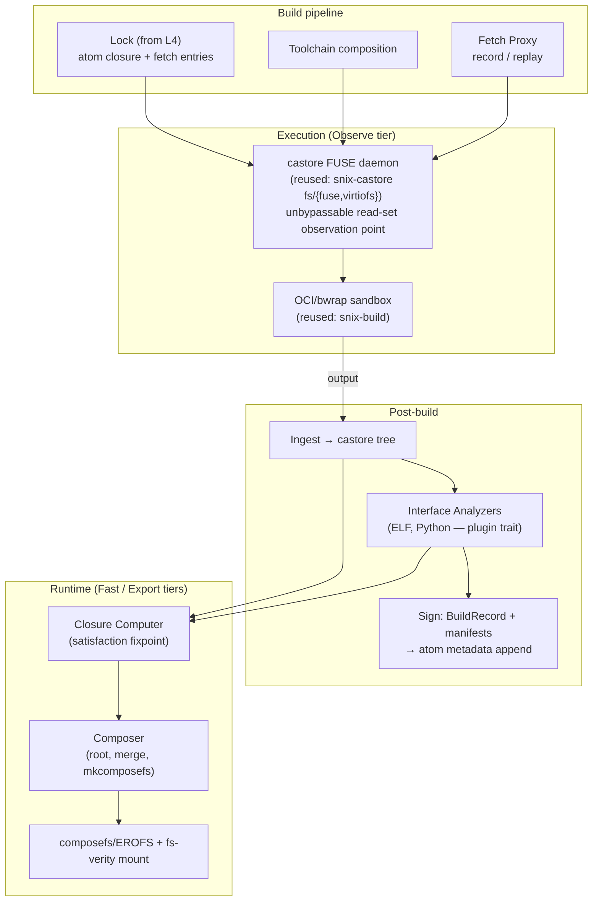
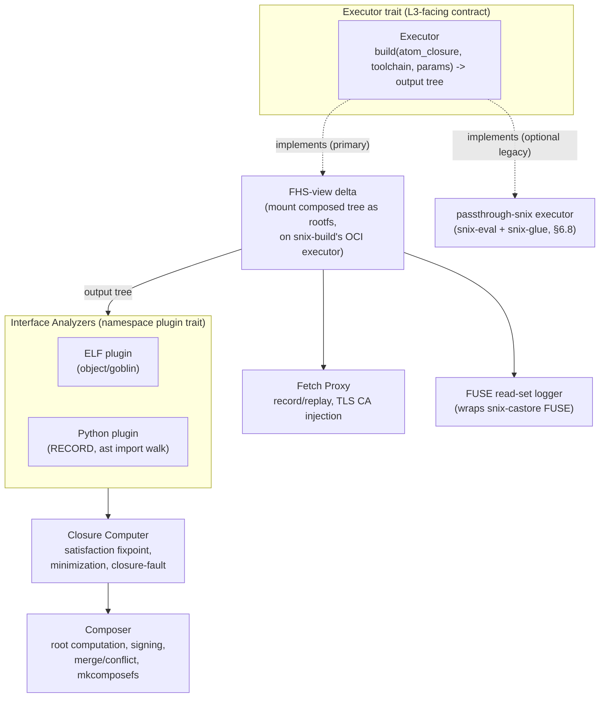

<!--
  HTC (Hermetic Transactional Composition) Software Architecture Document
  (SAD) — L2.

  This document is the authoritative source of truth for the HTC layer,
  landed alongside ADR-0005 (../adr/0005-hermetic-transactional-composition.md),
  which it elaborates in full architectural detail. There is no specification
  under docs/specs/ for this layer yet — spec authorship is P3/P4 work (see
  Appendix C); until then, this SAD and the ADR are the normative record.

  Maintained as Architecture-as-Code. Diagrams are Mermaid.js, inline.

  Settled design inputs: ADR-0005 (layer designation L2/"HTC", the GPL-seam
  wire-first posture, no-Nix-in-MVP); the atom keystone (AtomId = abstract
  (anchor,label) pair; 2-value name-anchored lock; blake3(publish_czd)-keyed
  store) which this layer's composition object generalizes one layer up.
-->

# HTC (Hermetic Transactional Composition) Software Architecture Document (SAD)

## 1. Context

### 1.1 System Purpose

HTC is the **build-execution and artifact-composition layer** (L2) of the
Axios decentralized publishing stack. It answers exactly one question
authoritatively: _given a signed atom closure and a toolchain, what tree
does upstream's own, unmodified build process produce, and what other
trees can stand in its place without breaking anything that depends on
it_ — without an interpreted expression language, and without storing
dependency pointers inside the artifacts themselves.

HTC owns:

- **The build function** — `build(atom closure, toolchain composition,
  action params) → output tree`, executed by upstream's own build process
  inside a materialized FHS view. There is no evaluator; the function is
  deterministic and hermetic — the same three inputs always produce the
  same result, success or failure — but it is **not total**: an
  unmodified upstream build can and does fail for the same reasons it
  would fail outside this substrate.
- **Interface analysis** — deriving provides/requires facts from a
  build's output tree, memoized per `(analyzer, blob)` pair in the CAS
  (§2.2). Dynamically observed facts (§6.3) are a separate, run-scoped
  record, not part of that memoization — see §2.2 for why.
- **Composition** — the signed, content-addressed name→digest binding that
  is this layer's closure object, and the successor to a Nix derivation's
  output closure.
- **Materialization** — mounting a composition as a runtime view, at one
  of three tiers (Observe / Fast / Export).
- **The fetch boundary** — executing (not declaring) the non-atom fetch
  entries an L4 lock records, via a content-addressing record/replay proxy.

HTC does **not** own: atom identity, ownership, or the lock's atom
contribution (L1, atom); dependency resolution, the lock file as a whole,
or the manifest (L4, ion); scheduling policy, worker placement, or the
atom-DAG (L3, eos — HTC is what eos's executor trait dispatches *to*, not
the scheduler itself); key management and signing primitives (Cyphr/Coz,
below L1). HTC defines the build/composition contract those layers consume
and is consumed by; it never resolves atoms or schedules itself.

**[htc-declared-closure-enforced]**: the build sandbox is deny-by-default
— the only bytes a build process can read are those materialized from the
declared atom closure and toolchain composition, plus whatever the fetch
proxy explicitly permits through its own separate channel (§4.2). The
build's observed read set is checked against this declared closure —
reads ⊆ declared — and that containment is *enforced by the sandbox*, not
trusted from the build's own behavior. This is HTC's foundational
guarantee, carried forward unchanged from Nix's own sandbox model; §6.3
names the mechanism that observes it for the *build/check-phase* case,
and §8.1 names the corresponding runtime-side failure mode for a *mounted
view* that turns out to be missing something it needs.

### 1.2 External Actors

```mermaid
graph TB
  subgraph L4["Ion (L4)"]
    ION["Manifest / Lock author\n(declares [[deps]] type=\"fetch\" entries)"]
  end
  subgraph L3["Eos (L3)"]
    EOS["Scheduler\n(atom-DAG; executor trait)"]
  end
  subgraph L2["HTC (L2)"]
    CAS["CAS\n(blobs, trees — snix-castore)"]
    COMP["Composer\n(composition root, signing)"]
    AN["Interface Analyzers\n(ELF, Python, … — atoms)"]
    FP["Fetch Proxy\n(record/replay)"]
    MAT["Materializer\n(Observe / Fast / Export)"]
  end
  subgraph L1["Atom (L1)"]
    ATOM["AtomSource\n(closure content)"]
  end
  subgraph L0["Cyphr / Coz (below L1)"]
    COZ["Signing & CozMessage digests (czd)"]
  end

  ION -->|"lock: atom closure + fetch entries"| EOS
  EOS -->|"dispatch: build(atom closure, toolchain, params)"| CAS
  CAS -->|"materialize FHS view"| MAT
  MAT -->|"upstream's own build"| CAS
  CAS -->|"output tree"| AN
  AN -->|"interface manifest"| CAS
  FP -.->|"replay pinned bytes / record new"| CAS
  ATOM -->|"read atom closure content"| CAS
  COZ -.->|"signs compositions, build records"| COMP
  COMP -->|"composition root"| MAT
```

### 1.3 System Boundaries

| Boundary          | Inside HTC                                                                    | Outside HTC                                                                    |
| :----------------- | :----------------------------------------------------------------------------- | :------------------------------------------------------------------------------ |
| **Identity**       | Action identity (`action_id`, §6.5); composition/manifest/build-record digests | Atom identity, the `(anchor, label)` pair (L1)                                 |
| **Execution**      | `build`, sandboxing, FHS-view materialization, upstream's own process          | Scheduling policy, worker placement, DAG traversal (L3, eos)                   |
| **Analysis**       | Interface manifest derivation (provides/requires), observation records, satisfaction | Manifest/lock authorship, resolution (L4, ion)                                 |
| **Fetch**          | The record/replay proxy's *execution* of a fetch entry                        | Fetch entry *declaration* — a `[[deps]]` entry with `type = "fetch"`, dispatched via ion's `[lock-dep-type-dispatch]`, is L4's (ion) |
| **Storage**        | CAS (blobs, trees), composition/manifest/build-record persistence            | Atom registry/store (L1); the lock file as a whole (L4)                       |
| **Runtime**        | View mounting (composefs/fs-verity, FUSE), closure-fault handling             | System integration below the mount (units, users, kernel modules) — out of v0 |

### 1.4 Layer Discipline

HTC sits between atom (L1) and eos (L3). `htc-*` components **MUST NOT**
depend on `eos-*` or `ion-*`; eos depends on HTC (via the executor trait it
dispatches through), and ion never depends on HTC directly — it only
authors lock entries HTC's fetch proxy later executes. This mirrors
`layer-boundaries.md`'s `[boundary-downward-only]` rule one layer up from
where atom established it; the concrete ownership assignment this section
makes (compositions/manifests/build-records are owned by L2/HTC) closes a
gap `layer-boundaries.md`'s own text has not yet been amended to reflect —
that amendment is follow-up work outside this document's file scope.

### 1.5 Object Taxonomy

Five nouns, one function (ADR-0005 §1), restated as the taxonomy this SAD
elaborates:

| Noun                  | Role                                                          | Persisted where                     |
| :--------------------- | :-------------------------------------------------------------- | :------------------------------------ |
| **Atom**               | Signed intent (sources + lock) — defined at L1, consumed here  | Atom registry/store (L1)              |
| **Tree**               | A castore Merkle output                                        | CAS                                    |
| **Interface manifest** | A derived, static fact (provides/requires) about one tree     | CAS, keyed `(ns, analyzer_czd, subject_digest)` — see §2.2 for why not by subject alone |
| **Composition**        | A signed name→digest binding — the closure object              | CAS, keyed by its own Merkle root      |
| **View**               | A composition mounted at runtime                                | Not persisted — a mount, materialized on demand |

The **one function**, `build`, is not in this table because it is not a
persisted noun; an **action** is one invocation of it, identified by
`action_id` (§6.5). Compositions are pure data; the only function over
them is `build`. There is no interpreted composition language.

## 2. Container View



### 2.1 Composition

```
Composition {
  version: 0
  entries: BTreeMap<Path, Entry>
  Entry {
    content:    File{blob: b3digest, exec: bool}
              | Dir{tree: castore_digest}
              | Symlink{target}
    constraint: ExactDigest
              | SatisfiesInterface{ required_manifest_digest, proof }
  }
  provenance: [SubstitutionRecord{old, new, proof, signer}]  // entries whose
                                                              // constraint is
                                                              // SatisfiesInterface
}
root = H(canonical serialization)   // the closure identity
```

Per [htc-constraint-strength] (ADR-0005 §3), constraint strength is a
**per-entry** attribute, not an object-level toggle: most entries pin an
exact digest (the degenerate, Nix-equivalent case); an entry MAY instead
carry an ABI-satisfaction constraint, recorded with its satisfaction proof
in `provenance`. A composition with zero `SatisfiesInterface` entries
behaves identically to a fully exact-pinned Nix-style closure. Signed the
same way atoms sign (a composition has a czd). The entries map at `Dir`
granularity means a composition is typically a few dozen lines binding
package trees to FHS prefixes — human-readable, diffable. Note the
identical *shape* to the atom lock — `name → signed content pointer` — one
layer down; see atom-sad §6.5/§6.7 for that isomorphism (not restated
here).

### 2.2 Interface Manifest

```
InterfaceManifest {
  subject:  tree_digest                          // the output tree these facts describe
  provides: [ Provided{ns, name, iface_digest} ]
  requires: [ Required{ns, name, needs} ]
}
```

Per [htc-manifest-binding-free] (ADR-0005 §4): binding-free by
construction — no foreign artifact hash appears anywhere in this schema.
`ns` is a namespace (`elf-soname`, `python-module`, `cli-name`,
`pkgconfig`, …), an open plugin set (§6.1). `iface_digest` is the hash of
the provider's canonical interface description (e.g. a sorted exported
`(symbol, version)` set for a shared object) — the ABI-granularity
identity a plain drv hash skips over. One manifest can satisfy many
compositions, each with its own independently-computed root; the manifest
itself never names which composition will use it.

**Keying, precisely.** `provides`/`requires` are a pure function of
*(which analyzer, which blob)*, not of the blob alone — a newer analyzer
version can extract different (typically more precise) facts from
identical bytes. The manifest is therefore memoized in the CAS keyed
`(ns, analyzer_czd, subject_digest)` (§3.2), not by `subject` in
isolation: exactly once per `(analyzer, subject)` pair ever, shareable,
verifiable by recomputation (rerun that analyzer on that blob, get the
same facts). A new analyzer version does not overwrite an old one's
manifest — it occupies a different key.

**`observed` facts are a different object, deliberately not this one.**
Dynamic facts — what a check-phase run actually touched via
`dlopen`-by-computed-string, Python's `importlib`, or similar (§6.3) —
depend on which composition was mounted and what code path executed
during *that specific run*. They are not a pure function of the subject
blob, so they cannot share the manifest's memoize-once-per-pair guarantee
without breaking it. They are tracked as a separate, run-scoped
observation record —

```
ObservationRecord {
  subject:     tree_digest        // the tree under test
  composition: composition_root   // which mounted view produced this run
  observed:    [ Observed{ns, name, evidence} ]
}
```

— produced once per check-phase run, keyed `(subject, composition)`, and
consumed directly by the closure computer's `augment` step (§6.4)
alongside whatever `InterfaceManifest`s are already known, rather than
folded into the manifest object itself. Storage home for both objects:
appended signed atom metadata (§6.10; the mechanism atoms already have).

### 2.3 Build Record

```
BuildRecord {
  action_id, output_tree_digest,
  build_composition_root,
  observed_read_set_digest,     // §6.3 — the FUSE access log, hashed
  builder identity + signature
}
```

SLSA-shaped provenance, produced once per action and appended to the
building atom's signed metadata (§6.10).

### 2.4 The CAS

Reused, not built: `snix-castore`'s `BlobService` (blake3, chunked,
verified streaming) and `DirectoryService` (real Merkle trees, not opaque
NARs — file-level dedup, lazy walk). HTC treats the CAS as a dumb,
content-addressed file/tree store; every HTC-native object (composition,
interface manifest, build record) is itself CAS-resident, addressed by its
own canonical-serialization digest.

## 3. Component View



### 3.1 Composer

Owns the composition object's lifecycle: format, root computation
(`H(canonical serialization)`), signing (a composition has a czd, per
atom-sad's signing convention), merge/conflict resolution — conflict at
compose time is an **explicit error**, never silent, this is where ABI
reality actually lives, the same fail-loud posture atom-sad's tamper
guards (e.g. `[set-anchor-bijection]`) take at L1, applied here to
composition entries — and `mkcomposefs` emission for the Fast
materialization tier (§5.2).

### 3.2 Interface Analyzers

A namespace plugin supplies four pure functions:

```
extract_provides : output tree → [Provided]     // static
extract_requires : output tree → [Required]     // static
observe          : trace event → Observed        // dynamic, from FUSE read logs
satisfies        : (Required, Provided) → bool | proof
```

Per [htc-analyzers-are-atoms] (ADR-0005 §5): an analyzer's execution is an
ordinary eos action — the same `build`-shaped invocation as any other, not
a privileged system stage — and its namespace + satisfaction relation
register in an ion-style namespace registry. `extract_provides`/
`extract_requires` produce the static `InterfaceManifest` facts, keyed
`(ns, analyzer_czd, subject_digest)` (§2.2): recomputable (rerun the
analyzer atom, get the same facts), provenance-clean (the analyzer's own
identity is part of the key), and correctly versioned as the analyzer
evolves (a new version is a new key, not an overwrite). `observe` produces
`Observed` facts for a specific check-phase run instead — these are
**not** memoized against `(ns, analyzer_czd, subject_digest)`; they are
tracked in the separate, run-scoped `ObservationRecord` (§2.2), because
they depend on which composition was mounted for that run, not on the
blob alone. Two plugins prove the model:

- **ELF** (§6.2): `DT_SONAME`, exported dynamic symbols with version
  definitions, `DT_NEEDED`, undefined symbols + version needs,
  `PT_INTERP`, shebang lines, `.pc`/CMake config files. Prior art: rpm
  `elfdeps`, Debian `dpkg-shlibdeps`, `libabigail` — 25 years of
  production distro-scale precedent, reimplemented in Rust
  (`object`/`goblin`).
- **Python**: `RECORD`/`top_level.txt` for provides, an `ast`-level import
  walk for static requires, the FUSE log mapped through `RECORD` for
  dynamic requires (catches `importlib.import_module`-by-computed-string —
  the undecidable case static analysis cannot resolve, per Rice's
  theorem).

The general recipe for any further ecosystem (Ruby, Node, JVM…): provides
= the ecosystem's installed-artifact manifest; static requires = its
import/require syntax; dynamic requires = the FUSE log through that
manifest; satisfaction = name-in-set (+ ecosystem versioning). The FUSE
log (§6.3) is the universal fallback needing zero language cooperation.

### 3.3 Closure Computer

Pure functions over manifests: the satisfaction fixpoint, minimization,
and closure-fault runtime semantics. Full algorithm: §6.4.

### 3.4 Fetch Proxy

The record/replay HTTP(S) CONNECT proxy (§4.2), plus TLS CA injection for
record-mode interception and protocol-aware handlers for tooling that MITM
poorly (git resolves to a pinned commit fetch instead of a generic byte
capture).

### 3.5 Executor Trait

The single contract eos's scheduler (L3) dispatches through:
`build(atom_closure, toolchain_composition, params) → output tree`. Two
implementations are named in this SAD: the **primary** FHS executor (§4,
this document's main subject) and the **optional legacy** passthrough-snix
executor (§6.8), which links `snix-eval`/`snix-glue` in-process to run
legacy Nix expressions. The trait boundary is exactly where sandboxing
technology's volatility is isolated from the scheduling theory it serves
(ADR-0005 §Hickey/Lowy Audits, Temporal Volatility).

## 4. Core Lifecycles

### 4.1 The Build Pipeline

```
lock ──resolve──▶ atom closure ──┐
toolchain composition ───────────┼─▶ materialize FHS view (castore FUSE)
fetch set (replay proxy) ────────┘        │
                                          ▼
                     OCI/bwrap sandbox: upstream's own build
                     (./configure && make && make DESTDIR=/out install)
                                          │
                                          ▼
                     ingest /out ──▶ castore tree (output digest)
                                          │
                                          ▼
                     analyze: interface manifests + read-set
                                          │
                                          ▼
                     sign: BuildRecord + manifests → atom metadata
```

The upstream contract this pipeline leans on is two conventions, both
already ecosystem norms, not axios inventions: (1) **fetch is separable
from build** (vendoring/offline flags, or externally imposed by the
recording proxy); (2) **staged install** (`DESTDIR`/`--prefix` discipline
— autotools, CMake, Meson, cargo, Go all support it). A binary that
hardcodes `/usr/share/foo` finds it at runtime too, because the runtime
composition puts it there — no patchelf, no wrappers, no `stdenv`.

### 4.2 Fetch: Record and Replay

Per [htc-fetch-set-lock-plugin] (ADR-0005 §7), the governing rule for
*where* a fetch pin lives is: **lock = intent (before the build); metadata
= fact (after the build)**. Execution — the part this SAD owns — has two
modes:

- **Record** (first build, explicitly impure, like `--impure` FOD
  discovery): the sandbox's only network route is the content-addressing
  proxy. Every response body → CAS blob; every (normalized request → blob
  digest) tuple → the discovered fetch set, written back into the lock by
  the tool (mechanically, like `cargo update`).
- **Replay** (every subsequent build): the same proxy serves only the
  recorded map from the CAS. Anything unrecorded: connection refused,
  logged. The build still believes it downloaded something; network
  becomes the pure function `request → pinned bytes`.

Nondeterministic endpoints (redirect chains, mirrors) are normalized at
record time by keying on the *final* content — the same epistemics as a
Nix FOD hash bump. Prior art: Bazel's repository cache and downloader
config, Gradle dependency verification; record-then-replay-proxy is a
standard hermetic-CI pattern, not novel to this substrate.

### 4.3 Runtime Composition and Activation

`Composition → mkcomposefs → EROFS image (small, cached by composition
root) → mount`. See §5.2 for the materialization mechanics and §6.4 for
how the composition's entry set is computed in the first place.

## 5. Materialization and Runtime

Per [htc-materialization-tiers] (ADR-0005 §11), three tiers over one
composition object:

| Tier        | Mechanism                                | Use                                                    |
| :----------- | :------------------------------------------ | :-------------------------------------------------------- |
| **Observe** | castore FUSE (reused: `snix-castore`)     | builds, check phases — logs every read (§6.3)          |
| **Fast**    | composefs/EROFS + fs-verity               | production runtime views                                |
| **Export**  | plain copy / OCI image / tarball          | interop, deployment elsewhere                           |

### 5.1 Observe Tier

Builds and check-phase runs mount the composed view via the castore FUSE
daemon — the same daemon `snix-castore` already ships, unmodified except
for the read-set logging wrap (§6.3). This tier trades mount speed for
observability; it is never used for production runtime.

### 5.2 Fast Tier

One **EROFS metadata-only image** describes the entire merged tree (the
composition, compiled); one flat **objects dir** holds content files named
by fs-verity digest (the CAS itself, or hardlinks into it); mounted as a
*single* overlayfs with data-only lowerdirs. Kernel requirement: ≥ 6.5
(basic composefs), ≥ 6.6 (verity redirect validation), ≥ 6.7 (nested
mounts) — the format is stable and already shipping in
bootc/OSTree/containers-storage. This is **O(1) layers by construction**,
unlike the overlayfs-layer-stacking bottleneck a Nix-paths-as-Docker-layers
approach hits (lookup cost and layer-count limits scale with lowerdir
count there). fs-verity makes the *running* closure tamper-evident — the
kernel refuses to hand back corrupted content when it is read, which is a
strictly stronger guarantee than Nix's NAR-verification-at-
substitution-time-only model (a tampered Nix store file executes happily;
a tampered composefs-backed file fails the read instead of executing —
the mount itself, being metadata-only, still succeeds).

### 5.3 Export Tier

Plain copy, OCI image, or tarball emission from a composition — the
interop path for deployment onto systems that don't run this substrate's
own materializer.

## 6. Cross-Cutting Concerns and System Invariants

### 6.1 The Namespace-Plugin Abstraction

One core algebra (§3.2's four functions), per-ecosystem plugins — mirrors
ion's lock plugin mechanism exactly (`[lock-type-extension-mechanism]`,
ion-sad §6.5, not restated here): the core stays language-agnostic (names,
digests, a satisfaction relation); ecosystems plug in. This is the same
"one algebra, many registered instances" shape the fetch plugin type uses
one layer up.

### 6.2 The ELF Plugin — Concrete Algorithm

*Provides*, per shared object in the tree: `DT_SONAME`; the exported
dynamic symbol set with version definitions (`.gnu.version_d`);
`iface_digest = H(sorted [(symbol, version, type-class)])`.

*Requires*, per ELF (binary or library): `DT_NEEDED` entries; undefined
dynamic symbols + version needs (`.gnu.version_r`); `PT_INTERP` (the
loader itself is a require); shebang lines (→ `cli-name` namespace);
`.pc`/CMake config files (→ `pkgconfig` namespace, dev-facet).

*Satisfies*: `needs.symbols ⊆ provider.exports ∧ needs.versions ⊆
provider.version_defs` — cheap set inclusion, emitting a checkable proof
object (the intersection witness) recordable in a composition's
`provenance` (§2.1).

**Honest precision statement**: symbol/version satisfaction is *necessary,
not sufficient* — same-symbol struct-layout changes escape it
(`libabigail`'s DWARF type analysis catches most of those; behavioral
changes, nothing catches). Stage 1 ships symbol-level; DWARF type-level is
a named stage-2 upgrade (§9) with the same `satisfies` interface, not a
different mechanism.

This is the granularity a plain drv hash skips: Nix pins "built by exactly
this derivation"; a distro package manager pins a version range; **this
substrate pins "provides interface digest X"** — the actual ABI surface,
cryptographically named. An ABI-compatible provider swap (§2.1,
`SatisfiesInterface`) is bound by editing the composition, recomputing the
root, re-signing — surety identical to a from-scratch rebuild (the root
still commits to exact blobs), cost near zero, justification
machine-checked and recorded.

### 6.3 The Trace Observer

Builds already consume their *composed-view* inputs — the materialized
atom closure and toolchain composition — through the castore FUSE daemon;
the daemon is the *only* source of **those** bytes, making it a perfect,
unbypassable observation point for the declared closure. (Fetch-set bytes
are a separate channel — §4.2's record/replay proxy sees and logs those
directly; they never pass through FUSE.) Recording `(path, digest)` per
read at the daemon gives the exact build-time read set with zero
ptrace/seccomp/eBPF machinery. The observed read set is a sound
under-approximation feeding a proven over-approximation: reads ⊆ declared
closure, [htc-declared-closure-enforced] (§1.1) — enforced by the sandbox,
not trusted; unread ∖ declared = **prunable closure bloat**.

For *runtime* observation (producing an `ObservationRecord`, §2.2), the
artifact's check phase / smoke tests run with the composed view mounted at
Observe tier instead of Fast tier — same daemon, same log.
`dlopen`-by-computed-string and Python dynamic imports are caught here, as
file opens, which is exactly the case static analysis cannot decide
(Rice's theorem) — the two detectors (§3.2, this section) are
complementary by construction, not redundant.

At Fast-tier production runtime there is no observation and no overhead; a
missing dependency there is a **closure fault**: fail-closed, logged with
the exact name that missed, one command away from a fix (add a provider to
the composition, or record a new `ObservationRecord` and recompute §6.4).
Nix's equivalent failure is a silent wrong-library pickup or an
inscrutable missing-store-path error; this substrate names the exact
unsatisfied require.

### 6.4 Computing the Runtime Closure

```
roots    = requires(requested artifacts)
resolve  = fixpoint: bind each Required to a Provided within the candidate
           set (build composition ∪ declared runtime deps), pulling in each
           chosen provider's own requires
augment  = ∪ observed facts (from ObservationRecords, §2.2, §6.3)
minimize = drop candidate trees providing nothing bound
⇒ runtime composition (Merkle root, signed)
```

Deterministic given the candidate set and binding policy (prefer
same-atom, then lock order — the same resolution-determinism discipline
ion-sad §6.7 states for the lock, applied here one layer up). Compare
Nix's closure = "every store path whose hash appears in the output bytes"
— over-approximate, under-approximate, and unexplainable. This closure is
*justified*: every entry is present because a named require binds to it,
and the justification graph is itself a storable artifact.

### 6.5 Action Identity

```
action_id = H( atom_czd_closure_root        // what to build (signed intent)
             , toolchain_composition_root   // what to build WITH
             , action_params )              // target system, variant flags
```

Per [htc-action-identity] (ADR-0005 §2): same inputs ⇒ same cache slot —
this is eos's (L3) scheduling cache key, replacing every drv-hash-shaped
identity in the pre-HTC doctrine (ADR-0001's `BuildEngine::Plan`,
ADR-0004's `plan_digest`/`plan_name`). The atom closure pins sources and
dependency intent; the toolchain composition joins it in the identity
exactly as a Nix derivation's builder is part of its own hash — both terms
are Merkle roots, so the identity remains one hash over signed data.

### 6.6 Constraint Strength, Restated Precisely

Per [htc-constraint-strength] (ADR-0005 §3): there is no composition-wide
policy toggle. Constraint strength — exact-digest (the degenerate,
universal case) versus ABI-satisfaction (the general case, proof-carrying)
— is an attribute of each entry in `Composition.entries` (§2.1). A
composition every one of whose entries carries an exact-digest constraint
behaves identically, byte for byte, to a fully pinned Nix-style closure:
this is the guarantee floor, not a separate mode a caller must opt into.

### 6.7 Atom-DAG Scheduling — What HTC Does Not Own

Per [htc-atom-dag-executor-trait] (ADR-0005 §6): the atom-DAG itself, its
scheduling (Graham/PEFT dispatch, delay-credit fairness, the TLA⁺/Lean-
verified bounds), and worker placement belong to eos (L3), not to HTC.
What HTC contributes to that boundary is exactly the executor trait (§3.5)
— `build` as a single, schedulable, pure function per atom action — and
the action identity (§6.5) that gives the scheduler its cache key. This
document does not restate eos's scheduling theory; see eos-sad §7 and
ADR-0004 (theory body untouched, ADR-0005's supersession note) for that.

### 6.8 The GPL Seam and the Executor Boundary

Per [htc-gpl-seam-wire-first] (ADR-0005 §10): the primary FHS executor
speaks to snix's castore and build components over gRPC as independent
processes — never linked in-process. The **optional legacy** executor
(passthrough-snix) links `snix-eval`/`snix-glue`/`nix-compat` in-process to
run pre-existing Nix expressions unmodified; it exists for interoperating
with legacy content, is not the default, and is not required for the MVP
path. Which wire-first implementation the primary executor ultimately uses
— unmodified upstream snix binaries, or a fork-and-simplified castore+build
subset — is **not decided by this SAD**; it is an open item deferred to
P3 (ADR-0005 §Open Items).

### 6.9 The Lock↔Composition Isomorphism

The atom lock (`(set, label) → {version, publish_czd}`, atom-sad §6.5)
and the composition object (`name → content digest`, §2.1) share the
identical algebra one layer apart: a name→signed-content-pointer map,
itself content-addressed. This SAD does not restate atom-sad §6.5/§6.7's
lock mechanics or `[eos-backend-agnosticism]`/ion-sad §6.6's minimal-
pointer handoff — both hold unchanged and are the contracts HTC's executor
trait consumes without modification. The isomorphism is the load-bearing
justification for why this substrate's design cost was mostly already
paid: the keystone lock decision made atom's layer the composition
primitive's own shape, one level up (ADR-0005 §Context).

### 6.10 The Fact-Publication Channel

Interface manifests and build records are appended as signed atom
metadata (§2.2, §2.3) — the mechanism atom already provides, per
`[publish-payload-extensible]` (atom-transactions.md) and the append
transition in `git-storage-format.md` (both cited, not restated). This
channel is currently under-hardened for HTC's purposes: builder-signer
authorization (builder ≠ claim owner) is unspecified, and every routine
fact append currently trips atom-sad §8.6's "moved tip / optional czd
bump" warning path, which needs a fact-append carve-out. Registered as a
Known Gap (§9) and an ADR-0005 open item (P1), not resolved here.

## 7. Wire and Storage Formats

| Concern                                              | Governing document (this layer)                        |
| :------------------------------------------------------ | :--------------------------------------------------------- |
| Composition schema, root computation, signing         | §2.1, this document                                      |
| Interface manifest schema                             | §2.2, this document                                      |
| Observation record schema                             | §2.2, this document                                      |
| Build record schema                                   | §2.3, this document                                      |
| Fetch entry declaration (`[[deps]]`, `type = "fetch"`)  | `lock-file-schema.md`'s `[lock-type-extension-mechanism]` (L4, ion — not restated here) |
| Fetch entry execution (record/replay)                  | §4.2, this document                                      |
| CAS blob/tree encoding                                 | `snix-castore` (reused, unmodified at the wire level)     |
| Runtime mount format                                   | composefs/EROFS + fs-verity (external kernel format, ≥ 6.5) |

No specification file under `docs/specs/` exists for this layer yet; spec
authorship is P3/P4 work (Appendix C). This SAD and ADR-0005 are the
normative record until then.

## 8. Failure Modes

| #   | Failure                                                      | Behavior                                                                |
| :-- | :-------------------------------------------------------------- | :-------------------------------------------------------------------------- |
| 8.1 | Missing dependency at Fast-tier runtime                       | **Closure fault** — fail-closed, logged with the exact unsatisfied require (§6.3) |
| 8.2 | Composition merge conflict at compose time                   | Explicit error — never silently resolved (§3.1)                        |
| 8.3 | Fetch request not in the recorded map (replay mode)           | Connection refused, logged                                              |
| 8.4 | TLS interception friction (tooling pins certs, record mode)   | Bounded annoyance — needs a protocol-aware handler (git, crates, npm known shapes) |
| 8.5 | Upstream fetch nondeterminism (mirrors/redirects drift)       | Loud fetch-set diff at re-record time — same epistemics as a Nix FOD hash bump |
| 8.6 | ABI-satisfaction proof fails to verify                        | Composition rejected at compose time — the entry cannot bind             |
| 8.7 | Tampered Fast-tier content (fs-verity mismatch)                | Mount succeeds (metadata-only); kernel refuses that file's read — stronger than Nix's NAR-verify-at-substitution-only |
| 8.8 | Package violates the fetch-separable/staged-install convention | Requires the one conventional patch this model still allows (rare)      |
| 8.9 | Host-probing configure script's feature auto-detection finds an optional dependency present in the toolchain composition and silently enables a feature | Not eliminated by hermeticity — the probe's output is stable per action identity, but divergent auto-detection is real; must be pinned via an explicit action param (variant), not detected automatically |

## 9. Known Gaps and Future Explorations

| #   | Gap                                                                              | Notes                                                                     |
| :-- | :---------------------------------------------------------------------------------- | :----------------------------------------------------------------------------- |
| 1   | **DWARF type-level ABI** (stage 2)                                                | Symbol/version satisfaction (§6.2) is necessary, not sufficient; `libabigail`-class analysis is the named hardening, same `satisfies` interface |
| 2   | **System integration** (setuid, systemd units, kernel modules, users/groups)      | Real scope, bootc/OSTree territory — explicitly **out of v0**             |
| 3   | **macOS/Windows executors**                                                       | The substrate is Linux-first (user namespaces, overlayfs, fs-verity); other platforms need different executors (sandbox-exec/VM), same objects, different P3 |
| 4   | **The GPL-seam fork-vs-upstream call** (ADR-0005 §10's "G2" gate) — fork-and-simplify snix vs. speak upstream's protocol, formally | ADR-0005 §10 resolves the posture (wire-first); the specific implementation call is deferred to **P3** |
| 5   | **Signed-metadata-append hardening**                                              | Builder≠owner signer authorization, fact-append vs. moved-tip-warning carve-out, fact-kind convention — consumed contract, design campaign **P1** |
| 6   | **Lock fetch-plugin liveness + preservation semantics**                          | Owner-derived liveness vs. purge-on-reconcile; `deny_unknown_fields` vs. preserve-if-unknown — consumed contract, design campaign **P2/P4** |
| 7   | **Successor `[compose]` semantics, spec re-derivation**                           | `lock-file-schema.md`'s NixTrivial `[compose]` variant remains valid only as the passthrough-snix executor's on-ramp — P2 debt, not resolved here |
| 8   | **composefs mount privilege**                                                     | Kernel mount of EROFS/composefs needs elevated privilege or a user namespace — qualifies ADR-0003's zero-root claim; resolve at P3/P4 |
| 9   | **`snix-castore` naming collision**                                               | `composition.rs` already exists there (unrelated: service DI config); this substrate needs a distinct proto/package name before P3 |
| 10  | **Capability-runtime (WASI) execution tier**                                     | Post-MVP horizon; the composition object is designed to survive the transition intact, becoming the capability grant |
| 11  | **Toolchain-composition provenance and lock pinning**                            | `action_id` (§6.5) commits to `toolchain_composition_root` as an input, but no lock entry type exists for pinning a toolchain composition; by the lock=intent rule (§4.2) this belongs lock-side. Design campaign: **P2/P5** |

## 10. Scope Boundaries

Out of scope for the HTC layer:

- **Atom identity, ownership, the lock's atom contribution** (L1, atom).
- **Dependency resolution, manifest authorship, the lock file as a whole,
  fetch-entry declaration** (L4, ion).
- **Scheduling policy, worker placement, the atom-DAG traversal itself**
  (L3, eos) — HTC provides the executor trait and action identity eos
  dispatches through; it does not schedule.
- **System integration** below the mount boundary (setuid, systemd units,
  kernel modules, users/groups) — bootc/OSTree territory, out of v0.
- **Non-Linux executors** (macOS/Windows) — named, not built, in v0.
- **DWARF type-level ABI analysis** — named stage-2 hardening, not shipped
  in v0; symbol/version-level satisfaction is the v0 floor.
- **The formal fork-vs-upstream snix call** — deferred to P3 (§6.8, §9.4).
- **Key management and signing primitives** (Cyphr/Coz) — opaque to HTC,
  as they are to atom.

## Appendix A: Terminology

| Term                | Definition                                                              |
| :------------------- | :-------------------------------------------------------------------------- |
| Atom                 | Signed intent (sources + lock) — defined at L1, consumed unchanged here |
| Action               | One invocation of `build`; identified by `action_id` (§6.5)             |
| Tree                 | A castore Merkle output                                                 |
| Interface manifest   | A derived, static fact about one tree: provides/requires, keyed `(ns, analyzer_czd, subject_digest)` (§2.2) |
| Observation record   | A derived, run-scoped fact about a specific check-phase run, keyed `(subject, composition)` — not part of the interface manifest (§2.2, §6.3) |
| Composition          | A signed, content-addressed name→digest binding — the closure object (§2.1) |
| View                 | A composition mounted at runtime, at one of three tiers (§5)            |
| Constraint           | A per-entry composition attribute: exact-digest or ABI-satisfaction (§6.6) |
| Closure fault        | A Fast-tier runtime miss against the composed view — fail-closed (§6.3, §8.1) |
| Composition-addressing | The paradigm name (ADR-0005 §9) for the property every HTC layer shares |
| HTC                  | Hermetic Transactional Composition — this layer's name (ADR-0005 §9)    |

## Appendix B: Component Map

| Layer | Component (planned)   | Kind           | Purpose                                                          |
| :---- | :---------------------- | :-------------- | :------------------------------------------------------------------ |
| L2    | `htc-compose`          | Component      | Composition format, root computation, signing, merge/conflict, `mkcomposefs` emission |
| L2    | `htc-analyze-elf`      | Component (atom)| ELF interface analyzer plugin                                     |
| L2    | `htc-analyze-python`   | Component (atom)| Python interface analyzer plugin                                  |
| L2    | `htc-closure`          | Component      | Runtime closure computer (satisfaction fixpoint, minimization)     |
| L2    | `htc-fetch-proxy`      | Component      | Record/replay content-addressing proxy, TLS CA injection, git handler |
| L2    | `htc-fuse-log`         | Component      | FUSE read-set logging (wraps `snix-castore`'s FUSE daemon)         |
| L2    | Executor trait         | Contract        | `build(atom_closure, toolchain, params) → output tree` (§3.5)      |
| L2    | FHS executor (primary) | Implementation  | Reuses `snix-castore` + `snix-build` (OCI/bwrap) over gRPC, per §6.8 |
| L2    | Passthrough-snix executor (optional) | Implementation | Links `snix-eval`/`snix-glue` in-process; legacy escape hatch only |

None of these components exist in the codebase yet; this table is the
planned crate/component surface P3/P4 implementation targets, not an
as-built inventory (contrast atom-sad Appendix B, which documents landed
crates).

## Appendix C: Specification Cross-Reference

No `docs/specs/` file governs this layer yet. Spec authorship is explicitly
sequenced as P3 (hermetic FHS builder: composition format, FUSE logging,
fetch proxy) and P4 (analyzers, closure computer) work in the roadmap; this
SAD and ADR-0005 are the normative record in the interim, per this
document's header note. Adjacent specs this layer's design already leans
on without amending: `lock-file-schema.md`'s
`[lock-type-extension-mechanism]` (the fetch entry's declaration point,
L4); `atom-transactions.md`'s `[publish-payload-extensible]` and
`git-storage-format.md`'s append transition (the fact-publication channel,
§6.10); `ion-eos-contract.md`'s `[eos-backend-agnosticism]` (the
lock-format neutrality this layer's executor trait generalizes to full
build-contract neutrality).

## Appendix D: Known Specification Drift

- `docs/specs/lock-file-schema.md`'s `[compose]` section bakes a
  `NixTrivial`/`use="nix"` variant into the **core** lock schema, not a
  plugin. It remains valid today as the passthrough-snix
  executor's on-ramp (§6.8); the successor compose semantics this layer's
  executor trait implies are designed in ADR-0005/this SAD, but the spec
  re-derivation itself is **not** performed here — it is P2 debt.
- `docs/specs/ion-eos-contract.md:557–564` currently states dependencies
  are "fetched by snix from the lock-specified mirrors using normal Nix
  fetching semantics," which contradicts both its own
  `[fetch-verify-build]` and this layer's record/replay proxy model
  (§4.2). This is a pre-existing internal contradiction in that spec,
  independent of this ADR's timing; it is **not** amended by
  this document (out of file scope — ion-eos-contract.md is a spec file,
  not one of this node's two target files) and is tracked as follow-up
  work outside this document's file scope.
- `docs/specs/layer-boundaries.md` has no L2/HTC slot yet; this
  SAD's §1.4/§9 register the ownership assignment ADR-0005 §9 makes, but
  the spec file itself is unamended here.

## Appendix E: Stale Documentation

None yet — this is the initial SAD for the HTC layer; there is no prior
version to have gone stale against. Documents elsewhere in the corpus that
predate this layer's introduction (the 5-layer stack diagrams in
`ADR-0001`, `layer-boundaries.md`, `AGENTS.md` glossaries, `README.md`) are
tracked as stale against ADR-0005 §9's layer designation, but realigning
them is follow-up work outside this document's file scope.
