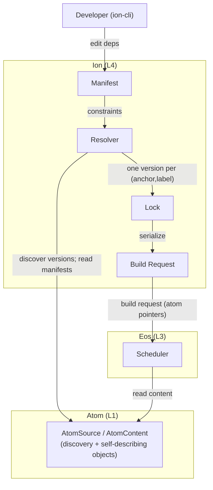
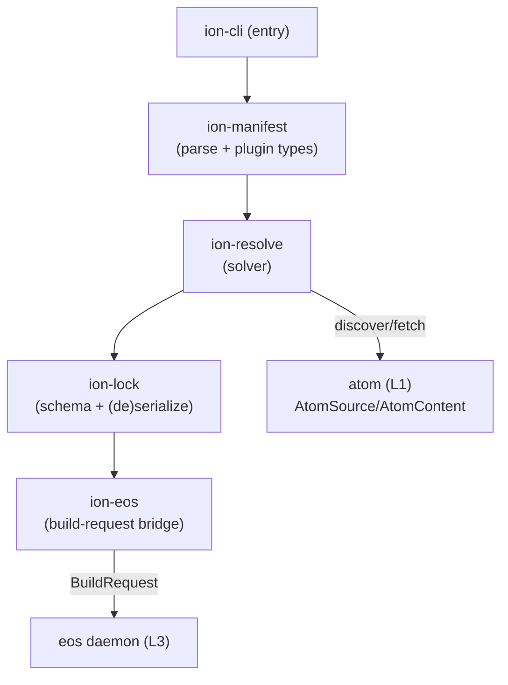
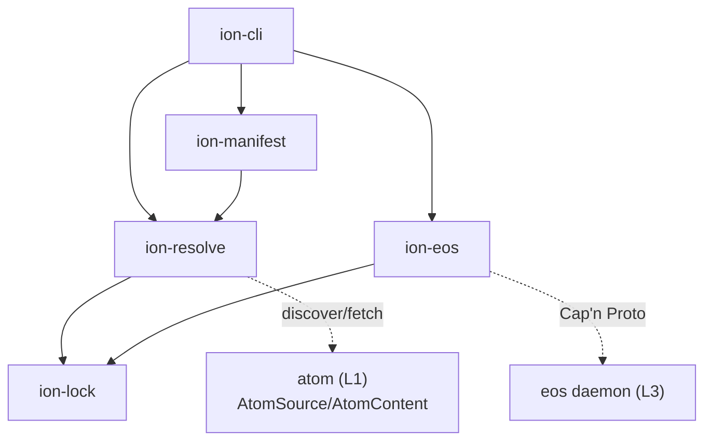
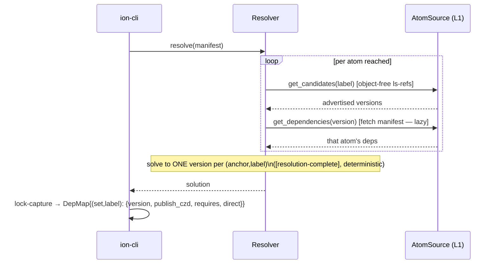
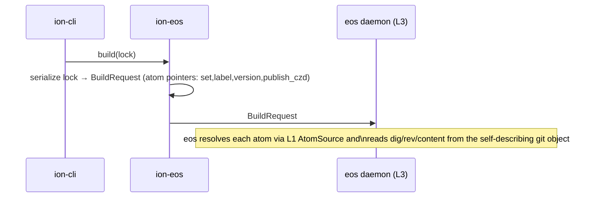
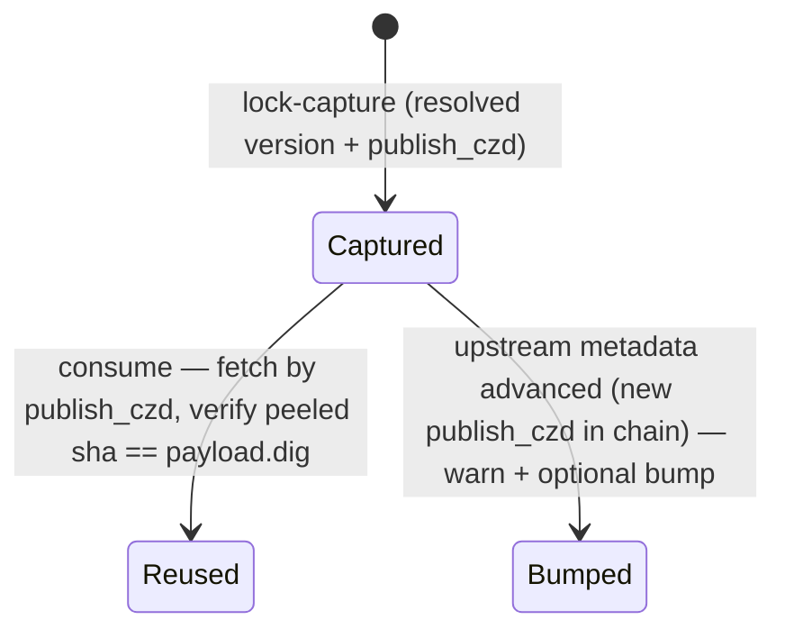

<!--
  Ion Software Architecture Document (SAD) — L4 (renumbered 2026-07-05 per
  ADR-0005 §9, [htc-layer-designation]; was L3 before HTC/L2 was inserted).

  Authoritative source of truth for the Ion layer. The specs under docs/specs/
  (ion-manifest.md, ion-resolution.md, lock-file-schema.md, ion-eos-contract.md)
  derive from this document; on conflict, this document takes precedence and the
  spec is realigned. ADRs record architectural changes.

  Maintained as Architecture-as-Code. Diagrams are Mermaid.js, inline.

  Consumes the atom (L1) identity contract — see atom-sad.md. Key inputs: AtomId =
  abstract (anchor,label) pair; the 2-value atom lock contribution {version,
  publish_czd}; the self-describing atom git object.
-->

# Ion Software Architecture Document (SAD)

## 1. Context

### 1.1 System Purpose

Ion is the **dependency resolution and lock** layer (L4) of the Axios stack. It
takes a project's **manifest** (what it depends on, as ranges), resolves a
**single coherent version per atom** across the transitive graph, and writes a
**lock** that is the sole, reproducible input handed to eos (L3) for building.

Ion owns:

- **The manifest** — the human-authored declaration of direct dependencies and
  version constraints, extensible by plugins for non-atom dependency types.
- **Resolution** — solving the transitive constraint graph to one version per
  `(anchor, label)`, deterministically, with actionable diagnostics on failure.
- **The lock** — the reproducible, verifiable pin of the resolved graph: the
  atom-core entry (from L1) plus ion's graph extensions, keyed by `AtomId`.
- **The eos handoff** — turning the lock into a build request eos can execute.

Ion does **not** own: atom identity, publishing, or storage (L1, atom); build
execution or scheduling (L3, eos). It **consumes** atom's identity contract and
**produces** eos's build input. By layer discipline, ion depends on atom and eos
contracts; nothing depends on ion.

### 1.2 External Actors



### 1.3 System Boundaries

| Boundary       | Inside Ion                                                   | Outside Ion                                                          |
| :------------- | :----------------------------------------------------------- | :------------------------------------------------------------------- |
| **Manifest**   | direct-dep declaration, ranges, plugin-extended types        | atom identity, version _semantics_ (L1 `VersionScheme`)              |
| **Resolution** | the constraint solver, single-version selection, diagnostics | atom discovery/fetch primitives (L1 `AtomSource`)                    |
| **Lock**       | the lock schema, ion graph extensions, cross-references      | the atom-core entry fields (defined by L1 `[lock-entry-sufficient]`) |
| **Handoff**    | lock→build-request serialization, the eos contract           | build execution, scheduling, the artifact store (L3)                 |

### 1.4 Layer Discipline

`ion-*` crates depend on `atom-*` (the identity/lock-core contract) and on the
eos contract types; the reverse is forbidden (`layer-boundaries.md`
`[boundary-downward-only]`). Ion reads atoms via L1 `AtomSource`/`AtomContent`
and never reaches below the published contract (no direct git-object surgery —
that is L1's `atom-git`).

## 2. Container View



### 2.1 Manifest

The human-authored entrypoint (`ion.toml`): direct dependencies with version
ranges, the `[compose]` declaration, and plugin-typed non-atom deps. Parsed by
`ion-manifest`; it is the input to resolution, never transmitted to eos.

### 2.2 Resolver

Drives `ion-resolve`: discovers candidate versions (object-free `ls-refs` over L1
`AtomSource`), lazily fetches each reached atom's manifest, and solves to one
version per `(anchor, label)`. Output is the resolved graph.

### 2.3 Lock

`ion-lock` serializes the resolved graph deterministically. It is the **only**
artifact that crosses the L4→L3 boundary, and the sole input eos needs to fetch,
verify, and build the closure.

### 2.4 Eos Bridge

`ion-eos` translates the lock into an eos `BuildRequest` (atom pointers +
`compose.args` → `action_params`) and connects to the eos daemon over the wire (§6.9).
It is the only ion container that speaks the eos protocol.

### 2.5 Atom (L1) / Eos Daemon (L3)

External to ion: the L1 `AtomSource`/`AtomContent` that resolution discovers and
fetches from, and the L3 daemon that executes the build request. Ion depends on
both contracts; neither depends on ion.

## 3. Component View



| Crate          | Role                                                                             |
| :------------- | :------------------------------------------------------------------------------- |
| `ion-manifest` | Parse the manifest; dispatch direct-dep types (atom + plugin-registered)         |
| `ion-resolve`  | The constraint solver; transitive resolution to one version per `(anchor,label)` |
| `ion-lock`     | The lock schema and (de)serialization; the `DepMap` keyed by `AtomId`            |
| `ion-eos`      | Translate the lock into an eos `BuildRequest`; the L3 handoff                    |
| `ion-cli`      | Developer entry point (resolve, lock, build orchestration)                       |

## 4. Core Lifecycles

### 4.1 Resolve → Lock



### 4.2 Lock → Build Request (eos handoff)



## 5. State Machine Models

### 5.1 Resolution

```mermaid
stateDiagram-v2
  [*] --> Solving: resolve(manifest)
  Solving --> Solving: propagate / decide / backtrack (solver-internal; not spec-mandated)
  Solving --> Solved: one version per (anchor,label)
  Solving --> Unsolvable: no valid assignment
  Solved --> [*]: write lock
  Unsolvable --> [*]: actionable diagnostic ([resolution-unsolvable-diagnostic])
```

### 5.2 Lock Entry



## 6. Cross-Cutting Concerns and System Invariants

### 6.1 Resolution Properties

Ion's contract is five behavioral properties, solver-agnostic (any complete
resolver — PubGrub or a SAT solver such as resolvo — MAY implement them):

- **`[resolution-complete]`** — if a valid assignment exists, the resolver MUST
  find one.
- **`[resolution-deterministic]`** — same manifest + same available versions ⇒
  byte-identical lock. **This requires every discovery/provider output to be
  consumed in a stable order** (git-ref and map iteration MUST be normalized);
  ordering nondeterminism is the determinism footgun and is forbidden.
- **`[resolution-highest-match]`** (SHOULD) — prefer the highest version
  satisfying all constraints.
- **`[resolution-unsolvable-diagnostic]`** — on failure, produce a human-readable
  "because X and Y, Z" explanation.
- **`[resolution-transitive]`** — resolve the full transitive closure.

### 6.2 Single Version per Identity

Exactly one version is locked per `AtomId = (anchor, label)`. This is structural:
the lock's `DepMap` is keyed by `AtomId`, so uniqueness holds by construction.
(Multi-version coexistence is a roadmap concern, not the current contract.)

### 6.3 The Lock Model (atom-core + ion extensions)

The lock entry composes two layers (see §7 for the schema):

- **Atom core** (defined by L1 `[lock-entry-sufficient]`): keyed by
  `AtomId = (set, label)`, value `{version, publish_czd}`. Ion does **not**
  redefine these — it inherits them.
- **Ion extensions**: `requires` (the resolved direct-dep edges, for offline graph
  reconstruction without re-resolving) and `direct` (declared-vs-transitive). These
  are ion's concern, layered over the atom core.

### 6.4 Cross-Reference Encoding

With no hashed atom `id`, intra-lock references — `requires`, `owner`, and
`[compose].use` — name an atom by its **`publish_czd`** (the bare Coz digest already
carried by every atom entry; cryptographically unique to one publish). Each
reference MUST equal the `publish_czd` of exactly one `type = "atom"` entry. This
pins the **specific publish** of the referenced dependency — not just its name — and
inherits the same durability as the entry's own pin (if the dependency's metadata
later advances, the edge still names the old, persisted `publish_czd`). The closures
(`[lock-requires-closure]`, `[lock-owner-closure]`, `[lock-compose-closure]`) match
on `publish_czd`.

### 6.5 Plugin Extension Point

Non-atom dependency types are **plugin extensions**, not core. Each `[[deps]]`
entry carries a `type` discriminant (`[lock-dep-type-dispatch]`); `type = "atom"`
is the ion core, and plugins register additional namespaced types via
`[lock-type-extension-mechanism]`. Ion core does not interpret plugin-defined
fields; it dispatches by `type` and preserves them. The manifest mirrors this
(`ion-manifest.md` §Direct Dependency Plugin Extension).

### 6.6 The Eos Handoff (minimal pointer)

The build request carries, per atom dep, the **minimal pointer**
`(set, label, version, publish_czd)`. Eos resolves the atom via L1 `AtomSource`
and reads `dig`, the source revision, and content **from the self-describing atom
git object** (the signed publish payload + the peeled commit) — nothing else is
copied. `[handoff-atom-fields]`'s prior mandate to transmit `rev`/`id` is
**over-specification** and is removed: those are git-object-readable. (Whether eos
reads the object directly or ion materializes wire fields from it is an
implementation choice that does not change the lock or the atom contract.)

### 6.7 Determinism and Reproducibility

`[resolution-deterministic]` + the lock's deterministic serialization
(`BTreeMap` ordering on the `(set, label)` key) make the lock a reproducible
artifact. A run-twice property test is the standing guard against provider-order
leaks (§6.1).

### 6.8 Composition

The `[compose]` section determines how the root atom's build is **composed** —
which atom (or trivial nix expression, or static config) provides the
import/composition logic that wires the dependency graph into the
inputs eos's executor builds from. It is the third pillar of the lock
alongside `[sets]` and `[[deps]]`, and it flows the full length of the
pipeline:

- **`compose.use`** selects the composer. For the atom variant it names the composer
  atom by its **`publish_czd`** (§6.4) — the composer is itself a locked dependency,
  pinned like any other. `at` + `entry` give its version and composition entrypoint.
  The non-atom variants are `"nix"` (trivial import) and `"static"` (config).
- **`compose.args`** are action parameters (e.g. `system`) that flow
  manifest → lock → `ion-eos` → the eos `BuildRequest`'s `action_params`
  (`ion-eos-contract.md §Compose.args Flow`). Ion captures them in the lock; eos's
  executor consumes them. This is the L4 side of eos-sad §6.5's `action_params`.

> **Note (2026-07-05; amended 2026-07-07):** This section's terminology
> matches the substrate model — no evaluation stage; `action_params`,
> not `eval_args` (eos-sad.md §6.5). The compose _object model_
> (`compose.use`/`compose.as.nix`) described an evaluator-shaped
> composer and is **dead** per
> [ADR-0006](../adr/0006-execution-as-the-primitive.md) §3 (the
> evaluator is removed, no legacy path); its successor is the
> manifest/lock redesign. See
> [ADR-0005](../adr/0005-hermetic-transactional-composition.md) and
> [htc-sad.md](htc-sad.md).

### 6.9 Transport and Security

Ion is a client of the eos daemon, not a networked service itself. `ion-eos`
connects over **Cap'n Proto RPC** — in v1 a **Unix domain socket** at a well-known
path; the daemon returns an `EosDaemon` bootstrap capability on connect. The build
request is submitted through that capability, and progress is streamed back over
**capability-based** references (`BuildJob`), which are exercised and then released.
The wire schema, capability model, session lifecycle, and transport evolution are
defined normatively in `eos-network-protocol.md`; the semantic contract (what ion
transmits, what eos expects) is `ion-eos-contract.md`. Authentication is the
transport layer's concern (the daemon's auth middleware), not ion's — ion holds
only the capabilities the daemon grants it, and capability possession _is_ the
authorization (drop the capability, drop the access).

## 7. The Lock Schema

Keyed by `Either<AtomId, Name>` where `AtomId = (set, label)`; atom entries sort
lexicographically on the pair. A representative atom entry:

```toml
[sets.<anchor>]
tag     = "auth-set"            # human-readable alias (required)
mirrors = ["git@…/atoms", "https://mirror/…"]

[[deps]]
type        = "atom"            # core; plugins register other types
set         = "<anchor>"        # AtomId component; → [sets.<anchor>]
label       = "auth-service"    # AtomId component
version     = "1.4.2"           # atom-core (L1)
publish_czd = "12207a…"         # atom-core (L1) — the pin; store-keyed via blake3
requires    = ["1220b3…", "1220c9…"]   # ion extension — publish_czd of each direct dep
direct      = true              # ion extension — declared vs transitive
```

- **Atom core** (`version`, `publish_czd`) is L1's `[lock-entry-sufficient]`; ion
  inherits it unchanged. No `id`, no `rev`, no `dig` (`dig` lives in the signed
  payload, verified by peel — atom-sad §6.5).
- **Ion extensions** (`requires`, `direct`) record the graph; `requires` entries are
  the `publish_czd` of each direct dependency.
- **Cross-references** (`requires`, `owner`, `compose.use`) name an atom by its
  `publish_czd` (§6.4).
- **`[sets]` → mirrors** (with the required `tag`) is shared with L1 (atom-sad §1.5).

## 8. Failure Modes

| #   | Failure                         | Behavior                                                                |
| :-- | :------------------------------ | :---------------------------------------------------------------------- |
| 8.1 | Unsatisfiable constraints       | `[resolution-unsolvable-diagnostic]` — "because…" explanation, no lock  |
| 8.2 | Provider returns unstable order | determinism violation — forbidden (§6.1); caught by run-twice test      |
| 8.3 | Cross-reference dangling        | a `requires`/`owner` pair with no matching `(set,label)` entry → reject |
| 8.4 | Unknown plugin `type`           | core dispatches by `type`; unregistered type → error, not silent drop   |
| 8.5 | Upstream metadata advanced      | non-fatal — warn + optional `publish_czd` bump (atom-sad §6.4)          |

## 9. Known Gaps and Future Explorations

| #   | Gap                                                                 | Notes                                                                 |
| :-- | :------------------------------------------------------------------ | :-------------------------------------------------------------------- |
| 1   | Multi-version coexistence + MaxSAT optimality                       | roadmap; would justify a full SAT solver over PubGrub                 |
| 2   | Plugin extension API surface (how a plugin registers a type/fields) | mechanism named (`[lock-type-extension-mechanism]`); concrete API TBD |

## 10. Scope Boundaries

Out of scope for ion:

- **Atom identity, publishing, storage** (L1) — ion consumes the contract.
- **Build execution, scheduling, the artifact store** (L3).
- **Version semantics** — `VersionScheme` is an L1 trait; concrete ecosystem
  adapters live above ion.
- **The atom-core lock fields** — defined by L1; ion inherits, never redefines.

## Appendix A: Terminology

| Term            | Definition                                                        |
| :-------------- | :---------------------------------------------------------------- |
| Manifest        | Human-authored direct-dependency declaration with version ranges  |
| Lock            | Reproducible pin of the fully resolved transitive graph           |
| AtomId          | `(anchor, label)` pair (from L1) — the lock's dep key             |
| Atom core       | The L1-defined lock entry fields `{version, publish_czd}`         |
| Ion extension   | Ion-layer lock fields (`requires`, `direct`) over the atom core   |
| Cross-reference | An intra-lock atom reference, named by the target's `publish_czd` |
| Plugin type     | A non-atom dep `type`, registered via the extension mechanism     |
| Build request   | The serialized lock handed to eos (atom pointers)                 |

## Appendix B: Crate Map

| Layer | Crate          | Kind           | Purpose                                                     |
| :---- | :------------- | :------------- | :---------------------------------------------------------- |
| L4    | `ion-manifest` | Implementation | Parse manifest; direct-dep type dispatch (atom + plugins)   |
| L4    | `ion-resolve`  | Implementation | Constraint solver; transitive single-version resolution     |
| L4    | `ion-lock`     | Implementation | Lock schema + (de)serialization; `DepMap` keyed by `AtomId` |
| L4    | `ion-eos`      | Bridge         | Lock → eos `BuildRequest` handoff                           |
| L4    | `ion-cli`      | Implementation | Developer entry point                                       |

## Appendix C: Specification Cross-Reference

| SAD Section                | Governing Specification                                                                                                                              |
| :------------------------- | :--------------------------------------------------------------------------------------------------------------------------------------------------- |
| §4.1 Resolve               | [ion-resolution.md](../specs/ion-resolution.md) §Resolution Properties                                                                               |
| §4.2 Handoff               | [ion-eos-contract.md](../specs/ion-eos-contract.md)                                                                                                  |
| §6.1 Resolution Properties | [ion-resolution.md](../specs/ion-resolution.md) `[resolution-*]`                                                                                     |
| §6.3 Lock Model            | [lock-file-schema.md](../specs/lock-file-schema.md); [atom-sourcing.md](../specs/atom-sourcing.md) `[lock-entry-sufficient]`                         |
| §6.4 Cross-Reference       | [lock-file-schema.md](../specs/lock-file-schema.md) `[lock-requires-closure]`, `[lock-owner-closure]`, `[lock-compose-closure]`                      |
| §6.5 Plugin Extension      | [lock-file-schema.md](../specs/lock-file-schema.md) `[lock-type-extension-mechanism]`; [ion-manifest.md](../specs/ion-manifest.md) §Plugin Extension |
| §6.6 Eos Handoff           | [ion-eos-contract.md](../specs/ion-eos-contract.md) `[handoff-atom-fields]`                                                                          |
| §7 Lock Schema             | [lock-file-schema.md](../specs/lock-file-schema.md)                                                                                                  |

## Appendix D: Known Specification Drift

None outstanding. The lock-layer realignment to this SAD has been applied across
`lock-file-schema.md` (no hashed `id`/`rev`; `publish_czd` cross-references; the
`(set, label)` key), `ion-resolution.md` (`AtomDep` without `cad`; `requires` over
`publish_czd`; determinism ordering), `ion-manifest.md` (`owner` over `publish_czd`),
`ion-eos-contract.md` (minimal-pointer handoff), and `layer-boundaries.md`
(`blake3(publish_czd)` addressing). The schema `version` is `0` and the anchor lock
field is named `set`, consistently across the lock and resolution specs.

## Appendix E: Stale Documentation

None outstanding. (The row previously here — claiming `ion-resolution.md`
§Lock File Schema still showed a `cad`/`AtomDigest` example — was itself
stale: `ion-resolution.md`'s informative schema already shows `publish_czd`,
no `cad`, consistent with SAD §7. Removed 2026-07-05.)
