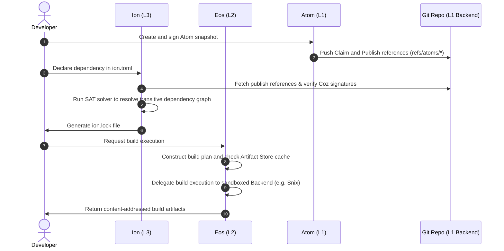

+++
title = "Axios Stack Architecture & Implementation"
description = "High-level technical overview of the Axios monorepo workspaces, crate organization, trait boundaries, and evaluation data flows"
quadrant = "Explanation"
audience = "Axios stack developers, codebase contributors, and architects tracking integration patterns"
+++

# Axios Stack Architecture & Implementation

The Axios stack is designed as a layered, content-addressed publishing and build system. To maintain clean separation of concerns and prevent dependency bloat, the codebase is split into three independent Cargo workspaces, representing a downward-only dependency chain:

$$\text{Ion (L3)} \to \text{Eos (L2)} \to \text{Atom (L1)}$$

## Layered Crate Architecture

The system is organized into decoupled crates across the workspaces, ensuring that plumbing libraries do not import higher-level porcelain concerns.

```mermaid
graph TD
    subgraph L3: Ion (Porcelain Workspace)
        ion-cli["ion-cli (CLI tool)"]
        ion-resolve["ion-resolve (SAT solver)"]
        ion-manifest["ion-manifest (TOML parsing)"]
        ion-lock["ion-lock (Lock file)"]
        ion-eos["ion-eos (Integration glue)"]
    end

    subgraph L2: Eos (Scheduler & Runtime Workspace)
        eos["eos (Orchestrator)"]
        eos-core["eos-core (Traits)"]
        eos-snix["eos-snix (Build Backend)"]
        eos-proto["eos-proto (Network APIs)"]
        eos-daemon["eos-daemon (Eval daemon)"]
    end

    subgraph L1: Atom (Protocol Workspace)
        atom-core["atom-core (Traits)"]
        atom-git["atom-git (Git backend)"]
        atom-id["atom-id (Identity & Sign)"]
        atom-uri["atom-uri (URI Parser)"]
    end

    %% Dependencies
    ion-cli --> ion-resolve
    ion-cli --> ion-manifest
    ion-cli --> ion-lock
    ion-cli --> ion-eos
    
    ion-eos --> eos
    eos --> eos-core
    eos-snix --> eos-core
    eos --> eos-proto
    eos-daemon --> eos
    
    eos-core --> atom-core
    atom-git --> atom-core
    atom-core --> atom-id
    atom-core --> atom-uri
```

### Dependency Budget Constraints
To enforce security and maintainability, crates in the protocol layer (`atom-core`, `atom-id`, `atom-uri`) target $\le 5$ external non-standard dependencies. This protects the cryptographic root of trust from supply chain bloating.

---

## Technical Data Flow

The lifecycle of an atom spans from creation and signing (L1) to dependency resolution (L3) and execution (L2).



---

## Core Trait Seams

The workspaces decouple implementation details from core logic by defining abstract traits as interfaces. This design allows changing storage backends or build schedulers without modifying porcelain crates.

### L1: Protocol Interface (`atom-core`)

The protocol defines traits for reading and writing atoms:

- **`AtomSource`**: The read-only observer interface. It provides methods to resolve atom IDs, retrieve versions, and fetch deterministic content trees.
  ```rust
  pub trait AtomSource {
      type Error: std::error::Error + Send + Sync + 'static;
      
      async fn resolve_id(&self, label: &Label) -> Result<AtomId, Self::Error>;
      async fn get_versions(&self, id: &AtomId) -> Result<Vec<Version>, Self::Error>;
      async fn fetch_snapshot(&self, id: &AtomId, version: &Version) -> Result<Tree, Self::Error>;
  }
  ```
- **`AtomRegistry`**: The write-only publisher interface. It manages signing and publishing claim and publish transactions to the backend.
  ```rust
  pub trait AtomRegistry: AtomSource {
      async fn publish_claim(&self, claim: &Claim, key: &PrivateKey) -> Result<(), Self::Error>;
      async fn publish_version(&self, publish: &Publish, key: &PrivateKey) -> Result<(), Self::Error>;
  }
  ```

*The default implementation of these traits is provided by `atom-git`, which translates the operations into Git objects and references.*

### L2: Scheduler Interface (`eos-core`)

The build scheduler separates evaluation orchestration from build execution:

- **`BuildEngine`**: The execution interface. It takes a build plan (such as a nix/snix derivation) and schedules sandboxed build execution, yielding a content-addressed output path.
  ```rust
  pub trait BuildEngine {
      type Plan: PlanSpec;
      type Output: OutputSpec;
      type Error: std::error::Error + Send + Sync + 'static;

      async fn execute(&self, plan: &Self::Plan) -> Result<Self::Output, Self::Error>;
  }
  ```
- **`ArtifactStore`**: The cache and storage interface. It stores build artifacts and links them to the source atom digests, enabling cache-skipping optimizations.

*The default build scheduler is provided by `eos-snix`, which delegates the actual build work to the Snix engine while `eos` handles the dependency orchestration and caching.*
