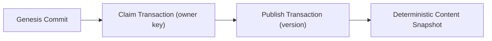

+++
title = "The Decentralized Cure for Supply Chain Attacks"
description = "How the Atom protocol's Surety of Source model replaces administrative trust in registries with cryptographic proofs of repository origin"
quadrant = "Explanation"
audience = "Security engineers, package manager designers, and Axios users evaluating system trust guarantees"
+++

Modern software development is built on the assumption that package registries are secure. Every time a developer runs `npm install`, `cargo build`, or `pip install`, they delegate trust to a centralized intermediary. This trust model is a major vulnerability in the software supply chain.

## The Centralized Registry Bottleneck

In a traditional package ecosystem, a package's integrity rests on the security of a centralized registry (e.g., `npmjs.com`, `crates.io`). The registry acts as an administrative authority, managing developer credentials, access tokens, and namespace ownership.

This administrative model has two critical flaws:

1. **Credential-Based Security**: Trust is linked to account authentication. If a maintainer's registry credentials or API tokens are leaked, phished, or hijacked (as seen in the RedHat npm account compromise), an attacker can publish malicious package versions. The registry accepts these updates as legitimate because the authentication checked out.
2. **Opaque Tarballs**: Registries distribute pre-packaged source files or built artifacts (such as tarballs). The link between the code in the public repository and the file hosted on the registry is completely opaque. There is no cryptographic proof that the code in the registry's tarball actually corresponds to a specific commit in the developer's source repository.

The downstream user has no way to verify the code's lineage. They must trust that the registry's database is uncompromised and that the builder published the correct files.

## The Surety of Source Model

The Atom protocol inverts this trust model. Instead of relying on administrative credentials on a centralized server, Atom establishes trust through **Surety of Source**—a cryptographic link that binds a published package directly to its origin repository's history.

Under this model, package mirrors, registries, and stores are treated as dumb transport layers. The package's authenticity is verified locally by the consumer using cryptographic proofs:

The verification chain relies on three immutable links:

1. **The Anchor**: The package identity is bound to a cryptographic anchor (the repository's initial or genesis commit hash). This anchor cannot be faked or reassigned without creating a completely different repository identity.
2. **The Claim**: The repository owner publishes a signed `claim` transaction containing their public key, the anchor, and the package label. This establishes ownership using a Trust-On-First-Use (TOFU) model.
3. **The Publish**: Every version release is signed by the owner's key in a `publish` transaction. The publish transaction cryptographically binds the version to:
   - The authorizing `claim` digest.
   - The exact source commit revision (`src`).
   - The relative path where the package lives in the repository.
   - The content-addressed hash of the deterministic content snapshot (`dig`).

## local Verification & DAG Validation

When a client resolves and fetches an atom, it runs a 12-step verification sequence completely locally. The verification validates the Git Directed Acyclic Graph (DAG) using a three-point temporal ancestry check:

$$\text{genesis} \to \text{claim.src} \to \text{publish.src}$$

The client verifies that the genesis commit is an ancestor of the claim's source commit, which in turn is an ancestor of the publish's source commit. This temporal floor prevents backdating: an attacker who gains access to a publisher's key cannot publish a malicious version and pretend it was released prior to the key compromise.

Finally, because the content snapshot is deterministic, the client can independently download the source tree at `publish.src`, navigate to `path`, regenerate the snapshot commit, and verify that the resulting commit hash matches the signed `dig`.

If the signature checks out, the DAG ordering holds, and the content hash matches, the atom is verified. The consumer has mathematical certainty that the code came from the legitimate repository owner, bypassing the need to trust any registry, mirror, or transport network.
